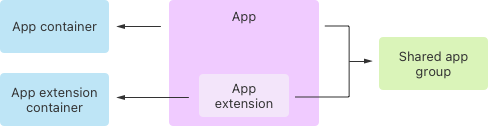

> Navigation: [Technologies](../technologies.md) · [Technology Overviews](../technologyoverviews.md) · [Data management](data-management.md)

# Shared data

Share data with your apps running on different devices using iCloud, or share data between your app and app extensions.

Share data to help people access what they need wherever they are, and to make sure your own apps are able to coordinate. If you build multiple apps, build an app for multiple devices, or deliver app extensions inside your apps, consider how you might share data between different processes.

## Make your app’s content available on multiple devices

iCloud lets people store their data securely, access it wherever they go, and keep it up to date on all their devices. The power and simplicity of iCloud means you can focus on delivering a great experience, and let iCloud handle the details of scaling, consistency, and security.

When someone enables iCloud on their device, that device gains access to the files and data in their iCloud account on the server. While iCloud is active, the device maintains metadata about all the items in the person’s account, but might store only a subset of those items locally on a device. When someone accesses an item that isn’t on the device, the system downloads it transparently. When someone modifies an item, the system uploads the changes to the iCloud server and propagates them to other devices.

When developing apps, choose the iCloud technology that works best for the data you want to share. You can share a small amount of data, or a lot. You can even adopt multiple iCloud technologies in the same app.

- **Share a directory of game-save data.** Developers of multiplatform games adopt the [GameSave](../gamesave.md) framework to synchronize game data among someone’s devices using iCloud. The framework handles common syncing scenarios like conflict resolution and offline play.
- **Share small amounts of app state and data.** Store discrete values related to app preferences, app configuration, or app state using iCloud key-value storage. The [NSUbiquitousKeyValueStore](../foundation/nsubiquitouskeyvaluestore.md) type is similar to the defaults database you use to manage preferences. Use it to store scalar values and property-list object types, including numbers, strings, dates, and small amounts of data, arrays, and dictionaries. You can store a maximum of 1024 keys and 1 megabyte of data.
- **Share files and documents in iCloud Drive.** Store someone’s personal documents in iCloud Drive using iCloud document storage. With this feature, your app gains access to an app-specific directory in the person’s iCloud storage. Fetch this directory using the [url(forUbiquityContainerIdentifier:)](<../foundation/filemanager/url(forubiquitycontaineridentifier_).md>) method, and make it the default location for storing a person’s files.
- **Share your app’s data structures.** Adopt [SwiftData](../swiftdata/syncing-model-data-across-a-persons-devices.md) or [Core Data](../coredata/mirroring-a-core-data-store-with-cloudkit.md), which work with [CloudKit](../cloudkit.md) to store your app’s data. You can also adopt [CloudKit](../cloudkit.md) directly, or use [CloudKit JS](../cloudkitjs.md) to add CloudKit support to your web app. Get up to 1PB of storage for your app’s public data, and create containers for people to share content with each other. Run integration tests of your CloudKit code from Xcode or your continuous integration system. Access performance metrics, telemetry data, logs, and more using tools like [CloudKit Console](https://icloud.developer.apple.com/dashboard/).

[Configure the iCloud services](../xcode/configuring-icloud-services.md) your app uses in Xcode. Each service requires specific entitlements to validate your app’s access to a person’s iCloud storage.

> [!note] Note
> Devices that access iCloud must have a network connection and a valid Apple Account. Devices can operate without network access for a period of time after the initial login, relying on previously downloaded data.

## Share content on the same device

To protect apps from nefarious code, Apple places them in _sandboxes_ on nearly all devices. Each sandbox includes a container directory, which only the owning app can access. To share files between two apps you create, or between your app and an app extension, configure an [app group](../xcode/configuring-app-groups.md) for both processes. A process with the [proper entitlements](../bundleresources/entitlements/com.apple.security.application-groups.md) can [request the URL](<../foundation/filemanager/containerurl(forsecurityapplicationgroupidentifier_).md>) of the app group directory, and access files in that directory.

The creation of an app group creates a shared space on disk for multiple processes to share files. It also enables additional interprocess communication (IPC) between those processes using Mach IPC, POSIX semaphores and shared memory, UNIX domain sockets, and other IPC mechanisms. In macOS, app groups facilitate communication between sandboxed apps, and between sandboxed and nonsandboxed apps. Apps can belong to one or more app groups.

## Deploy your own shared remote file server

If you manage your own server-side storage, create a File Provider extension to access that remote storage. A File Provider extension monitors and manages the local copy of documents someone places on your remote server. When someone changes a local file, the extension uploads the modified file to your server. Similarly, when the file changes on the server, the extension downloads the file and updates the local storage.

Create your extension using the [File Provider](../fileprovider.md) and [File Provider UI](../fileproviderui.md) frameworks. Deploy your app extension inside an app you offer to your customers to manage their access to your system.

## Coordinate access to shared files

File coordination is essential if you read and write files in iCloud, in an app group, or in any shared space. File coordinators prevent multiple processes from accessing a file in a conflicting way. For example, file coordinators prevent two processes from writing to the same file simultaneously. You adopt file coordinators in one of the following ways:

- **Document-based coordination** — Adopt the [FileDocument](../swiftui/filedocument.md), [UIDocument](../uikit/uidocument.md), or [NSDocument](../appkit/nsdocument.md) type for your app’s documents. These types automatically create file coordinators when reading and writing the underlying document using their APIs.
- **Manual coordination** — Implement the [NSFilePresenter](../foundation/nsfilepresenter.md) protocol in one of your custom types. Read and write the data for that type using a
[NSFileCoordinator](../foundation/nsfilecoordinator.md) object.

## Design custom document formats for sharing

If your app uses a custom file format for documents, [design those file formats](../design/human-interface-guidelines/icloud.md) to operate well on all platforms. iCloud document storage lets someone open files on iPhone, iPad, Mac, and other devices.

- **Design your document types for network efficiency.** If your document contains several different types of data, consider using a file package to store each type of data separately. A file package is a directory that the system presents as a single file in appropriate situations. When you modify files in the package, the system transfers only the files that changed to iCloud.
- **Keep file formats platform-agnostic.** Differences between platforms might require you to pick a format for your data and use it on all platforms. For example, the positive y-axis points in different directions in iOS and macOS, requiring you to convert coordinate values on one of the platforms.
- **Include a version number in file formats.** Version numbers are always a good idea, especially when accessing your documents on different device types. Handle documents with older version numbers gracefully, and alert someone if they try to open a document with an unsupported version number.
- **Persist relevant state information to your documents.** In addition to document-specific data, include app-specific state that applies to your documents in your custom file formats. For example, a drawing app might store the currently selected tool and drawing colors with the rest of the document data. Don’t store transient state that might impact the experience with your app from one device to another. For example, don’t store the current scroll position of the document window. Use a file package to store any app-related state separately from your document data.
