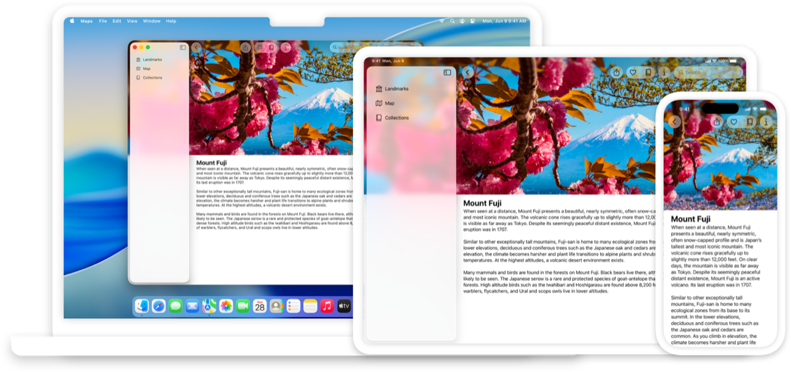
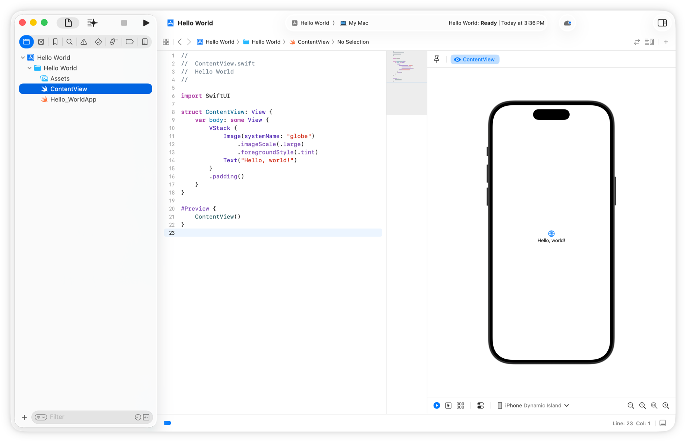

> Navigation: [Technologies](../technologies.md) · [Technology Overviews](../technologyoverviews.md) · [App design and UI](app-design-and-ui.md)

# SwiftUI apps

Build your app for all Apple platforms using the Swift programming language and a modern approach.

[SwiftUI](../swiftui.md) is the best choice for creating new apps, the preferred choice for visionOS apps, and required for watchOS apps. Its declarative programming model and approach to interface construction makes it easier to create and maintain your app’s interface on multiple platforms simultaneously.



## Assemble your app’s core content

When someone launches your app, your app needs to initialize itself, prepare its interface, check in with the system, begin its main event loop, and start handling events as quickly as possible. When you build your app using SwiftUI, you initialize your app’s custom data and SwiftUI handles the rest.

The main entry point for a SwiftUI app is the [App](../swiftui/app.md) structure. You use this structure to initialize your app’s global data structures. You also use it to declare one or more scenes, where each scene corresponds to part of your app’s interface code. You specify your app’s scenes in the [body](../swiftui/app/body-swift.property.md) property of the app structure. All [new Xcode projects](../xcode/creating-an-xcode-project-for-an-app.md) contain an initial scene you can modify, and you can [add more scenes](../swiftui/bringing-multiple-windows-to-your-swiftui-app.md) as needed to support preference panes, tool palettes, alert panels, and other types of content.

Each of your app’s scenes contains a part of your interface. An app with a single main window can use a [WindowGroup](../swiftui/windowgroup.md) scene to display that window’s contents. If your app manages documents, you use a [DocumentGroup](../swiftui/documentgroup.md) scene to specify contents of the document windows. Each scene contains the views you want to display in a particular window. At launch time, SwiftUI chooses an appropriate scene and displays it.

**Window-based app**

```swift
import SwiftUI

@main
struct MyApp: App {
    var body: some Scene {
        WindowGroup {
            ContentView()
        }
    }
}
```

**Document-based app**

```swift
import SwiftUI

@main
struct MyDocApp: App {
    var body: some Scene {
        DocumentGroup(newDocument: MyDocAppDocument()) { file in
            ContentView(document: file.$document)
        }
    }
}
```

SwiftUI creates the app structure at launch time, so it’s the only object guaranteed to be present at startup. At startup, initialize the data structures you need to display your app’s initial interface. Keep your initialization code fast to minimize any delays in presenting your interface. If needed, move any noncritical work to background tasks that can finish after your app’s UI appears.

## Declare your interface

[Creating an interface](../swiftui/declaring-a-custom-view.md) involves telling SwiftUI what views you want to include in each scene, how you want them arranged, and what data each one contains. SwiftUI uses your declarations to build and manage your app’s actual interface. With this approach, your focus stays on [your app’s data](swiftui.md#Make-data-driven-changes) and making sure that data is correct. SwiftUI assumes responsibility for your interface and making sure it stays consistent with your data.

An advantage of the declarative approach is that it’s easier to update your interface. Instead of writing code to update your views, you change the associated data and let SwiftUI handle the updates. The declarative approach even makes it easier to [animate changes](../swiftui/animations.md) to your interface. All you have to do is specify which animations you want with only a few lines of code. SwiftUI performs the animations and even responds to interactions and changes while the animations run.

In SwiftUI, views are lightweight structures with minimal default behavior. The view’s [body](../swiftui/view/body-8kl5o.md) property contains the declarations for your view’s content. Build and arrange your view’s content using the other views that SwiftUI provides. To modify one of your declared views, add one or more [modifiers](../swiftui/configuring-views.md) to it. A modifier imparts a new behavior on the associated view. For example, the [font(_:)](<../swiftui/view/font(__).md>) modifier in the code listing applies the specified font to the [Text](../swiftui/text.md) view. You can add many different types of modifiers to your views, and the order in which you add some modifiers determines your view’s final appearance.

```swift
import SwiftUI

struct LibraryItemView: View {
    var book: Book
    
    var body: some View {
        VStack(alignment: .leading) {
            Text(book.title)
            Text("Written by: \(book.author.name)")
                .font(.caption)
        }
    }
}
```

## Preview your content live

To help you design your views, Xcode provides intuitive design tools to [show you what you’re building](../xcode/previewing-your-apps-interface-in-xcode.md) while you build it. As you edit the code for your view, Xcode updates the preview next to your code
to reflect the changes you made. This immediate feedback lets you see if those changes match your expectations.



Xcode displays previews only when a source file includes a [preview macro](../swiftui/previews-in-xcode.md). This macro tells Xcode what view to create and how to configure it. You can incorporate test data into your previews, and you can configure multiple previews with different content or configurations. You can even see your previews on different device types and with different system appearance settings.

## Make data-driven changes

In SwiftUI, your app’s data model is the source of truth, and the way you modify that data drives your app’s behavior. When building your app’s interface, think about the types of data each view needs. A view might have properties that refer to part of your app’s data model, or have properties that store state information such as the current selection. The [wrappers](../swiftui/model-data.md) you apply to each property declaration tell SwiftUI how to respond when the data in the property changes.

- Apply the [State](../swiftui/state.md) property wrapper to local variables that manage the state of your interface. When you change the value of the variable, SwiftUI automatically updates your interface to reflect the new value.
- Apply the [Binding](../swiftui/binding.md) property wrapper to variables outside your view that you access. Like state variables, changes to the value cause SwiftUI to update your view.
- Apply the [Bindable](../swiftui/bindable.md) property wrapper to a local variable that another view references. A variable with this wrapper provides the content for a [Binding](../swiftui/binding.md) variable in another view. Use bindable properties to drive changes in other views.
- Apply the [StateObject](../swiftui/stateobject.md) property wrapper to a variable that contains an object you create in your view. Use that object as the single source of truth, and pass it to other views in your view hierarchy so that they can observe changes to that data.
- Apply the [ObservedObject](../swiftui/observedobject.md) property wrapper to a variable that monitors changes to a [StateObject](../swiftui/stateobject.md) type you created in another view.

```swift
struct CategoryView: View {
    @Environment(PlayerModel.self) private var player
    @Environment(\.modelContext) private var context

    @State private var navigationPath: [NavigationNode]
    @State private var videos: [Video] = []
    
    private let category: Category
    private let namespace: Namespace.ID
 
    var body: some View {
        // Wrap the content in a vertically scrolling view.
        NavigationStack(path: $navigationPath) {
            ScrollView(showsIndicators: false) {
                VStack(alignment: .leading) {
                    Text(category.name)
                        .font(.title.bold())
                 
                    Text(category.description)
                        .font(.body)
                                              
                    ...
                } 
            }
            ...
        }
    }
}
```

- Apply the [Environment](../swiftui/environment.md) property wrapper to create a local reference to a value in the [view’s environment](../swiftui/environmentvalues.md).

The [Destination Video](../visionos/destination-video.md) sample demonstrates how you use data to drive interface changes in a multiplatform app. The app uses SwiftUI to support iOS, iPadOS, macOS, tvOS, and visionOS using the same set of views and controls. See how you can build your app once and deploy it on multiple platforms.

## Handle events and interactions

Interactions with your app can come from a variety of sources. On a Mac, people interact with your app primarily using the mouse and keyboard, but they can also use the trackpad of a MacBook Pro, an input tablet, or other input devices. On iPad, people interact by touching the screen, but can also interact with apps using Apple Pencil or a Magic Keyboard. SwiftUI takes all of the events coming from the system and distributes them to the views of your interface and your event-handling code.

For controls and other views that support direct interactions, you typically specify your code as a parameter to the view’s initializer. As a convenience, Swift often lets you specify that code using an inline closure instead of an explicit parameter.

In addition to explicit handlers, you can add modifiers to your views to respond to known [gestures](../swiftui/adding-interactivity-with-gestures.md). SwiftUI supports standard touch-based and mouse-based gestures, and you can add custom gestures as needed. If you’re building an app for visionOS, SwiftUI automatically maps a person’s hand movements to equivalent gestures.

```swift
Button("Button") {
    // Action
}
Slider(
    value: $speed,
    in: 0...100,
    onEditingChanged: { editing in
        isEditing = editing
    }
)
```

SwiftUI also supports many other types of events that you might need to support, including:

- [Cut, copy, and paste](../swiftui/clipboard.md) events
- [Drag-and-drop](../swiftui/drag-and-drop.md) events
- [Focus](../swiftui/focus.md)-related events that aid navigation and selection
- [System events](../swiftui/system-events.md) to open URLs and user activity objects, handle background tasks, and import and export transferable data.

## Explore other features

SwiftUI offers additional features to help you create the features you want. Use these features to differentiate your app’s content.

- **Create immersive spaces in visionOS.** Use an [immersive space](../swiftui/immersive-spaces.md) in your visionOS app to display content outside of a window or volume. Immersive spaces focus the person’s attention on your app’s content, removing other distractions, and optionally filling their field of vision with the content you supply.
- **Draw shapes and custom graphics in your interface.** SwiftUI includes a [Canvas](../swiftui/canvas.md) view for drawing outlined or filled paths, images, or text. SwiftUI also provides a variety of views that render specific [shapes](../swiftui/shapes.md) directly. Use these views to create custom content in your interface.
- **Display SwiftUI views in your UIKit or AppKit app, and vice versa.** If you already built an app with [UIKit](../swiftui/uikit-integration.md) or [AppKit](../swiftui/appkit-integration.md), create new views using SwiftUI and adopt them incrementally. If you have a SwiftUI app, you can similarly incorporate existing UIKit or AppKit views into your interface.
- **Incorporate views from other system frameworks.** Some system frameworks provide standard views to use when implementing specific features. For example, you might want to adopt the specific button for initiating payments with Apple Pay. For these external views, use the [technology-specific views and modifiers](../swiftui/technology-specific-views.md) that SwiftUI offers.
