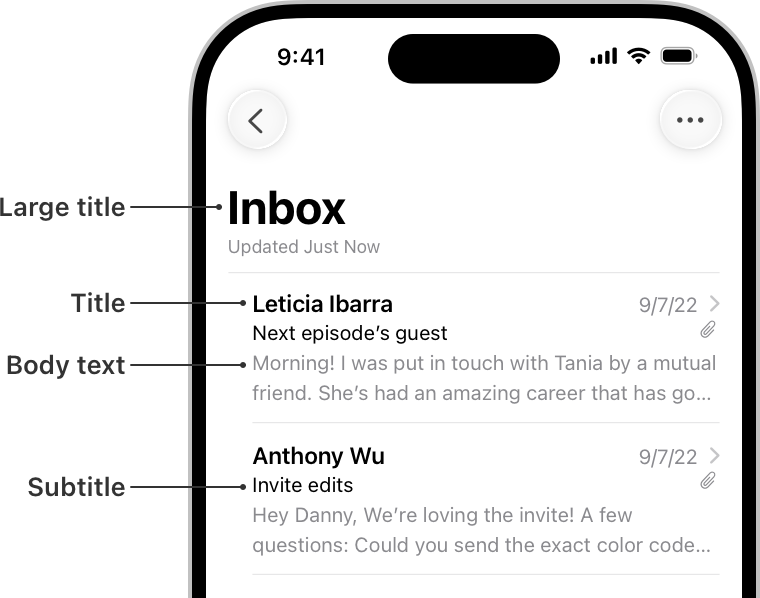

> Navigation: [Technologies](../technologies.md) · [Technology Overviews](../technologyoverviews.md) · [Graphics, drawing, and animation](graphics-drawing-and-animation.md)

# Text display

Display localized text from your app’s interface, and discover how to lay out and render text yourself.

Words are a powerful communication tool and have multiple roles within apps. Whether you display words in your interface, or capture someone else’s words as data or input, the presentation of text involves the collaboration of several different types:

- Strings are data objects that store the characters you want to display. Some string types also store data about how to format individual characters.
- Fonts provide the visual appearance of text. The font family defines the shape of characters, while size and style values change the dimensions or appearance of those shapes.
- Views display strings using the font information you provide. Views use layout objects to help calculate the position of individual characters based on their font and the available space.

## Manage text as string data

Store text in your app using the provided [String](../swift/string.md) type, which is Unicode-correct, efficient, and suitable for managing text of any length or in any language. The type is also interchangeable with the [`NSString`](../foundation/nsstring.md) type common in Objective-C interfaces, so you can use it in both Swift and Objective-C code.

When you need to manage text and style information together, store that text in an [AttributedString](../foundation/attributedstring.md) type instead of a regular string. Attributed strings are also strings, but they allow you to apply font, style, and other visual and nonvisual characteristics to the characters of that string. For example, you can store a URL with a range of characters and use it to create a link during rendering. You can apply attributes to the entire string, to a subset of characters, or to a single character.

> [!note] Note
> If you build a custom text view using TextKit for [UIKit](../uikit/textkit.md) or [AppKit](../appkit/textkit.md), you also use the [NSAttributedString](../foundation/nsattributedstring.md) and [NSMutableAttributedString](../foundation/nsmutableattributedstring.md) types to manage text.

## Choose the fonts for your text

The [system font](../design/human-interface-guidelines/typography.md#Using-system-fonts) on Apple platforms is a great choice for text because it’s always present and supports an extensive range of weights, sizes, and languages. The system font also adapts readly to support [Dynamic Type](../design/human-interface-guidelines/typography.md#Supporting-Dynamic-Type) and [accessibility](../design/human-interface-guidelines/accessibility.md) features. You can also choose from a variety of other fonts available on the system or use a [custom font](../swiftui/applying-custom-fonts-to-text.md) that you provide.

When specifying the system font, choose from the predefined text styles as much as possible. Text styles are preconfigured versions of the font that impart specific meaning to your text. For example, apply the [title](../swiftui/font/title.md) text style to section titles that need a bigger font to make them stand out from the surrounding [body](../swiftui/font/body.md) text. Create fonts with text styles using predefined constants for [SwiftUI](../swiftui/font.md), [UIKit](../uikit/uifont/textstyle.md), and [AppKit](../appkit/nsfont/textstyle.md). Font characteristics for each text style can differ from one Apple platform to another.



<sub>A screenshot showing text on an iPhone in several different styles, including a large title, a title, body text, and a subtitle.</sub>

Typically, you choose the fonts you use in your interface, but a word processor or text-creation app might want to give someone the option to select the fonts for their content. [UIKit](../uikit/uifontpickerviewcontroller.md) and [AppKit](../appkit/nsfontpanel.md) provide a font picker interface, which displays the available fonts and reports selections back to your app. Present this interface from appropriate places in your app when you want someone to choose a font for their content.

## Display text in your interface

Display text in your interface using the standard text views that [SwiftUI](../swiftui/text-input-and-output.md), [UIKit](../uikit/text-display-and-fonts.md), and [AppKit](../appkit/text-display.md) provide. Standard text views render the text you specify in a consistent and efficient way. They also adapt automatically to [Dark Mode](../design/human-interface-guidelines/dark-mode.md), [Dynamic Type](../design/human-interface-guidelines/typography.md#Supporting-Dynamic-Type), [accessibility](../design/human-interface-guidelines/accessibility.md), and other system settings so you don’t have to handle those changes yourself.

When you add text to one of the standard text views, the view displays that text using the [system font](../design/human-interface-guidelines/typography.md#Using-system-fonts) by default. For labels and text fields, you typically use the same font for the entire string. For text views, you you can specify multiple fonts using an attributed string or continue to use a single font for all of the text.

Each app-builder framework defines how you apply fonts to your text:

- In SwiftUI, you [apply fonts](../swiftui/applying-custom-fonts-to-text.md) to standard text views using a [modifier](../swiftui/text-input-and-output.md#Setting-a-font). Choose a predefined [Font](../swiftui/font.md) type for the text style you want, or create a custom instance with your preferred font information.
- In UIKit, you apply fonts to the standard text views using the methods and properties of those views. Retrieve predefined instances of the [system font](../uikit/uifont.md#Creating-System-Fonts) or [standard text styles](../uikit/uifont/textstyle.md) from the [UIFont](../uikit/uifont.md) type, or create custom fonts using the initializers of that type. You can also collect the font attributes you want in a [UIFontDescriptor](../uikit/uifontdescriptor.md) type, and use that type to create a font object.
- In AppKit, you apply fonts to the standard text views using the methods and properties of those views. Retrieve predefined instances of the [system font or standard text styles](../appkit/nsfont.md#Creating-System-Fonts) from the [NSFont](../appkit/nsfont.md) type. You can also retrieve fonts meant for specific types of [UI elements](../appkit/nsfont.md#Creating-UI-Element-Fonts), or create custom font objects from [attributes you supply](../appkit/nsfont.md#Creating-Arbitrary-Fonts).

When you need more control over the placement of text in your view, [create a custom view](text-display.md#Build-a-custom-text-view) using TextKit for [UIKit](../uikit/textkit.md) or [AppKit](../appkit/textkit.md). TextKit provides the types you need to lay out and render text efficiently, and in a way that’s compatible with the [app-builder technologies](app-design-and-ui.md).

## Prepare your text for translation

If you’re planning to support multiple languages, [internationalize](../xcode/supporting-multiple-languages-in-your-app.md) your code to make it ready to handle different languages. During this process, identify the [strings](../xcode/preparing-your-apps-text-for-translation.md) and other content that require translation and look for places where you use [numbers, currencies, dates](../xcode/preparing-dates-numbers-with-formatters.md), images, and other content that might change after translation. Update your code to create this information in a localization-friendly way.

[String catalogs](../xcode/localizing-and-varying-text-with-a-string-catalog.md) offer a modern way to manage localizable string resources in your app. A string catalog keeps all of your translations in one place, and gives you ways to customize translations based on grammatical differences. For example, a string that contains a number can have different translations when the number indicates zero, one, or more than one item. You can also specify per-device translations to adjust text for different device sizes.

Xcode automatically collects properly marked strings in your code and places them in string catalogs. In SwiftUI, the view initializers always mark text as localizable and add them to your string catalogs. To add other strings, use a [String](../swift/string.md) initializer that takes a localized value, as shown in the following example:

```swift
myLabel.string = String(localized: "There are \(peopleInChat) people in this chat.",
              comment: "Label indicating number of chat participants.")
```

All string types store text as Unicode characters and support both left-to-right and right-to-left languages. If you support bidirectional text, make sure the rest of your text [supports both language directions](../https_/developer.apple.com/videos/play/wwdc2022/10107.md) correctly. For example, use [range sets](../swift/rangeset.md) to correctly manage text selections with bidirectional text.

> [!note] Note
> Translate only the strings and data that appear in your interface. Don’t translate strings you use internally to manage your data. For example, don’t translate key names you use to identify data in a custom file format.

## Build a custom text view

If you need more control over the placement and display of text than the standard text views offer, create a custom view with [TextKit](../https_/developer.apple.com/videos/play/wwdc2021/10061.md) for [UIKit](../uikit/textkit.md) or [AppKit](../appkit/textkit.md). Use this approach if you’re building a word processor or similarly advanced app that requires sophisticated text handling. TextKit gives you the types you need to manage and lay out text precisely in your custom view. It also integrates with other system features, like [Writing Tools](../https_/developer.apple.com/videos/play/wwdc2025/265.md), so you can incorporate those features into your own text-based code.
