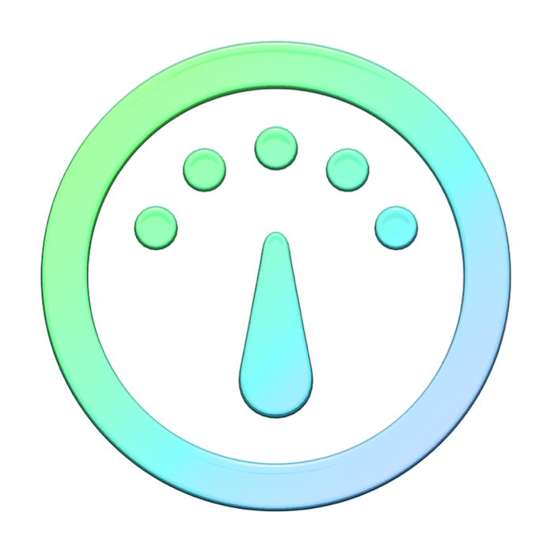

> Navigation: [Technologies](../technologies.md) · [Technology Overviews](../technologyoverviews.md)

# Tools and distribution

Create software on Apple platforms using Xcode and the Swift programming language, and distribute your apps on the App Store.

Software development for Apple platforms starts with Xcode, Apple’s integrated development environment (IDE). Xcode provides the suite of tools you use to create apps. It also supports the Swift programming language, Apple’s preferred language for writing code. After you write, test, and polish your code, distribute it on the App Store or your own website.

Start the development process with the Xcode app, which you use to manage your project’s code and resources. Write your code using Swift, and build and run the results on a real or simulated device. Use the integrated debugger to find and fix issues in your code and verify its behavior.

- Write your code using Swift, Objective-C, C++, or other programming languages.
- Generate code, fix bugs, and navigate unfamiliar code bases using coding intelligence.
- Manage and edit project resources, including source files, assets, localized content, and more.
- Build, run, and debug your code using Xcode, Simulator, and other tools.

Automate the testing of your code using the frameworks and tools that come with Xcode. You can incorporate unit tests into your project to validate your code at compile time, and perform more extensive server-based testing and build management using Xcode Cloud. Improve your app’s efficiency, speed, and energy usage with Instruments.

- Write unit tests to validate the behavior of your code at build time.
- Add continuous integration and delivery (CI/CD) support using Xcode Cloud.
- Invite beta testers to download and run builds of your app using TestFlight.
- Collect data related to your app’s performance using Instruments.

When you’re ready to package your software for distribution and deliver it to your customers, ship it on the App Store to take advantage of the Apple distribution network around the world. You can also support other marketplaces, or deliver software directly to customers yourself.

- Reach a global audience by distributing your apps on the App Store.
- Manage releases and updates, and promote your app.
- View metrics and sales insights.
- Explore alternate distribution options.

## Topics

### Tools and testing

- [Development process](development-process.md) — Discover the tools, programming languages, and resources you use to develop apps on Apple platforms.
- [Testing and performance](testing-and-performance.md) — Discover and fix potential issues in your code by testing and regularly collecting performance metrics.
- [Distribution](distribution.md) — Distribute your apps on the App Store, or make them available to people directly from your website.
