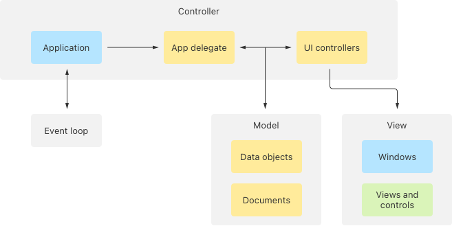
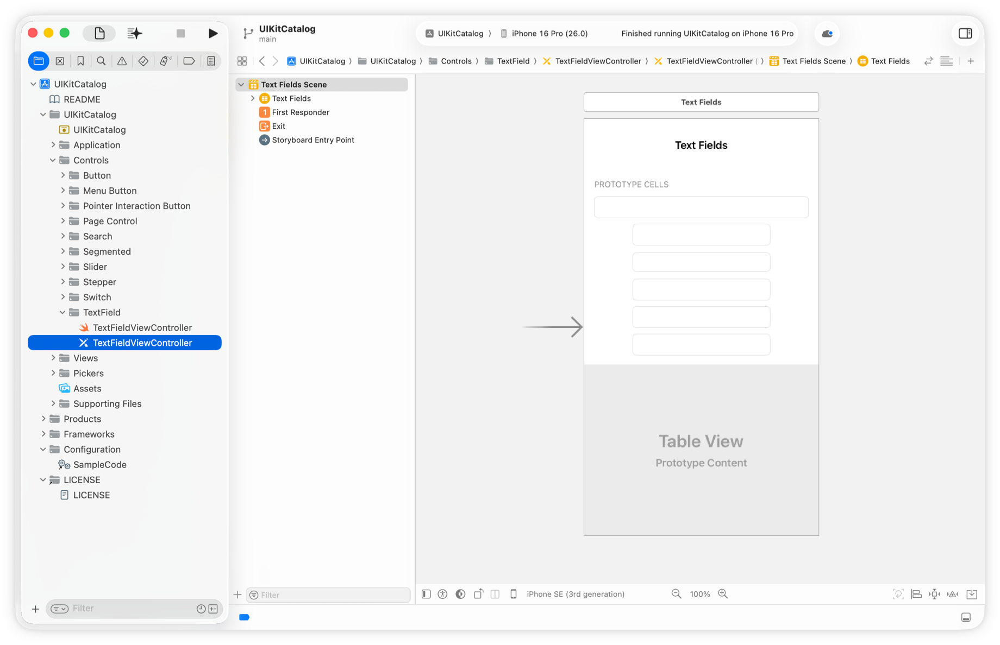
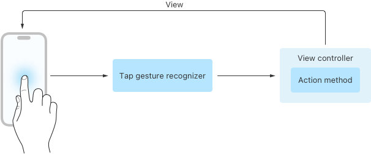

> Navigation: [Technologies](../technologies.md) · [Technology Overviews](../technologyoverviews.md) · [App design and UI](app-design-and-ui.md)

# UIKit and AppKit apps

Build your app using a traditional design approach and the Swift or Objective-C programming language.

[UIKit](../uikit.md) and [AppKit](../appkit.md) both provide a more traditional approach to creating apps that some people might prefer. Both frameworks provide a library of objects that you assemble to create your app. To implement your app’s behavior, you write additional code to update the objects when your data changes or in response to interactions with your app’s interface.

## Assemble your app’s core content

When someone launches your app, your app needs to initialize itself, prepare its interface, check in with the system, begin its main event loop, and start handling events as quickly as possible. When you build your app using UIKit or AppKit, you handle some of these tasks yourself while the frameworks handle the rest.

The main entry point for a UIKit or AppKit app is the app object, which handles the system-required initialization tasks. During the initialization process, the app object calls your custom code to perform related tasks. Specifically, it calls methods of your app delegate object, which is a custom type you provide that adopts the [UIApplicationDelegate](../uikit/uiapplicationdelegate.md) (UIKit) or [NSApplicationDelegate](../appkit/nsapplicationdelegate.md) (AppKit) protocol. The app delegate initializes your app’s data structures, and can also customize your app’s interface to respond to different launch conditions.

Your app delegate is one of many controller objects you use to manage your app’s behavior. UIKit and AppKit use a _model-view-controller_ architecture to manage information. This architecture separates the objects that manage your app’s data from the interface objects you use to present that data. Controller objects sit between your data and views and manage the flow of information between them. Separating the responsibilities makes it easier to change your interface without changing your underlying data objects.

An illustration of the model-view-controller architecture and the objects in each layer. The model layer contains data objects and documents. The view layer contains windows, views, and controls. The controller layer contains the application, app delegate, and UI controllers.

One special data object you use to manage content is the document object. If your app manages document-based content, use the [UIDocument](../uikit/uidocument.md) (UIKit) or [NSDocument](../appkit/nsdocument.md) (AppKit) type to manage your document’s data. The document types integrate with other framework objects to support behaviors people expect, like autosave. Adopting them reduces the amount of work you need to do to add document support to your app.

Another important object in UIKit apps is the [trait collection](../uikit/uitraitcollection.md). Traits help you make decisions about how to present your app’s content on different types of devices. For example, traits indicate whether your app runs in a large or small space. You use trait information to make decisions about your content, such as what views to display in your interface.

## Assemble your interface

Construct your app’s interface from system-provided views and controls, or create your own views when you want a more custom appearance. Views handle the basic presentation of content in your interface. [UIKit](../uikit/views-and-controls.md) and [AppKit](../appkit/views-and-controls.md) provide standard views for buttons, text fields, and other views you use as is. They also provide an architecture for creating views with any content you want. You can draw custom content in your views, or use them to organize one or more child views.

Manage major segments of your app’s interface using [UIKit](../uikit/view-controllers.md) or [AppKit](../appkit/view-management.md) view controllers. A view controller [manages a set of views](../uikit/managing-content-in-your-app-s-windows.md) that share a common purpose. For example, one view controller might display a list of items and allow people to search the list, while a second view controller displays the details for a single item. When someone selects an item in the list, you create the second view controller, fill it with the detailed data, and present it. Presenting a view controller typically replaces the previous one, but if there’s sufficient space you can design your interface to show multiple view controllers simultaneously. AppKit apps also use [window controllers](../appkit/nswindowcontroller.md) to manage the content of windows.

Build your interface visually in Xcode and connect it your app’s code. Use the visual editor to configure the appearance and values for the views and controls in each of your scenes. You can also define transitions from one part of your UI to another. The visual editor saves all of your changes in a resource file. At runtime, you load that resource file and use its contents to reconstitute your UI.

Your interface needs to be able to fit different-sized devices and different amounts of space on one device. Instead of adjusting the size and position of views manually, Auto Layout in [UIKit](../uikit/view-layout.md) and [AppKit](../appkit/view-layout.md) lets you adjust views using rules-based constraints. For example, you might create a rule to pin the edges of your view to the edges of the available space. When the size of your interface changes for any reason, the system automatically reapplies the rules to adjust the size and position of your views.

> [!note] tvOS
> If you’re developing apps for tvOS, the [TVUIKit](../tvuikit.md) framework offers additional tvOS-specific views and features. Use this framework together with UIKit to improve your experience on Apple TV.

UIKit and AppKit require that all UI-related tasks run on your app’s main thread to ensure correctness. If your app uses [Dispatch](../dispatch.md) to perform work asynchronously on background threads, make sure to direct code that modifies your interface to the [main dispatch queue](../dispatch/dispatchqueue/main.md).

## Handle events and interactions

Interactions with your app can come from a variety of sources. On a Mac, people interact with your app primarily using the [mouse and keyboard](../appkit/mouse-keyboard-and-trackpad.md), but they can also use the trackpad of a MacBook Pro, an input tablet, or other input device. On iPad, people interact by [touching the screen](../uikit/handling-touches-in-your-view.md), but can also interact with apps using Apple Pencil or a Magic Keyboard. UIKit and AppKit intercept events coming from the system and redirect them to your app’s views and controller objects.

Most of the time, apps handle events using gesture recognizers, which track individual events and notify you when they match a specific pattern. All you have to do is provide a method or code block to execute when the gesture occurs. Use them to detect [taps, pans, pinches, and other gestures](../uikit/touches-presses-and-gestures.md#Standard-gestures) on iOS devices. In macOS, use them to detect [mouse clicks, long-presses, pans, and trackpad interactions](../appkit/gestures.md).

The controls in your interface handle their own events and report interactions to your app using the [target-action design pattern](../uikit/responding-to-control-based-events-using-target-action.md). When a relevant interaction occurs, the control executes the method or block you provide. You use your code to take whatever actions are appropriate. For example, when someone taps a button, you might dismiss part of your UI, update some data, or update related views. Gesture recognizers use this same design pattern to execute the code you provide.

Another way people interact with your app is using menus. In AppKit, put commonly used commands in your app’s [menu bar](../appkit/menus-cursors-and-the-dock.md). You can also add [context menus](../appkit/nsmenu.md#Displaying-Context-Sensitive-Help) to your views to display view-specific commands. iPadOS apps also support [menu bars](../uikit/adding-menus-and-shortcuts-to-the-menu-bar-and-user-interface.md) and [context menus](../uikit/uicontextmenuinteraction.md). Other platforms offer varying levels of support for menus.

The event-handling infrastructure relies on responder objects to distribute events throughout your app. A responder is an instance of the [UIResponder](../uikit/uiresponder.md) (UIKit) or [NSResponder](../appkit/nsresponder.md) (AppKit) class. The application object, windows, views, view controllers, and window controllers (AppKit only) are all responder objects. Explore the responder classes to see what other types of events you can handle in your apps.

## Explore other features

In addition to displaying content using the framework-provided views, you can draw anything you want using the [UIKit](../uikit/drawing.md) and [AppKit](../appkit/drawing.md) drawing support. Custom views offer a blank canvas for drawing anything you want, including:

- Stroked or filled shapes, including Bézier paths
- Bitmap and vector images
- Formatted text
- Visual effects like drop shadows and gradients

The most efficient way to draw text is to add [UIKit](../uikit/text-display-and-fonts.md) and [AppKit](../appkit/text-display.md) text views to your view hierarchies. In addition to being optimized for text display, these views also support Writing Tools and other standard system behaviors. However, if you’re implementing a custom text view and need to lay out and render text yourself, [TextKit](../uikit/textkit.md) provides the support you need.
