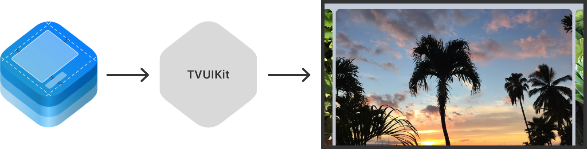

> Navigation: [Technologies](technologies.md)

# TVUIKit

Framework

Show common user interface elements from Apple TV in your native app.

## Overview

When you build an app for tvOS with [UIKit](uikit.md), you can use [TVUIKit](tvuikit.md) to refine the display of your content for a TV environment. Use the [TV Services](tvservices.md) framework to provide deeper integration between your app and Apple TV.

For more information about combining Apple technologies to build a great Apple TV experience, see [Planning your tvOS app](https://developer.apple.com/tvos/planning/#build-the-data-structures-youll-use-in-your-app).

A figure containing a hexagonal UIKit framework icon, an arrow pointing to the right, a hexagon with the label TVUIKit, an arrow pointing to the right, and a TV screen. The TV screen shows a centered image of a palm tree, with other images partially visible on either side of the palm tree.

## Topics

### Collections of content

- [Creating immersive experiences using a full-screen layout](tvuikit/creating-immersive-experiences-using-a-full-screen-layout.md) — Display content with a collection view that maximizes the tvOS experience.
- [TVCollectionViewFullScreenLayout](tvuikit/tvcollectionviewfullscreenlayout.md) — A collection view layout that organizes items into a browsable, full-screen display format.
- [TVCollectionViewDelegateFullScreenLayout](tvuikit/tvcollectionviewdelegatefullscreenlayout.md) — Methods that send notifications of events during cell transitions.
- [TVCollectionViewFullScreenCell](tvuikit/tvcollectionviewfullscreencell.md) — A full-screen cell to use in full-screen display format.
- [TVCollectionViewFullScreenLayoutAttributes](tvuikit/tvcollectionviewfullscreenlayoutattributes.md) — Attributes to manage the appearance of the collection view’s layout.

### Content views

- [TVMediaItemContentView](tvuikit/tvmediaitemcontentview.md) — A view that represents media content, such as movies and TV shows.
- [TVMonogramContentView](tvuikit/tvmonogramcontentview.md) — A view that contains a circular image of a person or the person’s initials.

### Numeric input

- [TVDigitEntryViewController](tvuikit/tvdigitentryviewcontroller.md) — A view controller that enables the user to enter digits, like a passcode, in your app.

### Lockup views

- [TVLockupView](tvuikit/tvlockupview.md) — A focusable view that presents main content, like a movie poster, and an optional header and footer.
- [TVLockupViewComponent](tvuikit/tvlockupviewcomponent.md) — The protocol for responding to lockup view state changes.
- [TVLockupHeaderFooterView](tvuikit/tvlockupheaderfooterview.md) — A view that contains header and footer information.
- [TVCardView](tvuikit/tvcardview.md) — A view that responds to focus interaction with a motion effect it applies to all of its subviews.
- [TVPosterView](tvuikit/tvposterview.md) — An optimized view for displaying an image, a header, and a footer.
- [TVCaptionButtonView](tvuikit/tvcaptionbuttonview.md) — A button-like view that responds to user interactions.
- [TVMonogramView](tvuikit/tvmonogramview.md) — A specialized lockup view that contains a circular image of a person or the person’s initials, along with a footer view. _(deprecated)_
