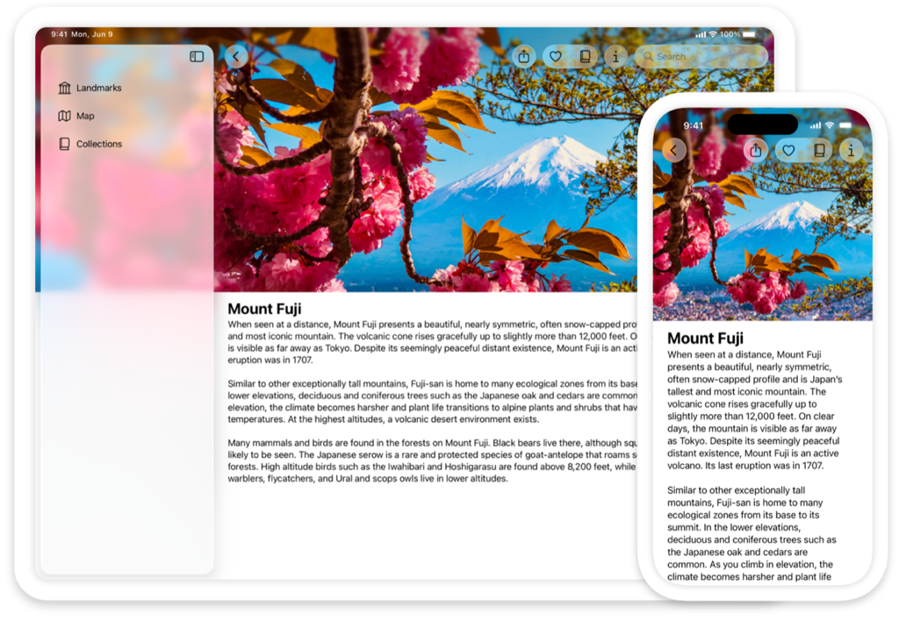

> Navigation: [Technologies](technologies.md)

# UIKit

Framework

Construct and manage a graphical, event-driven user interface for your iOS, iPadOS, or tvOS app.

## Overview

UIKit provides a variety of features for building apps, including components you can use to construct the core infrastructure of your iOS, iPadOS, or tvOS apps. The framework provides the window and view architecture for implementing your UI, the event-handling infrastructure for delivering Multi-Touch and other types of input to your app, and the main run loop for managing interactions between the user, the system, and your app.

UIKit also includes support for animations, documents, drawing and printing, text management and display, search, app extensions, resource management, and getting information about the current device. You can also customize accessibility support, and localize your app’s interface for different languages, countries, or cultural regions.

UIKit works seamlessly with the [SwiftUI](swiftui.md) framework, so you can implement parts of your UIKit app in SwiftUI or mix interface elements between the two frameworks. For example, you can place UIKit views and view controllers inside SwiftUI views, and vice versa.

To build a macOS app, you can use [SwiftUI](swiftui.md) to create an app that works across all of Apple’s platforms, or use [AppKit](appkit.md) to create an app for Mac only. Alternatively, you can bring your UIKit iPad app to the Mac with [Mac Catalyst](uikit/mac-catalyst.md).

> [!important] Important
> Use UIKit classes only from your app’s main thread or main dispatch queue, unless otherwise indicated in the documentation for those classes. This restriction particularly applies to classes that derive from [UIResponder](uikit/uiresponder.md) or that involve manipulating your app’s user interface in any way.

## Topics

### Essentials

- [Adopting Liquid Glass](technologyoverviews/adopting-liquid-glass.md) — Find out how to bring the new material to your app.
- [UIKit updates](updates/uikit.md) — Learn about important changes to UIKit.
- [About app development with UIKit](uikit/about-app-development-with-uikit.md) — Learn about the basic support that UIKit and Xcode provide for your iOS and tvOS apps.
- [Protecting the User’s Privacy](uikit/protecting-the-user-s-privacy.md) — Secure personal data, and respect user preferences for how data is used.

### App structure

- [App and environment](uikit/app-and-environment.md) — Manage life-cycle events and your app’s UI scenes, and get information about traits and the environment in which your app runs.
- [Documents, data, and pasteboard](uikit/documents-data-and-pasteboard.md) — Organize your app’s data and share that data on the pasteboard.
- [Resource management](uikit/resource-management.md) — Manage the images, strings, storyboards, and nib files that you use to implement your app’s interface.
- [App extensions](uikit/app-extensions.md) — Extend your app’s basic functionality to other parts of the system.
- [Interprocess communication](uikit/interprocess-communication.md) — Display activity-based services to people.
- [Mac Catalyst](uikit/mac-catalyst.md) — Create a version of your iPad app that users can run on a Mac device.

### User interface

- [Views and controls](uikit/views-and-controls.md) — Present your content onscreen and define the interactions allowed with that content.
- [View controllers](uikit/view-controllers.md) — Manage your interface using view controllers and facilitate navigation around your app’s content.
- [View layout](uikit/view-layout.md) — Use stack views to lay out the views of your interface automatically. Use Auto Layout when you require precise placement of your views.
- [Appearance customization](uikit/appearance-customization.md) — Apply Liquid Glass to views, support Dark Mode in your app, customize the appearance of bars, and use appearance proxies to modify your UI.
- [Animation and haptics](uikit/animation-and-haptics.md) — Provide feedback to users using view-based animations and haptics.
- [Windows and screens](uikit/windows-and-screens.md) — Provide a container for your view hierarchies and other content.

### User interactions

- [Touches, presses, and gestures](uikit/touches-presses-and-gestures.md) — Encapsulate your app’s event-handling logic in gesture recognizers so that you can reuse that code throughout your app.
- [Menus and shortcuts](uikit/menus-and-shortcuts.md) — Simplify interactions with your app using menu systems, contextual menus, Home Screen quick actions, and keyboard shortcuts.
- [Drag and drop](uikit/drag-and-drop.md) — Bring drag and drop to your app by using interaction APIs with your views.
- [Pointer interactions](uikit/pointer-interactions.md) — Support pointer interactions in your custom controls and views.
- [Apple Pencil interactions](uikit/apple-pencil-interactions.md) — Handle user interactions like double tap and squeeze on Apple Pencil.
- [Focus-based navigation](uikit/focus-based-navigation.md) — Navigate the interface of your UIKit app using a remote, game controller, or keyboard.
- [Accessibility for UIKit](uikit/accessibility-for-uikit.md) — Make your UIKit apps accessible to everyone who uses iOS and tvOS.

### Graphics, drawing, and printing

- [Images and PDF](uikit/images-and-pdf.md) — Create and manage images, including those that use bitmap and PDF formats.
- [Drawing](uikit/drawing.md) — Configure your app’s drawing environment using colors, renderers, draw paths, strings, and shadows.
- [Printing](uikit/printing.md) — Display the system print panels and manage the printing process.

### Text

- [Text display and fonts](uikit/text-display-and-fonts.md) — Display text, manage fonts, and check spelling.
- [TextKit](uikit/textkit.md) — Manage text storage and perform custom layout of text-based content in your app’s views.
- [Keyboards and input](uikit/keyboards-and-input.md) — Configure the system keyboard, create your own keyboards to handle input, or detect key presses on a physical keyboard.
- [Writing Tools](uikit/writing-tools.md) — Add support for Writing Tools to your app’s text views.
- [Handwriting recognition](uikit/handwriting-recognition.md) — Configure text fields and custom views that accept text to handle input from Apple Pencil.

### Deprecated

- [Deprecated symbols](uikit/deprecated-symbols.md) — Review unsupported symbols and their replacements.

### Reference

- [UIKit Enumerations](uikit/uikit-enumerations.md)
- [UIKit Constants](uikit/uikit-constants.md) — This document describes constants that are used throughout the UIKit framework.
- [UIKit Data Types](uikit/uikit-data-types.md) — The UIKit framework defines data types that are used in multiple places throughout the framework.
- [UIKit Functions](uikit/uikit-functions.md) — The UIKit framework defines a number of functions, many of them used in graphics and drawing operations.

### Structures

- [UITraitSystemPrefersReducedResourceUsage](uikit/uitraitsystemprefersreducedresourceusage-swift.struct.md)

### Macros

- [Preview(_:traits:arguments:body:)](<uikit/preview(__traits_arguments_body_)-6gm4c.md>)
- [Preview(_:traits:arguments:body:)](<uikit/preview(__traits_arguments_body_)-7cbjv.md>)

### Enumerations

- [UITextGrammarCheckingType](uikit/uitextgrammarcheckingtype.md) _(beta)_
