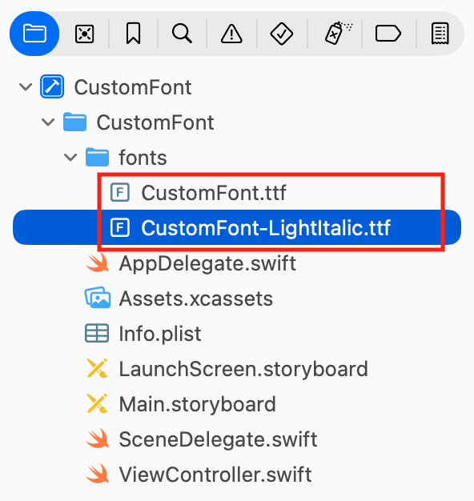
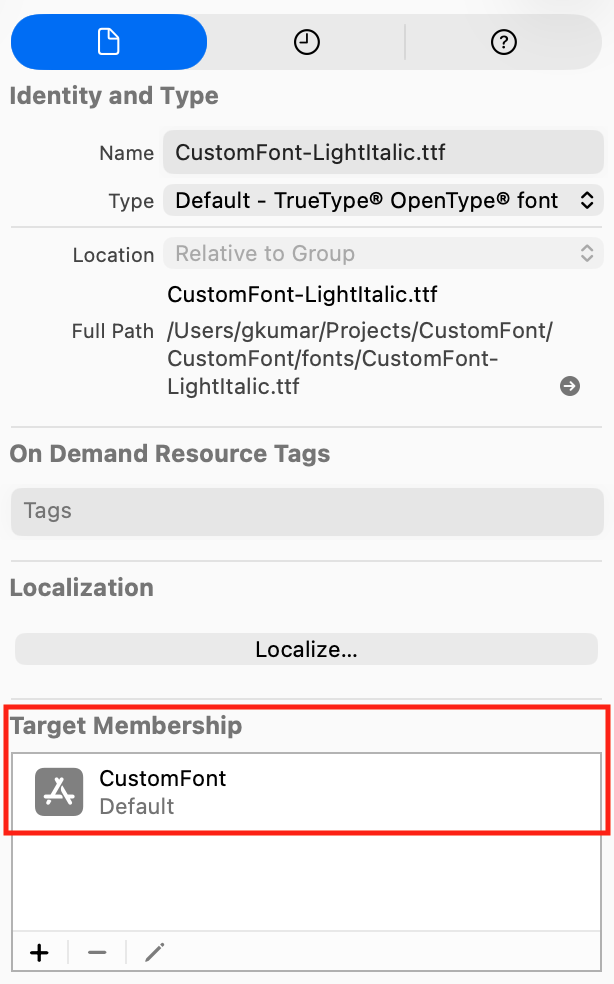
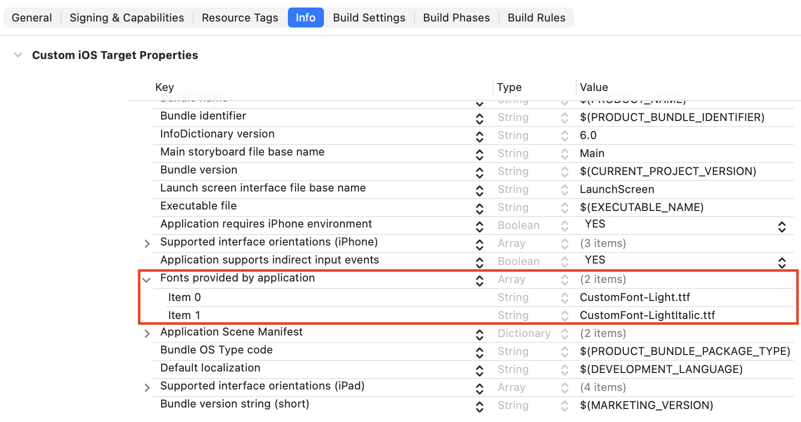
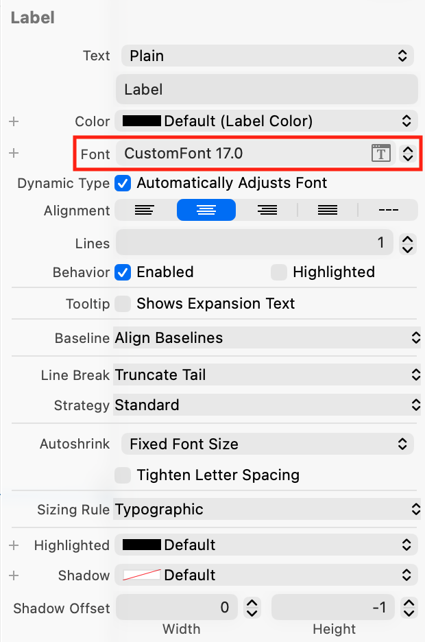

> Navigation: [Technologies](../technologies.md) · [UIKit](../uikit.md) · [Text display and fonts](text-display-and-fonts.md)

# Adding a custom font to your app

<sub>Article</sub>

Add a custom font to your app and use it in your app’s interface.

## Overview

Your app isn’t limited to the custom fonts provided by iOS. If your company has its own branded font, for example, you can use it in your app. Add the font file that contains your font to your app bundle, then use your font the same way you use any of the iOS-provided custom fonts.

### Add the font file to your Xcode project

To add a font file to your Xcode project, select _File \> Add Files to “Your Project Name”_ from the menu bar, or drag the file from Finder and drop it into your Xcode project. You can add True Type Font (.ttf) and Open Type Font (.otf) files.



Also, make sure the font file is a target member of your app; otherwise, the project will not distribute the font file as part of your app.



### Register your font file with iOS

After adding the font file to your project, you need to let iOS know about the font. To do this, add the key “Fonts provided by application” to the information property list (the raw key name is `UIAppFonts`). Xcode creates an array value for the key; add the names of each font file as items of the array. Be sure to include the file extension as part of the name.



<sub>Screenshot of Xcode showing the contents of the Info.plist file. The 'Fonts provided by application' key contains the filenames of two font files.</sub>

Include each font file you add to your project in this array; otherwise, the font will not be available to your app.

### Use your custom font in Interface Builder

After you add the font file to your Xcode project and its _Info.plist_, you can begin assigning the font to UI objects like [UILabel](uilabel.md) and [UITextField](uitextfield.md). If you’re using Interface Builder, assign the UI object’s _Font_ setting to your custom font using the Attribute Inspector.



### Use your custom font in source code

You can create an instance of your custom font in source code. To do this, you need to know the font name.  However, the name of the font isn’t always obvious, and rarely matches the font file name. A quick way to find the font name is to get the list of fonts available to your app, which you can do with the following code:

```swift
for family in UIFont.familyNames.sorted() {
    let names = UIFont.fontNames(forFamilyName: family)
    print("Family: \(family) Font names: \(names)")
}
```

Once you know the font name, create an instance of the custom font using [UIFont](uifont.md). If your app supports Dynamic Type, you can also get a scaled instance of your font, as shown here:

```swift
guard let customFont = UIFont(name: "CustomFont-Light", size: UIFont.labelFontSize) else {
    fatalError("""
        Failed to load the "CustomFont-Light" font.
        Make sure the font file is included in the project and the font name is spelled correctly.
        """
    )
}
label.font = UIFontMetrics.default.scaledFont(for: customFont)
label.adjustsFontForContentSizeCategory = true
```

For more information on using scaled fonts, see [Scaling fonts automatically](scaling-fonts-automatically.md).

## See Also

### Fonts

- [Scaling fonts automatically](scaling-fonts-automatically.md) — Scale text in your interface automatically using Dynamic Type.
- [UIFont](uifont.md) — An object that provides access to the font’s characteristics.
- [UIFontDescriptor](uifontdescriptor.md) — A collection of attributes that describes a font.
- [SymbolicTraits](uifontdescriptor/symbolictraits-swift.struct.md) — Constants that describe the stylistic aspects of a font.
- [UIFontMetrics](uifontmetrics.md) — A utility object for obtaining custom fonts that scale to support Dynamic Type.
