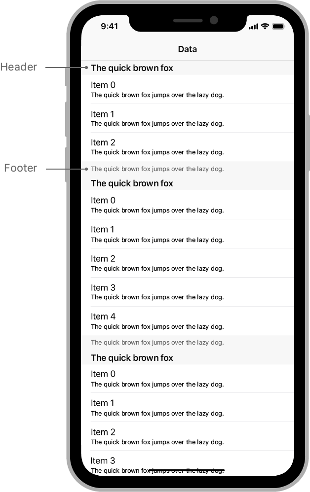
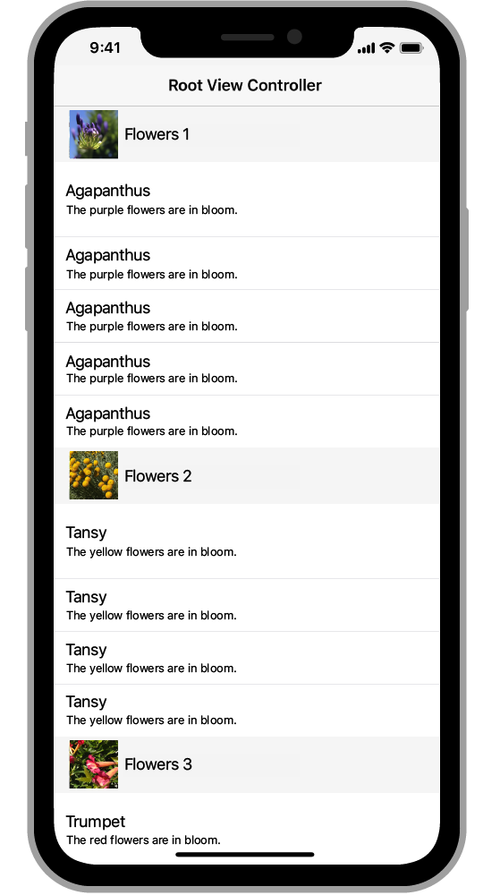

> Navigation: [Technologies](../technologies.md) · [UIKit](../uikit.md) · [Views and controls](views-and-controls.md) · [Table views](table-views.md)

# Adding headers and footers to table sections

<sub>Article</sub>

Differentiate groups of rows visually by adding header and footer views to your table view’s sections.

## Overview

Use header and footer views as visual markers for the beginning and end of sections. Header and footer views are optional, and you can customize them as much or as little as you want.



To create a basic header or footer with a text label, override the [- tableView:titleForHeaderInSection:](<uitableviewdatasource/tableview(__titleforheaderinsection_).md>) or [- tableView:titleForFooterInSection:](<uitableviewdatasource/tableview(__titleforfooterinsection_).md>) method of your table’s data source object. The table view creates a standard header or footer for you and inserts it into the table at the specified location.

```swift
// Create a standard header that includes the returned text.
override func tableView(_ tableView: UITableView, titleForHeaderInSection 
                            section: Int) -> String? {
   return "Header \(section)"
}

// Create a standard footer that includes the returned text.
override func tableView(_ tableView: UITableView, titleForFooterInSection 
                            section: Int) -> String? {
   return "Footer \(section)"
}

```

> [!note] Note
> Headers and footers normally apply to a single section, but you can also provide a single header or footer view for the entire table by using the [tableHeaderView](uitableview/tableheaderview.md) or [tableFooterView](uitableview/tablefooterview.md) properties of your table view. The global header appears at the top of your table’s content, and the global footer appears at the bottom.

### Customize the header and footer views

Custom header and footer views give the sections of your table a unique appearance. With custom headers and footers, you specify the views you want and position them anywhere within the allotted space. You can also provide different header or footer views for different sections of your table.

To create custom header or footer views:

1. Use [UITableViewHeaderFooterView](uitableviewheaderfooterview.md) objects to define the appearance of your headers and footers.
2. Register your [UITableViewHeaderFooterView](uitableviewheaderfooterview.md) objects with your table view.
3. Implement the [- tableView:viewForHeaderInSection:](<uitableviewdelegate/tableview(__viewforheaderinsection_).md>) and [- tableView:viewForFooterInSection:](<uitableviewdelegate/tableview(__viewforfooterinsection_).md>) methods in your table view delegate object to create and configure your views.

Always use a [UITableViewHeaderFooterView](uitableviewheaderfooterview.md) object for your headers and footers. That view supports the same reuse model that cells employ, allowing you to recycle views instead of creating them every time. After you register your header or footer view, use the table view’s [- dequeueReusableHeaderFooterViewWithIdentifier:](<uitableview/dequeuereusableheaderfooterview(withidentifier_).md>) method to request instances of that view. If recycled header or footer views are available, the table view returns those first, before creating new ones.

You can use a [UITableViewHeaderFooterView](uitableviewheaderfooterview.md) object as is and add views to its [contentView](uitableviewheaderfooterview/contentview.md) property, or you can subclass and add your views. Position your subviews inside the content view by using a stack view or Auto Layout constraints. To change the background behind your content, modify the [backgroundView](uitableviewheaderfooterview/backgroundview.md) property of the header-footer view. The following example code shows a custom header view that positions the image and label views at creation time.

```swift
class MyCustomHeader: UITableViewHeaderFooterView {
    let title = UILabel()
    let image = UIImageView()

    override init(reuseIdentifier: String?) {
        super.init(reuseIdentifier: reuseIdentifier)
        configureContents()
    }

    func configureContents() {
        image.translatesAutoresizingMaskIntoConstraints = false
        title.translatesAutoresizingMaskIntoConstraints = false

        contentView.addSubview(image)
        contentView.addSubview(title)

        // Center the image vertically and place it near the leading
        // edge of the view. Constrain its width and height to 50 points.
        NSLayoutConstraint.activate([
            image.leadingAnchor.constraint(equalTo: contentView.layoutMarginsGuide.leadingAnchor),
            image.widthAnchor.constraint(equalToConstant: 50),
            image.heightAnchor.constraint(equalToConstant: 50),
            image.centerYAnchor.constraint(equalTo: contentView.centerYAnchor),
        
            // Center the label vertically, and use it to fill the remaining
            // space in the header view. 
            title.heightAnchor.constraint(equalToConstant: 30),
            title.leadingAnchor.constraint(equalTo: image.trailingAnchor, 
                   constant: 8),
            title.trailingAnchor.constraint(equalTo: 
                   contentView.layoutMarginsGuide.trailingAnchor),
            title.centerYAnchor.constraint(equalTo: contentView.centerYAnchor)
        ])
    }
}
```

Register your header view as part of configuring your table view.

```swift
override func viewDidLoad() {
   super.viewDidLoad()
   
   // Register the custom header view.
   tableView.register(MyCustomHeader.self, 
       forHeaderFooterViewReuseIdentifier: "sectionHeader")
}
```

In your delegate’s [- tableView:viewForHeaderInSection:](<uitableviewdelegate/tableview(__viewforheaderinsection_).md>) method, create and configure your custom view. The following example code dequeues the registered custom header and configures its title and image properties.

```swift
override func tableView(_ tableView: UITableView, 
        viewForHeaderInSection section: Int) -> UIView? {
   let view = tableView.dequeueReusableHeaderFooterView(withIdentifier:
               "sectionHeader") as! MyCustomHeader
   view.title.text = sections[section]
   view.image.image = UIImage(named: sectionImages[section])

   return view
}
```

The following image shows the resulting headers.



<sub>Illustration showing custom headers. The custom headers contain an image and string explaining the contents of each section.</sub>

### Change the height of headers and footers

A table view tracks the height of section headers and footers separately from the views that represent them. [UITableView](uitableview.md) provides default sizes for both items. If all of your headers (or all of your footers) are the same height, specify that height using the table view’s [sectionHeaderHeight](uitableview/sectionheaderheight.md) and [sectionFooterHeight](uitableview/sectionfooterheight.md) properties, or use the default values provided by the table view.

If your header or footer heights aren’t all the same, or can change dynamically, provide the heights using the [- tableView:heightForHeaderInSection:](<uitableviewdelegate/tableview(__heightforheaderinsection_).md>) and [- tableView:heightForFooterInSection:](<uitableviewdelegate/tableview(__heightforfooterinsection_).md>) methods of your delegate object. When you implement these methods, you must provide values for every header and footer in your table. The table view asks for the heights of visible headers and footers only. As the user scrolls, the table view asks you to provide the height for each one as it appears, including when it moves offscreen and then back onscreen.

## See Also

### Related Documentation

- [Estimating the height of a table’s scrolling area](estimating-the-height-of-a-table-s-scrolling-area.md) — Provide height estimates for your table view’s headers, footers, and rows to ensure that scrolling accurately reflects the size of your content.

### Cells, headers, and footers

- [Configuring the cells for your table](configuring-the-cells-for-your-table.md) — Specify the appearance and content of your table’s rows by defining one or more prototype cells in your storyboard.
- [Creating self-sizing table view cells](creating-self-sizing-table-view-cells.md) — Create table view cells that support Dynamic Type and use system spacing constraints to adjust the spacing surrounding text labels.
- [UITableViewCell](uitableviewcell.md) — The visual representation of a single row in a table view.
- [UITableViewHeaderFooterView](uitableviewheaderfooterview.md) — A reusable view that you place at the top or bottom of a table section to display additional information for that section.
