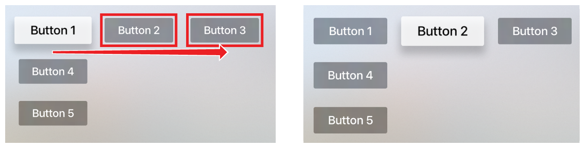
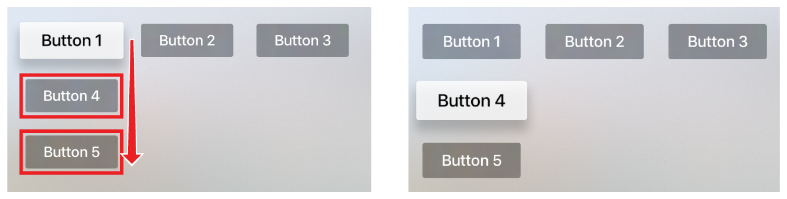
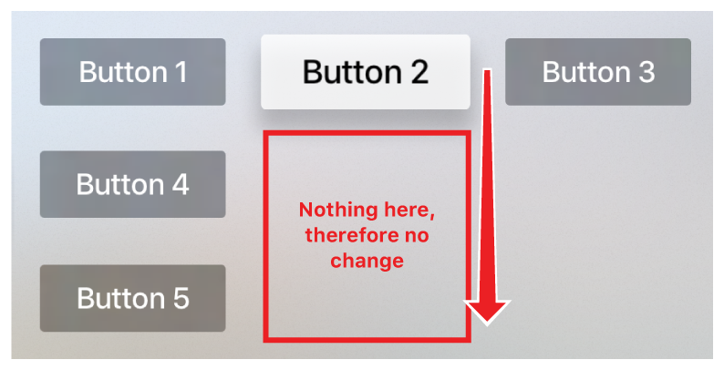

> Navigation: [Technologies](../technologies.md) · [UIKit](../uikit.md) · [Focus-based navigation](focus-based-navigation.md)

# Adding user-focusable elements to a tvOS app

<sub>Article</sub>

Create intuitive and easily manipulated user-interactive controls for your tvOS app.

## Overview

On Apple TV, people use a remote or game controller to navigate through interface elements like movie posters, apps, or buttons, highlighting each item as they come to it. The highlighted item is said to be _focused_ or _in focus_. It appears elevated or otherwise distinct from other items. An item is considered focused when the user has highlighted it, but not selected it. The user moves focus by navigating through different UI items, which triggers a focus update.

### Add focusable items to the view

In Xcode, search the Library pane for the item you want to add to your app, and drag it to your app’s storyboard. Several UIKit elements are focusable by default, including buttons ([UIButton](uibutton.md)), text fields ([UITextField](uitextfield.md)), and table cells ([UITableViewCell](uitableviewcell.md)). The top-left item is in focus when your app launches. (In right-to-left languages, the top-right item is initially in focus.) You don’t need to do anything to UIKit elements that are focusable by default. However, you can add SceneKit and SpriteKit nodes as focusable elements. To make a SceneKit or SpriteKit node focusable, set the [focusBehavior](../spritekit/sknode/focusbehavior.md) property of the node to `focusable`, as shown below.

```swift
node.focusBehavior = .focusable
```

### Design your layout in a grid pattern

The easiest way to ensure that focus moves between focusable items is to arrange the items in a grid pattern. Swiping on the remote triggers the focus engine—the system that controls focus and movement—to find all of the focusable items in the direction of the swipe. The first item found then becomes the newly focused item. The following image shows the items found by the focus engine when the user swipes right, and the resulting focused item.



The following image shows the items found by the focus engine when the user swipes down, and the resulting focused item.



When the focus engine doesn’t find any items in the direction of the swipe, by default the focused item doesn’t change, as shown in the following image.



When necessary, you can change the default behavior by using [UIFocusGuide](uifocusguide.md) to redirect focus to other focusable items in the user interface.

## See Also

### Focus interactions

- [Navigating an app’s user interface using a keyboard](navigating-an-app-s-user-interface-using-a-keyboard.md) — Navigate between user interface elements using a keyboard and focusable UI elements in iPad apps and apps built with Mac Catalyst.
- [About focus interactions for Apple TV](about-focus-interactions-for-apple-tv.md) — Design and implement intuitive control schemes for menus and interactive user interface layouts.
- [UIFocusEnvironment](uifocusenvironment.md) — A set of methods that define the focus behavior for a branch of the view hierarchy.
- [UIFocusSystem](uifocussystem.md) — Queries and reevaluates the currently focused item.
- [UIFocusUpdateContext](uifocusupdatecontext.md) — An object that provides information relevant to a specific focus update from one view to another.
- [UIFocusItem](uifocusitem.md) — An object that can become focused.
- [UIFocusMovementHint](uifocusmovementhint.md) — Provides movement hint information for the focused item.
- [UIFocusItemContainer](uifocusitemcontainer.md) — The container responsible for providing geometric context to focus items within a given focus environment.
- [UIFocusItemScrollableContainer](uifocusitemscrollablecontainer.md) — A type of focus item container that supports automatic scrolling of focusable content.
- [UIFocusGroupPriority](uifocusgrouppriority.md) — The importance of an item within a focus group, used by the focus system to determine the group’s primary item.
