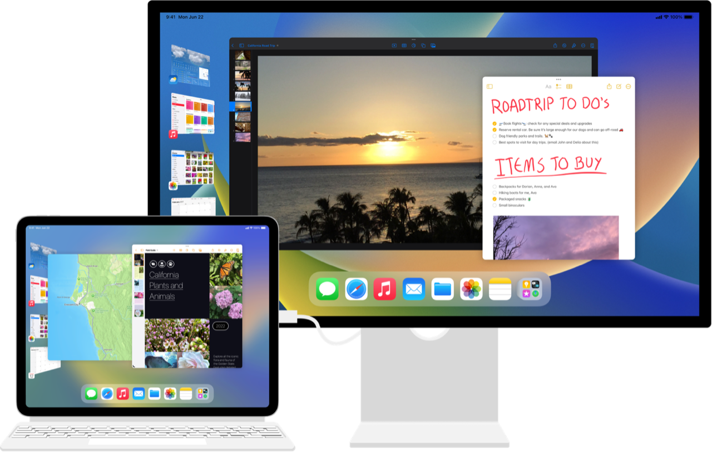

> Navigation: [Technologies](../technologies.md) · [UIKit](../uikit.md) · [App and environment](app-and-environment.md)

# Building a desktop-class iPad app

Article

Optimize your iPad app’s user experience by adopting desktop-class enhancements for multitasking with Stage Manager, document interactions, text editing, search, and more.

## Overview

People can use an iPad with a Magic Keyboard and an external display to achieve desktop-class productivity. Build your app to take advantage of features that help people increase their efficiency, customize their workflows, and complete tasks more quickly. After you create a desktop-class iPad app, bring your app directly over to the Mac with minimal additional effort using Mac Catalyst. Bring your app to Apple Vision Pro using the details in [Making your existing app compatible with visionOS](../visionos/making-your-app-compatible-with-visionos.md).

Image of an iPad with a Magic Keyboard connected to an external display with a cable. The built-in screen and connected screen both show the multitasking experience with Stage Manager. Several open apps appear side by side in the center of the screens, with other apps available on the left side of the screen for quick access.

### Enhance the multitasking experience with Stage Manager

A great iPad app supports productivity by enabling quick, complex workflows across multiple apps with Stage Manager, which people can use to quickly switch to other open apps and windows on the side of the screen. People can also dynamically resize app windows to show many open windows side by side on the iPad or on an external display.

Follow these steps to support a great multitasking experience with Stage Manager:

- Build your UI with scenes. A scene contains the windows and view controllers for presenting one instance of your UI. Adopt scenes as part of your app’s core infrastructure, and use them to adjust your app’s behavior at important times, such as when your scene transitions to the foreground, changes orientation, or moves to an external display. Use scenes, instead of [UIScreen](uiscreen.md), to determine which hardware display shows your UI. For more information, see [Scenes](scenes.md).
- Support a variety of workflows with multiple app windows. Consider letting people view and interact with more than one app window at a time to enable workflows like viewing multiple documents simultaneously or quickly dragging and dropping content from one part of your app to another. Use scenes to support multiple app windows. For more information, see [Supporting multiple windows on iPad](supporting-multiple-windows-on-ipad.md).
- Respond to window resizing. Because people who use Stage Manager can dynamically resize their iPad app windows, your app’s UI can transition through a broad range of sizes. Design your UI for flexible layout configurations, and make sure your app adapts to different window sizes quickly and smoothly. Discover your app’s environment with [UITraitCollection](uitraitcollection.md), and adapt to it by using Auto Layout or by registering for trait change notifications in your view controllers or views with [UITraitChangeObservable](uitraitchangeobservable-67e94.md) in Swift or [UITraitChangeRegistration](uitraitchangeregistration.md) in Objective-C.
- Consider the best use of additional space that an external display provides. Support interactive resizable windows through scenes with a [UIWindowSceneSessionRoleApplication](uiscenesession/role-swift.struct/windowapplication.md) role, or present noninteractive content with a [UIWindowSceneSessionRoleExternalDisplayNonInteractive](uiscenesession/role-swift.struct/windowexternaldisplaynoninteractive.md) scene. For more information, see [Presenting content on a connected display](presenting-content-on-a-connected-display.md).
- Test your UI on different devices, in different environments. Consider the various configurations and sizes your UI can appear in, and make sure to test your app under those conditions. For example, test under the following conditions: full screen, Split View, Slide Over, Picture in Picture (PIP), and dynamic resizing in all dimensions while using Stage Manager with an external display.

> [!note] Related Sessions from WWDC22
> Session 10068: [What’s new in UIKit](https://developer.apple.com/wwdc22/10068)

### Support powerful document-editing workflows

Navigation-based apps support a specialized editor style that brings important document-editing features to the forefront and supports user customization. Navigation-based apps can also use a title menu to surface document management operations, sharing capabilities, and custom actions.

Follow these steps to support document-editing enhancements on iPad:

- Switch to editor-style navigation for document-editing apps. Navigation-based interfaces can use the [UINavigationItemStyleEditor](uinavigationitem/itemstyle/editor.md) style to bring the content density and flexibility of the Mac toolbar to iPad. This style moves the title to the leading side to open up more space for important controls, so you can provide fast access to common actions with a single tap. Specify important controls using [centerItemGroups](uinavigationitem/centeritemgroups.md), and enable people to customize the layout of those controls using [customizationIdentifier](uinavigationitem/customizationidentifier.md).
- Support document interactions through a title menu. Show a menu when a person taps the document’s title using [titleMenuProvider](uinavigationitem/titlemenuprovider.md). Include standard actions like move, duplicate, and export, or implement custom actions. Add a menu header that contains document information and sharing capabilities, like share and drag and drop, using [documentProperties](uinavigationitem/documentproperties.md).
- Support fast document renaming. Implement [renameDelegate](uinavigationitem/renamedelegate-o32h.md) to show Rename in the title menu, and to surface an inline system UI for people to rename their document after tapping on the document’s title.

> [!note] Related Sessions from WWDC22
> Session 10069: [Meet desktop-class iPad](https://developer.apple.com/wwdc22/10069)
>
> Session 110343: [SwiftUI on iPad: Add toolbars, titles, and more](https://developer.apple.com/wwdc22/110343)

### Simplify the text-editing process

When people use an iPad with an external keyboard, they expect full support for keyboard input, including familiar keyboard shortcuts and interactions. A smooth text-editing experience takes advantage of standard system capabilities, and tailors itself according to touch or keyboard input. To enable a productive text-editing experience, leverage system enhancements to text-editing menus, as well as Find and Replace.

Follow these steps to provide a great text-editing experience on iPad:

- Create text-editing menus for the current input method. To create an edit menu that adjusts its presentation style according to touch or indirect input for an optimal user experience, see [UIEditMenuInteraction](uieditmenuinteraction.md).
- Integrate the system Find and Replace experience into your text views. For standard system text input views like [UITextView](uitextview.md) or [WKWebView](../webkit/wkwebview.md), set [findInteractionEnabled](uitextview/isfindinteractionenabled.md) to [true](../swift/true.md) to allow people to find and replace text using the system Find panel. For custom text view implementations, see [UIFindInteraction](uifindinteraction.md).

> [!note] Related Sessions from WWDC22
> Session 10071: [Adopt desktop-class editing interactions](https://developer.apple.com/wwdc22/10071)

### Support inline searches with suggestions

iPadOS includes an inline search UI that opens up more space for the surrounding content. Improve content discovery by taking advantage of search capabilities in your iPad app and providing search suggestions to help people navigate your content even quicker.

Follow these steps to provide a great search experience on iPad:

- Choose the search experience that’s best for your UI. Take advantage of the inline search placement in a navigation bar to open up more space for your content. To control the search placement explicitly, set [preferredSearchBarPlacement](uinavigationitem/preferredsearchbarplacement.md) to choose between the inline or traditional stacked search experience.
- Provide helpful search suggestions. Specify [searchSuggestions](uisearchcontroller/searchsuggestions.md) on your navigation item’s search controller to help people quickly narrow down their search. Update the search suggestions as people type. If you use a search field independently of a search controller, provide search suggestions using [searchSuggestions](uisearchtextfield/searchsuggestions.md).

### Provide an intuitive multiple-selection experience

People who use iPad with a Magic Keyboard expect to use the trackpad to perform different types of selections and actions in your app. Leverage multiple selection to provide intuitive interactions and elevate the most relevant contextual actions.

Follow these steps to provide a great experience for multiple selection on iPad:

- Enable lightweight multiple selection with indirect input. Allow people using indirect input methods, like a keyboard or trackpad, to select multiple items in a collection view without placing the collection view into editing mode. Opt into this behavior by setting [allowsMultipleSelection](uicollectionview/allowsmultipleselection.md), [allowsFocus](uicollectionview/allowsfocus.md), and [selectionFollowsFocus](uicollectionview/selectionfollowsfocus.md) to [true](../swift/true.md).
- Distinguish between selection and primary action. Primary actions allow you to distinguish between a distinct user action and a change in selection. A primary action occurs when a person selects a single cell without extending an existing selection. Implement [- collectionView:performPrimaryActionForItemAtIndexPath:](<uicollectionviewdelegate/collectionview(__performprimaryactionforitemat_).md>) to perform actions like navigation or showing another split-view column.
- Specialize context menu options according to the number of selected items. Customize your context menus to surface different capabilities depending on whether the selection contains zero, one, or many items. Implement [- collectionView:contextMenuConfigurationForItemsAtIndexPaths:point:](<uicollectionviewdelegate/collectionview(__contextmenuconfigurationforitemsat_point_).md>) to support context menus for multiple selections in a collection view. If you use [UIContextMenuInteraction](uicontextmenuinteraction.md) directly, implement [secondaryItemIdentifiers](uicontextmenuconfiguration/secondaryitemidentifiers.md) and the [UIContextMenuInteractionDelegate](uicontextmenuinteractiondelegate.md) preview animation methods.

> [!note] Related Sessions from WWDC22
> Session 10070: [Build a desktop-class iPad app](https://developer.apple.com/wwdc22/10070)
>
> Session 10058: [SwiftUI on iPad: Organize your interface](https://developer.apple.com/wwdc22/10058)

### Bring your iPad app to the Mac with Mac Catalyst

If your iPad app already supports a desktop-class experience, you can bring your app over to the Mac using Mac Catalyst. When you build your iPadOS app with Mac Catalyst, the system bridges certain interactions and UI elements to their counterparts in macOS.

Follow these steps to expedite the process of bringing your iPad app to the Mac with Mac Catalyst:

- Bring your navigation bar customization to the Mac toolbar. By default, [NSToolbar](../appkit/nstoolbar.md) automatically hosts your navigation bar’s content when its behavioral style is [UIBehavioralStyleMac](uibehavioralstyle/mac.md). Use [behavioralStyle](uinavigationbar/behavioralstyle.md) to check your navigation bar’s behavioral style, and [currentNSToolbarSection](uinavigationbar/currentnstoolbarsection.md) to check where the toolbar hosts the navigation bar. You can opt out of [NSToolbar](../appkit/nstoolbar.md) hosting your navigation bar by setting [preferredBehavioralStyle](uinavigationbar/preferredbehavioralstyle.md) to [UIBehavioralStylePad](uibehavioralstyle/pad.md).
- Host custom views directly in the Mac toolbar. If you build your own [NSToolbar](../appkit/nstoolbar.md) instead of using [UINavigationBar](uinavigationbar.md), host your custom UIKit views in the toolbar by creating a [NSUIViewToolbarItem](nsuiviewtoolbaritem.md). In your custom view, use the [toolbarItemPresentationSize](uitraitcollection/toolbaritempresentationsize.md) trait to render your content at an appropriate size depending on the toolbar’s display mode.

For more information about building an app with Mac Catalyst, see [Bring an iPad App to the Mac with Mac Catalyst](../tutorials/mac-catalyst.md).

> [!note] Related Sessions from WWDC22
> Session 10076: [Bring your iOS app to the Mac](https://developer.apple.com/wwdc22/10076)

## See Also

### iPad, Mac, and Apple Vision Pro

- [Elevating your iPad app with a tab bar and sidebar](elevating-your-ipad-app-with-a-tab-bar-and-sidebar.md) — Provide a compact, ergonomic tab bar for quick access to key parts of your app, and a sidebar for in-depth navigation.
- [Supporting desktop-class features in your iPad app](supporting-desktop-class-features-in-your-ipad-app.md) — Enhance your iPad app by adding desktop-class features and document support.
- [Multitasking on iPad, Mac, and Apple Vision Pro](multitasking-on-ipad-mac-and-apple-vision-pro.md) — Implement multitasking APIs to seamlessly integrate your app with iPadOS, macOS, and visionOS.
