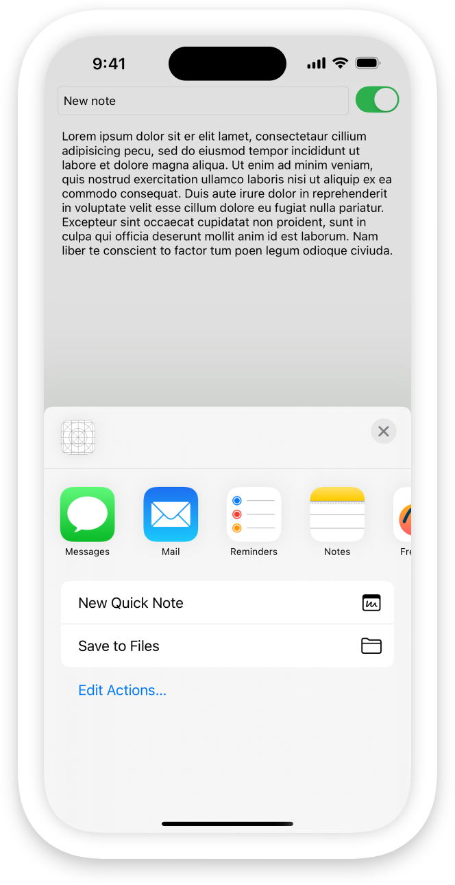
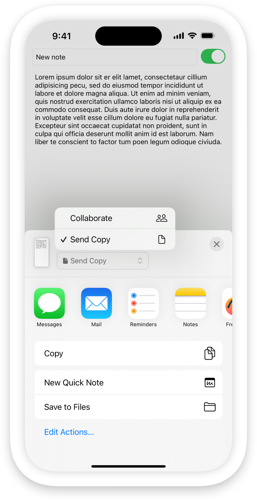
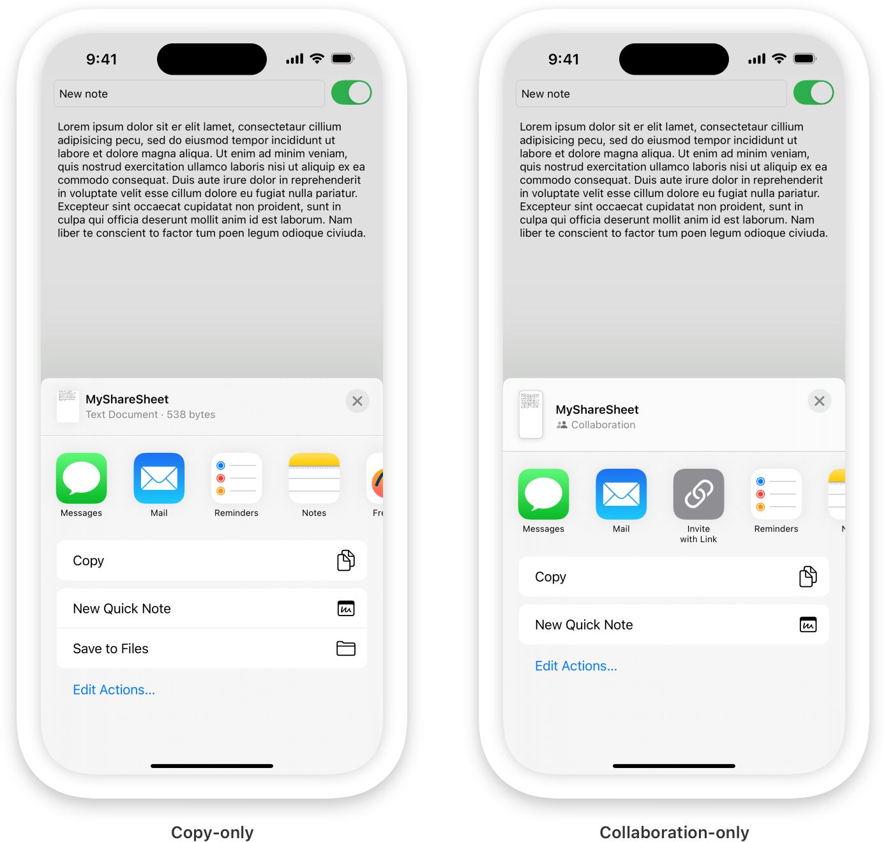
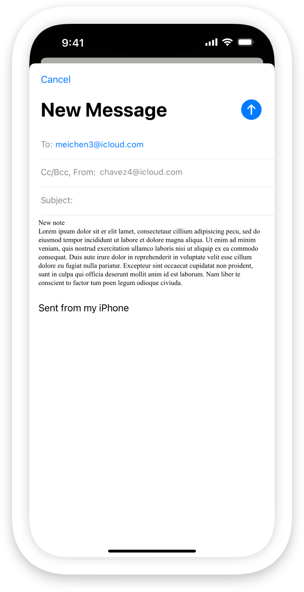

> Navigation: [Technologies](../technologies.md) · [UIKit](../uikit.md) · [View controllers](view-controllers.md)

# Collaborating and sharing copies of your data

<sub>Article</sub>

Share data and collaborate with people from your app.

## Overview

You can share data from your app using a [UIActivityViewController](uiactivityviewcontroller.md) object. There are numerous options for packaging your data and instantiating the activity view controller. One approach is to create one or more [NSItemProvider](../foundation/nsitemprovider.md) objects for the data you want to share. Use the item providers to create a [UIActivityItemsConfiguration](uiactivityitemsconfiguration.md), and then use the configuration to create your activity view controller. You can then present the view controller.

```swift
// Create an item provider for your data.
let itemProvider = NSItemProvider(item: noteText.text as NSString,
                                  typeIdentifier: "public.utf8-plain-text")

// Create an activity item configuration from the item provider.
let configuration =
UIActivityItemsConfiguration(itemProviders: [itemProvider])

// Create the activity view controller from the configuration.
let shareSheet = UIActivityViewController(activityItemsConfiguration: configuration)

// Present the share sheet.
present(shareSheet, animated: true) {}
```

This displays the share sheet, letting someone share a copy of the data with other apps on the device. The options that appear in the share sheet vary depending on the type of data that you’re sharing. The example above shares a UTF-8 string, so the share sheet shows apps that can accept text, like Messages, Mail, and Notes.



### Enable collaboration for iCloud documents

The example above shares a copy of your app’s data. You can also enable collaboration so that the recipients can see an updated view of the data, and even make their own changes to it, depending on the permissions in your app.

To enable collaboration, you need shareable content, such as:

- A URL to an iCloud document (see [url(forUbiquityContainerIdentifier:)](<../foundation/filemanager/url(forubiquitycontaineridentifier_).md>))
- Data stored in [CloudKit](../cloudkit.md)
- A custom collaboration architecture that supports universal links (see [Integrate your custom collaboration app in Messages](https://developer.apple.com/videos/play/wwdc2022/10093))

For example, to enable collaboration for an iCloud document, you need a URL to a file in your app’s iCloud container. Create an [NSItemProvider](../foundation/nsitemprovider.md) object, and call its [registerFileRepresentation(for:visibility:openInPlace:loadHandler:)](<../foundation/nsitemprovider/registerfilerepresentation(for_visibility_openinplace_loadhandler_).md>) method, passing the URL as the `for:` parameter and [true](../swift/true.md) as the `openInPlace:` parameter.

```swift
// Create an empty item provider.
let itemProvider = NSItemProvider()

// Add the URL to a file saved in the iCloud document container.
itemProvider
    .registerFileRepresentation(for: .utf8PlainText,
                                openInPlace: true) { completion in
    completion(url, true, nil)
    return nil
}
```

Then create and display the activity view controller as in the first code example. This time, the share sheet has a pop-up menu for selecting a sharing mode.



### Enable the copying and collaboration of CloudKit data

Because CloudKit doesn’t store its data as files, it requires a different approach for both sharing copies and collaborating. To share a copy of CloudKit data, you need to create a shareable representation of the data. Then register that data with an [NSItemProvider](../foundation/nsitemprovider.md). For example, if you want to share your app’s data as UTF-8 text, you can use the previous example to create an item provider for your text.

To enable collaboration, create a [CKShare](../cloudkit/ckshare.md) when collaboration starts. You also need your [CKContainer](../cloudkit/ckcontainer.md) and the [CKAllowedSharingOptions](../cloudkit/ckallowedsharingoptions.md) that define the permissions you’re granting to collaborators.

```swift
// Create an item provider.
let itemProvider = NSItemProvider()

// Create and save a new share.
itemProvider.registerCKShare(container: container,
                             allowedSharingOptions: CKAllowedSharingOptions.standard) {
    
    // Create your share.
    let newShare = CKShare(rootRecord: recordToShare)
    
    // Configure the share, save it, and handle any errors here.
    
    // Return the newly saved share.
    return newShare
    
}
```

To invite new collaborators to an existing share, create an item provider and register the share.

```swift
// Create an item provider.
let itemProvider = NSItemProvider()

// Register an existing share.
itemProvider
    .registerCKShare(
        savedShare,
        container: container,
        allowedSharingOptions: CKAllowedSharingOptions.standard
    )
```

For more information about collaboration in CloudKit, see [Sharing CloudKit Data with Other iCloud Users](../cloudkit/sharing-cloudkit-data-with-other-icloud-users.md).

### Restrict the sharing mode

By default, if your item provider supports both copying and collaborating, the share sheet shows a pop-up menu, letting people select a sharing mode. In iOS 18 and later, you can restrict sharing to only one of the two modes.

To restrict the sharing mode, create a [CollaborationModeRestriction](uiactivityviewcontroller/collaborationmoderestriction.md) and assign it to your configuration’s metadata. You can access the metadata using the configuration’s [perItemMetadataProvider](uiactivityitemsconfiguration/peritemmetadataprovider.md) property.

```swift
// Iterate through the metadata keys.
configuration.perItemMetadataProvider = { _, key in
    switch key {
    case .collaborationModeRestrictions:
        // If it's the collaboration mode restriction key, return an array
        // containing a collaboration mode restriction object.
        let modeRestriction = UIActivityViewController.CollaborationModeRestriction(
            disabledMode: .collaborate
        )
        return [modeRestriction]
    default:
        return nil
    }
}
```

Then, create and present the share sheet as before. This produces a share sheet that displays only the allowed sharing mode.



Alternatively, you can show both sharing options, but display an alert when someone selects the restricted mode. This alert can also include a recovery suggestion to help people enable the restricted mode.

```swift
// Iterate through the metadata keys.
configuration.perItemMetadataProvider = { _, key in
    switch key {
    case .collaborationModeRestrictions:
        // Set the title and text for the alert. Optionally, you can set the title and provide
        // a launch URL for the recovery action.
        let modeRestriction = UIActivityViewController.CollaborationModeRestriction(
            disabledMode: .collaborate,
            alertTitle: "File Locked",
            alertMessage: "You need to unlock the file before you can share it for collaboration.",
            alertDismissButtonTitle: "Cancel",
            alertRecoverySuggestionButtonTitle: "Unlock",
            alertRecoverySuggestionButtonLaunch: unlockURL
        )
        return [modeRestriction]
    default:
        return nil
    }
}
```

In this case, the share sheet shows the pop-up menu with the allowed sharing mode already selected. When someone tries to change the sharing mode to the restricted mode, the system displays an alert. If they then tap the recovery button, it calls your scene delegate’s [- scene:openURLContexts:](<uiscenedelegate/scene(__openurlcontexts_).md>) method, passing in the provided URL. For more information about using launch URLs, see [Defining a custom URL scheme for your app](../xcode/defining-a-custom-url-scheme-for-your-app.md).

### Specify the people to share with

In iOS 18 and later, you can also specify recipients for the shared data. Create an [INPerson](../intents/inperson.md) instance for each recipient and add them to your activity configuration’s metadata.

```swift
// Gather data about the recipient.
var name = PersonNameComponents()
name.givenName = myBFF.givenName
name.familyName = myBFF.familyName

let displayName = myBFF.givenName
let email = myBFF.email
let image = INImage(imageData: myBFF.image)

// Create an `INPerson` instance for the recipient.
let recipient = INPerson(
    personHandle: .init(value: email, type: .emailAddress),
    nameComponents: name,
    displayName: displayName,
    image: image,
    contactIdentifier: nil,
    customIdentifier: nil)

// Iterate through the metadata keys.
configuration.perItemMetadataProvider = { _, key in
    switch key {
        // Set the share recipients to an array of `INPerson` instances.
    case .shareRecipients:
        return [recipient]
    default:
        return nil
    }
}
```

The share sheet then populates the recipient’s data in apps that accept recipients, such as Mail and Messages.



If a person selects a different recipient from the share sheet, that selection overrides your specified recipients. If they select an app that doesn’t accept recipients, the system ignores your recipient.

You can also hide the other recipients from the share sheet by setting the activity view controller’s [excludedActivitySectionTypes](uiactivityviewcontroller/excludedactivitysectiontypes.md) property to [UIActivitySectionTypesPeopleSuggestions](uiactivitysectiontypes/peoplesuggestions.md).

```swift
// Hide the suggested recipients.
shareSheet.excludedActivitySectionTypes = .peopleSuggestions
```

## See Also

### Activities interface

- [UIActivityViewController](uiactivityviewcontroller.md) — A view controller that you use to offer standard services from your app.
- [UIActivityItemProvider](uiactivityitemprovider.md) — A proxy for data that passes to an activity view controller.
- [UIActivityItemSource](uiactivityitemsource.md) — A set of methods that an activity view controller uses to retrieve the data items to act on.
- [UIActivity](uiactivity.md) — An abstract class that you subclass to implement app-specific services.
- [UIActivityItemsConfigurationProviding](uiactivityitemsconfigurationproviding.md) — An interface that provides a source for shareable content to fulfill user requests to share current content.
