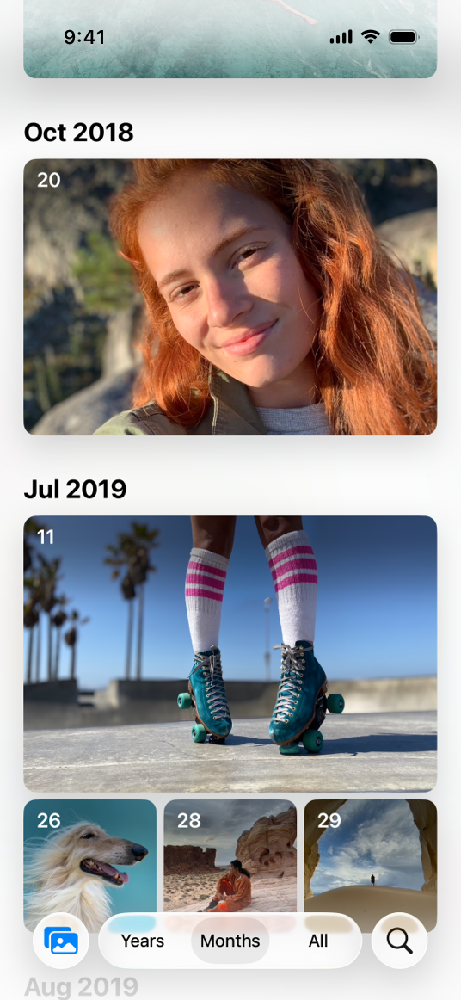

> Navigation: [Technologies](../technologies.md) · [UIKit](../uikit.md) · [Views and controls](views-and-controls.md)

# Collection views

API Collection

Display nested views using a configurable and highly customizable layout.

## Overview

A collection view manages an ordered set of content, such as the grid of photos in the Photos app, and presents it visually.

Collection views are a collaboration between many different objects, including:

- Cells. A cell provides the visual representation for each piece of your content.
- Layouts. A layout defines the visual arrangement of the content in the collection view.
- Your data source object. This object adopts the [UICollectionViewDataSource](uicollectionviewdatasource.md) protocol and provides the data for the collection view.
- Your delegate object. This object adopts the [UICollectionViewDelegate](uicollectionviewdelegate.md) protocol and manages user interactions with the collection view’s contents, like selection and highlighting.
- Collection view controller. You typically use a [UICollectionViewController](uicollectionviewcontroller.md) object to manage a collection view. You can use other view controllers too, but a collection view controller is required for some collection-related features to work.

## Topics

### View

- [UICollectionView](uicollectionview.md) — An object that manages an ordered collection of data items and presents them using customizable layouts.
- [UICollectionViewController](uicollectionviewcontroller.md) — A view controller that specializes in managing a collection view.

### Data

- [Updating collection views using diffable data sources](updating-collection-views-using-diffable-data-sources.md) — Streamline the display and update of data in a collection view using a diffable data source that contains identifiers.
- [Implementing modern collection views](implementing-modern-collection-views.md) — Bring compositional layouts to your app and simplify updating your user interface with diffable data sources.
- [Building high-performance lists and collection views](building-high-performance-lists-and-collection-views.md) — Improve the performance of lists and collections in your app with prefetching and image preparation.
- [UICollectionViewDiffableDataSource](uicollectionviewdiffabledatasource-9tqpa.md) — The object you use to manage data and provide cells for a collection view.
- [UICollectionViewDataSource](uicollectionviewdatasource.md) — The methods adopted by the object you use to manage data and provide cells for a collection view.
- [UICollectionViewDataSourcePrefetching](uicollectionviewdatasourceprefetching.md) — A protocol that provides advance warning of the data requirements for a collection view, allowing the triggering of asynchronous data load operations.
- [NSDiffableDataSourceSnapshot](nsdiffabledatasourcesnapshot-swift.struct.md) — A representation of the state of the data in a view at a specific point in time.
- [NSDiffableDataSourceSectionSnapshot](nsdiffabledatasourcesectionsnapshot-swift.struct.md) — A representation of the state of the data in a layout section at a specific point in time.
- [UIRefreshControl](uirefreshcontrol.md) — A standard control that can initiate the refreshing of a scroll view’s contents.

### Cells

- [UICollectionViewCell](uicollectionviewcell.md) — A single data item when that item is within the collection view’s visible bounds.
- [UICollectionViewListCell](uicollectionviewlistcell.md) — A collection view cell that provides list features and default styling.
- [UICollectionReusableView](uicollectionreusableview.md) — A view that defines the behavior for all cells and supplementary views presented by a collection view.

### Layouts

- [Implementing modern collection views](implementing-modern-collection-views.md) — Bring compositional layouts to your app and simplify updating your user interface with diffable data sources.
- [Layouts](layouts.md) — Arrange your collection view content in a highly configurable layout.

### Selection management

- [Changing the appearance of selected and highlighted cells](changing-the-appearance-of-selected-and-highlighted-cells.md) — Provide visual feedback to the user about the state of a cell and the transition between states.
- [Selecting multiple items with a two-finger pan gesture](selecting-multiple-items-with-a-two-finger-pan-gesture.md) — Accelerate user selection of multiple items using the multiselect gesture on table and collection views.

### Drag and drop

- [Supporting Drag and Drop in Collection Views](supporting-drag-and-drop-in-collection-views.md) — Initiate drags and handle drops from a collection view.
- [UICollectionViewDragDelegate](uicollectionviewdragdelegate.md) — The interface for initiating drags from a collection view.
- [UICollectionViewDropDelegate](uicollectionviewdropdelegate.md) — The interface for handling drops in a collection view.
- [UICollectionViewDropCoordinator](uicollectionviewdropcoordinator.md) — An interface for coordinating your custom drop-related actions with the collection view.
- [UICollectionViewDropPlaceholder](uicollectionviewdropplaceholder.md) — A placeholder for an item dropped on a collection view.
- [UICollectionViewDropProposal](uicollectionviewdropproposal.md) — Your proposed solution for handling a drop in a collection view.
- [UICollectionViewDropItem](uicollectionviewdropitem.md) — The data associated with an item being dropped into the collection view.
- [UICollectionViewDropPlaceholderContext](uicollectionviewdropplaceholdercontext.md) — An object that contains information about a placeholder in the collection view.
- [UIDataSourceTranslating](uidatasourcetranslating.md) — An advanced interface for managing a data source object.
- [UICollectionViewPlaceholder](uicollectionviewplaceholder.md) — A placeholder for an item dragged or dropped on a collection view.

## See Also

### Container views

- [Autosizing views for localization in iOS](../xcode/autosizing-views-for-localization-in-ios.md) — Add auto layout constraints to your app to achieve localizable views.
- [Table views](table-views.md) — Display data in a single column of customizable rows.
- [UIStackView](uistackview.md) — A streamlined interface for laying out a collection of views in either a column or a row.
- [UIScrollView](uiscrollview.md) — A view that allows the scrolling and zooming of its contained views.
- [UILookToScrollInteraction](uilooktoscrollinteraction.md) _(beta)_
