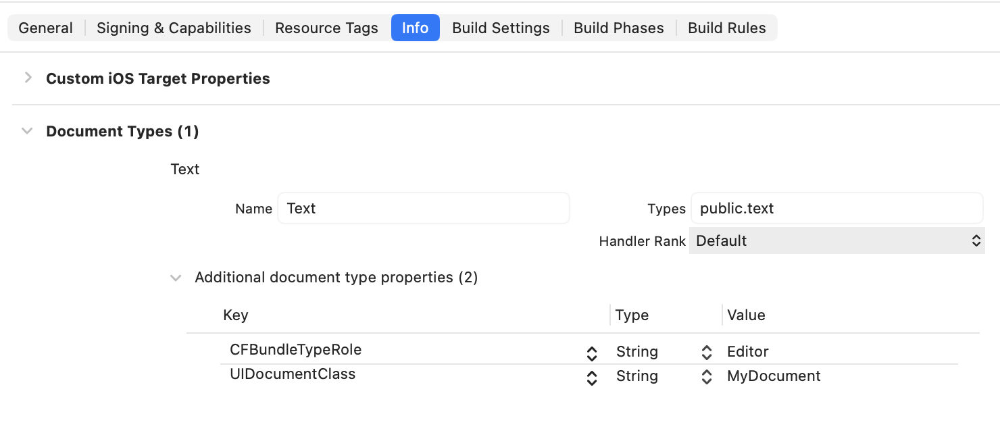
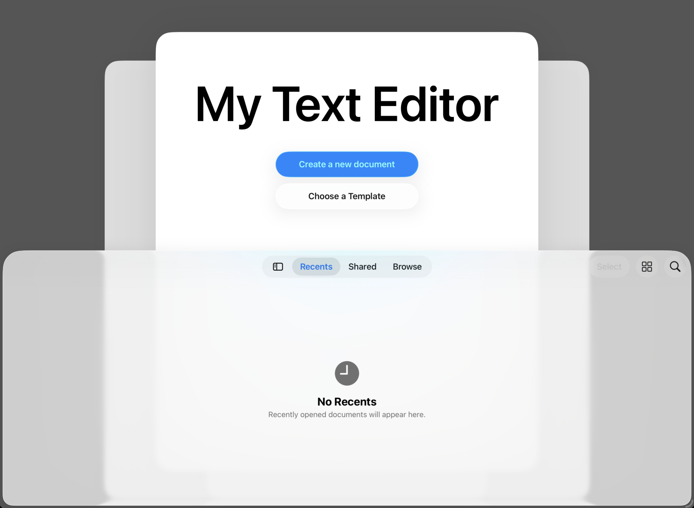

> Navigation: [Technologies](../technologies.md) · [UIKit](../uikit.md) · [View controllers](view-controllers.md)

# Customizing a document-based app’s launch experience

<sub>Article</sub>

Add unique elements to your app’s document launch scene.

## Overview

In iOS 18 and later, you can customize the document browsing experience for your app, such as setting the title and action buttons, configuring the background, and adding custom assets to the scene.

> [!note] SwiftUI equivalent
> For information about adopting the document-based launch experience in SwiftUI, read [Building a document-based app with SwiftUI](../swiftui/building-a-document-based-app-with-swiftui.md).

### Set up a document-based app

To create a customized document launch experience, follow these steps:

- Declare your supported document types in the Document Types section of your app target’s Info tab.
- Set the Supports Document Browser key (`UISupportsDocumentBrowser`) in the Custom iOS Target Properties section of the Info tab.
- Create a [UIDocument](uidocument.md) subclass for each document type your app supports.
- Create a [UIDocumentViewController](uidocumentviewcontroller.md) subclass for your app, and have the subclass adopt the [UIDocumentBrowserViewControllerDelegate](uidocumentbrowserviewcontrollerdelegate.md) protocol.
- Set your document view subclass as your app’s root view controller. Alternatively, you can embed your [UIDocumentViewController](uidocumentviewcontroller.md) subclass in a navigation controller, and set that as the root view controller.
- Implement your delegate’s [- documentDidOpen](<uidocumentviewcontroller/documentdidopen().md>) method to configure your document view.
- Configure the launch scene using the document view controller’s [launchOptions](uidocumentviewcontroller/launchoptions-swift.property.md) property.

When setting the document type, provide a name and the Uniform Type Identifier for your documents. Add the [CFBundleTypeRole](../bundleresources/information-property-list/cfbundledocumenttypes/cfbundletyperole.md) key with a value of `Viewer` (read-only) or `Editor` (if your app both reads and writes the document type). Finally, add a `UIDocumentClass` key, and set its value to the name of your [UIDocument](uidocument.md) subclass for this document type.



When implementing your [- documentDidOpen](<uidocumentviewcontroller/documentdidopen().md>) method, verify that you have a valid document and a valid view before updating the view. For more information, see [UIDocumentViewController](uidocumentviewcontroller.md).

```swift
override func viewDidLoad() {
    super.viewDidLoad()
    // Configure your launch options.
    mySetupTextView()
}

override func documentDidOpen() {
    mySetupTextView()
}

func mySetupTextView() {
    
    // Make sure you have a valid document.
    guard let document = document as? MyDocument else { return }
            
    // Make sure you have a valid view.
    guard let view else { return }
    
    // Make sure the document is open.
    guard !document.documentState.contains(.closed) else { return }

    // Configure the view.
    textView.text = document.text
}
```

### Create new documents

The document viewer uses app intents to create new documents. It also uses the [CreationIntent](uidocument/creationintent.md) structure to specify the different ways your app can create documents. [UIDocument](uidocument.md) already provides a default intent and the corresponding `.default` enumeration value.

To add your own intents, start by extending [CreationIntent](uidocument/creationintent.md) and adding values for your intents.

```swift
// Extend the creation intent enumeration to add custom options for document creation.
extension UIDocument.CreationIntent {
    static let template = UIDocument.CreationIntent("template")
}
```

Then call the [UIDocument](uidocument.md) class’s [+ createDocumentActionWithIntent:](<uidocumentviewcontroller/launchoptions-swift.class/createdocumentaction(withintent_).md>) method to create the intent. Set the intent’s title, and assign it to your [LaunchOptions](uidocumentviewcontroller/launchoptions-swift.class.md) instance’s [primaryAction](uidocumentviewcontroller/launchoptions-swift.class/primaryaction.md) or [secondaryAction](uidocumentviewcontroller/launchoptions-swift.class/secondaryaction.md) properties. By default, the system automatically sets the document view controller’s [primaryAction](uidocumentviewcontroller/launchoptions-swift.class/primaryaction.md) to the default create document action.

```swift
// Provide an action for the secondary action.
let templateAction = LaunchOptions.createDocumentAction(withIntent: .template)

// Set the intent's title.
templateAction.title = "Choose a Template"

// Add the intent to an action.
launchOptions.secondaryAction = templateAction
```

Finally, implement the [UIDocumentBrowserViewControllerDelegate](uidocumentbrowserviewcontrollerdelegate.md) protocol’s [- documentBrowser:didRequestDocumentCreationWithHandler:](<uidocumentbrowserviewcontrollerdelegate/documentbrowser(__didrequestdocumentcreationwithhandler_).md>) method. The system calls this method when something triggers one of the create document intents. In your implementation, use the controller’s [activeDocumentCreationIntent](uidocumentbrowserviewcontroller/activedocumentcreationintent.md) to determine the intent. Create the document, and then pass the URL and the [ImportMode](uidocumentbrowserviewcontroller/importmode.md) to the `intentHandler`.

```swift
override func documentBrowser(_ controller: UIDocumentBrowserViewController, didRequestDocumentCreationWithHandler importHandler: @escaping (URL?, UIDocumentBrowserViewController.ImportMode) -> Void) {

    switch controller.activeDocumentCreationIntent {
    case .template:
        
        // Let someone select a template, and return
        // a URL to that template.
        let templateURL = myPresentTemplateSelection()
        
        // Pass the URL to the import handler.
        importHandler(templateURL, .copy)
        
    default:
        
        // Create the default document.
        let newDocumentURL = myCreateEmptyDocument()
        
        // Pass the URL to the import handler.
        importHandler(newDocumentURL, .move )
    }
}
```

### Customize the document browsing experience

On iPad, iPhone, and Vision Pro (for compatible iPad apps), the system displays a launch scene that contains a title and any document creation buttons. It also displays the document browser as a sheet over this view. Use your document view controller’s [launchOptions](uidocumentviewcontroller/launchoptions-swift.property.md) property to customize this scene as follows:

- Set the [title](uidocumentviewcontroller/launchoptions-swift.class/title.md) property to change the name that appears in the title view. By default, the controller uses your app’s name.
- Modify the [background](uidocumentviewcontrollerlaunchoptions/background.md) property to configure the scene’s background.
- Use the [foregroundAccessoryView](uidocumentviewcontroller/launchoptions-swift.class/foregroundaccessoryview.md) or [backgroundAccessoryView](uidocumentviewcontroller/launchoptions-swift.class/backgroundaccessoryview.md) to place [UIView](uiview.md) objects in front of or behind the title view.
- Set the [primaryAction](uidocumentviewcontroller/launchoptions-swift.class/primaryaction.md) or [secondaryAction](uidocumentviewcontroller/launchoptions-swift.class/secondaryaction.md) properties to add buttons to the title view. If you don’t modify the [primaryAction](uidocumentviewcontroller/launchoptions-swift.class/primaryaction.md) property, the controller adds a Create Document button as the default primary action.
- Use [browserViewController](uidocumentviewcontroller/launchoptions-swift.class/browserviewcontroller.md) to access and configure the document browser controller.

Typically, you configure the launch options in your view controller’s [- viewDidLoad](<uiviewcontroller/viewdidload().md>) method.

```swift
override func viewDidLoad() {
    super.viewDidLoad()
    
    // Assign the view controller as the browser delegate.
    launchOptions.browserViewController.delegate = self
    
    // Customize launch options.
    launchOptions.title = "My Text Editor"
    launchOptions.background.backgroundColor = .darkGray
    
    // Provide an action for the secondary action.
    let templateAction = LaunchOptions.createDocumentAction(withIntent: .template)
    templateAction.title = "Choose a Template"
    launchOptions.secondaryAction = templateAction
    
    mySetupTextView()
}
```



<sub>A screenshot of the document launch scene with the title set to “My Text Editor”. It has the default primary action and a custom secondary action.</sub>

## See Also

### Documents and directories

- [Adding a document browser to your app](adding-a-document-browser-to-your-app.md) — Give people access to their local or remote documents from within your app.
- [Providing access to directories](providing-access-to-directories.md) — Use a document picker to access the content of a directory outside your app’s container.
- [Building an app with a document browser](building-an-app-with-a-document-browser.md) — Provide access to on-device and cloud files by adding a document browser to your app.
- [Building a document browser app for custom file formats](building-a-document-browser-app-for-custom-file-formats.md) — Implement a custom document file format to manage user interactions with files on different cloud storage providers.
- [UIDocumentViewController](uidocumentviewcontroller.md) — A view controller that manages and presents a document stored locally or in the cloud.
- [UIDocumentBrowserViewController](uidocumentbrowserviewcontroller.md) — A view controller for browsing and performing actions on documents that you store locally and in the cloud.
- [UIDocumentPickerViewController](uidocumentpickerviewcontroller.md) — A view controller that provides access to documents or destinations outside your app’s sandbox.
- [UIDocumentInteractionController](uidocumentinteractioncontroller.md) — A view controller that previews, opens, or prints files with a file format that your app can’t handle directly.
