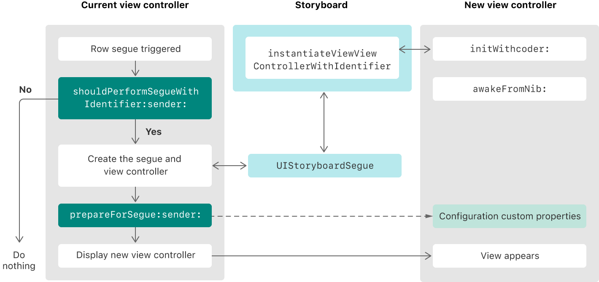

> Navigation: [Technologies](../technologies.md) · [UIKit](../uikit.md) · [Resource management](resource-management.md)

# Customizing the behavior of segue-based presentations

<sub>Article</sub>

Pass data between view controllers during a segue, and programmatically control when segues occur.

## Overview

When the user triggers a segue, UIKit presents the view controller using the options found in your storyboard. UIKit also provides opportunities for you to modify the segue process dynamically, either by preventing the segue from occurring or by doing extra work when a segue occurs.

For information on how to create a segue, see [Specify presentations visually in your storyboard file](showing-and-hiding-view-controllers.md#Specify-presentations-visually-in-your-storyboard-file).

### Configure the presentation style of the transition

The segue’s type determines what kind of animations UIKit uses when presenting and dismissing the segue, as the table below shows. You specify the type when you create the segue, but you can also change it in the attributes inspector later.

| Segue type | Behavior |
|---|---|
| Show (Push) | Displays the view controller modally unless a parent view controller implements the [- showViewController:sender:](<uiviewcontroller/show(__sender_).md>) action method, in which case that view controller defines the presentation behavior. For example, a [UINavigationController](uinavigationcontroller.md) pushes the new view controller onto its navigation stack. |
| Show Detail (Replace) | Displays the view controller modally unless a parent view controller implements the [- showDetailViewController:sender:](<uiviewcontroller/showdetailviewcontroller(__sender_).md>) action method, in which case that view controller defines the presentation behavior. For example, a [UISplitViewController](uisplitviewcontroller.md) replaces its second child view controller (the detail controller) with the new view controller. |
| Present Modally | Displays the view controller modally using the specified presentation and transition styles. |
| Present as Popover | In a horizontally regular environment, UIKit presents the view controller in a popover. In a horizontally compact environment, UIKit presents the view controller modally. |

For more information about how UIKit performs segues involving the Show and Show Detail presentation styles, see [Let the current context define the presentation technique](showing-and-hiding-view-controllers.md#Let-the-current-context-define-the-presentation-technique).

### Prevent a segue based on dynamic conditions

When you don’t want the user to leave the current view controller, tell UIKit not to perform a segue by returning false from the [- shouldPerformSegueWithIdentifier:sender:](<uiviewcontroller/shouldperformsegue(withidentifier_sender_).md>) method of the source view controller. Use that method to perform any checks you need to determine whether the segue can proceed. For example, return [false](../swift/false.md) if the view controller’s content is invalid and requires corrective user actions. Returning true lets the segue continue, but returning [false](../swift/false.md) causes the segue to fail silently.

### Pass data to the presented view controller

Because UIKit creates and presents the view controller automatically during a segue, use the [- prepareForSegue:sender:](<uiviewcontroller/prepare(for_sender_).md>) method to pass any data to that view controller before the segue occurs. Implement the method on the view controller containing the object that initiated the segue. Fetch the new view controller from the provided [UIStoryboardSegue](uistoryboardsegue.md) object, along with information about which segue was triggered.

In the following code example, the current view controller fetches the image associated with the selected table row and passes that image to the new view controller.

```swift
override func prepare(for segue: UIStoryboardSegue, sender: Any?) {
  // Get the new view controller.
   if let imageVC = segue.destination as? ImageViewController {

      // Fetch the image for the selected row. 
      let image = getImageForSelectedRow()
      imageVC.currentImage = image
   }
}
```

Use the delegate design pattern to pass data from a presented view controller back to the originating view controller. Configure that delegate relationship in your [- prepareForSegue:sender:](<uiviewcontroller/prepare(for_sender_).md>) method.

### Understand the sequence of events during a segue

Although UIKit handles segues automatically, there are many places where you can perform work related to displaying the new view controller. The following figure shows the flow of events that happens from the time the user triggers a segue until the process is complete. The main place to perform segue-related actions is the current view controller’s [- prepareForSegue:sender:](<uiviewcontroller/prepare(for_sender_).md>) method, but you also may perform tasks during the creation of the new view controller.



<sub>An illustration of the flow of events that occur when the user triggers a segue. UIKit calls methods of the current view controller to modify the segue’s behavior. </sub>

## See Also

### Storyboards

- [Dismissing a view controller with an unwind segue](dismissing-a-view-controller-with-an-unwind-segue.md) — Configure an unwind segue in your storyboard file that dynamically chooses the most appropriate view controller to display next.
- [UIStoryboard](uistoryboard.md) — An encapsulation of the design-time view controller graph represented in an Interface Builder storyboard resource file.
- [UIStoryboardSegue](uistoryboardsegue.md) — An object that prepares for and performs the visual transition between two view controllers.
- [UIStoryboardUnwindSegueSource](uistoryboardunwindseguesource.md) — An encapsulation of information about an unwind segue.
