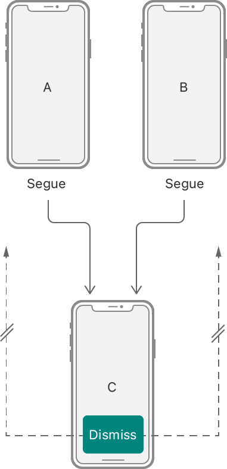
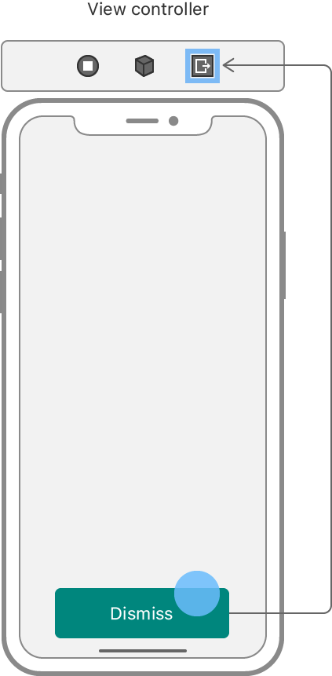

> Navigation: [Technologies](../technologies.md) · [UIKit](../uikit.md) · [Resource management](resource-management.md)

# Dismissing a view controller with an unwind segue

<sub>Article</sub>

Configure an unwind segue in your storyboard file that dynamically chooses the most appropriate view controller to display next.

## Overview

To handle the dismissal of a view controller, create an unwind segue. Unlike the segues that you use to present view controllers, an unwind segue promises the dismissal of the current view controller without promising a specific target for the resulting transition. Instead, UIKit determines the target of an unwind segue programmatically at runtime.

UIKit determines the target of an unwind segue at runtime, so you aren’t restricted in how you set up your view controller hierarchies. Consider a scenario where two view controllers present the same child view controller, as shown in the following figure. You could add complicated logic to determine which view controller to display next, but such a solution wouldn’t scale well. Instead, UIKit provides a simple programmatic solution that scales to any number of view controllers with minimal effort.



<sub>An illustration showing the problem of connecting an unwind segue to a specific view controller. There might be multiple targets to choose from. </sub>

### Define an unwind action on a parent view controller

The presence of an unwind segue action method tells UIKit that a view controller is a potential destination for an unwind segue. Before configuring any unwind segues in your storyboard, add this action method to at least one of your view controllers. If no view controller has an unwind action, Xcode prevents you from creating unwind segues. This action method has the following format:

**Swift**

```swift
@IBAction func myUnwindAction(unwindSegue: UIStoryboardSegue)
```

**Objective-C**

```objc
- (IBAction) myUnwindAction:(UIStoryboardSegue*)unwindSegue
```

You don’t need to do anything in your unwind segue action methods. The presence of the method is enough to dismiss the current view controller. However, you can use the method to perform relevant tasks during the dismissal process. For example, you might pass data from the dismissed view controller back to the parent that presented it. If you do, you can use the provided [UIStoryboardSegue](uistoryboardsegue.md) object to retrieve the starting and ending view controllers.

### Connect a triggering object to the exit control

In your storyboard, create an unwind segue by right-clicking a triggering object and dragging to the Exit control at the top of your view controller’s scene. You may trigger the segue from any object that supports the target-action design pattern, such as a control or gesture recognizer attached to your view controller.



When you connect an object to the Exit control, UIKit presents a list of known action methods. Select one of the action methods to complete the unwind segue. You only select the action method, not a specific view controller. To be displayed after the dismissal, a parent view controller must implement the method you select.

When the user triggers the dismiss action, UIKit searches the current view controller hierarchy for a view controller that implements the designated action method. It looks for the closest view controller, starting with the immediate parent, and walks up the view controller hierarchy until it finds an appropriate target. If it can’t find a view controller that implements the method, the unwind segue fails silently and the current view controller remains onscreen.

## See Also

### Storyboards

- [Customizing the behavior of segue-based presentations](customizing-the-behavior-of-segue-based-presentations.md) — Pass data between view controllers during a segue, and programmatically control when segues occur.
- [UIStoryboard](uistoryboard.md) — An encapsulation of the design-time view controller graph represented in an Interface Builder storyboard resource file.
- [UIStoryboardSegue](uistoryboardsegue.md) — An object that prepares for and performs the visual transition between two view controllers.
- [UIStoryboardUnwindSegueSource](uistoryboardunwindseguesource.md) — An encapsulation of information about an unwind segue.
