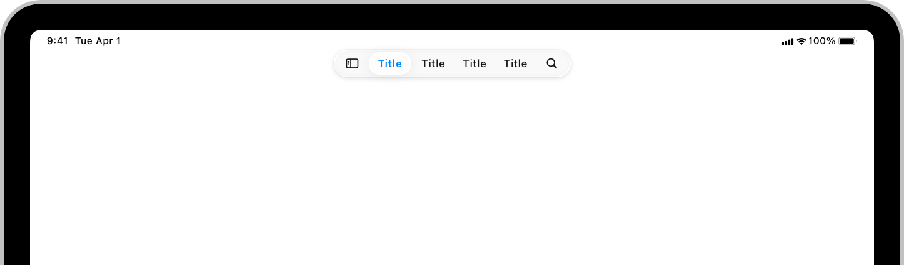
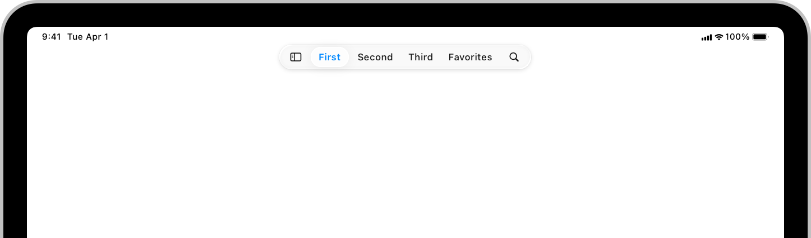
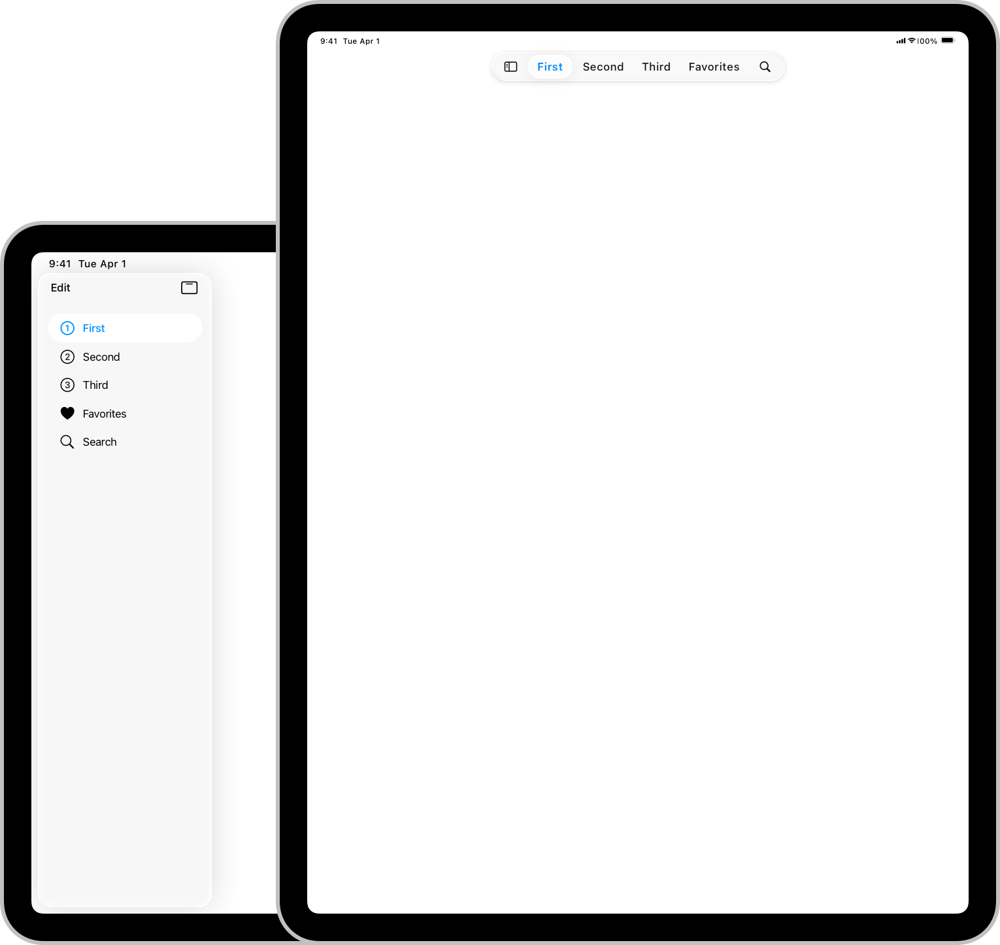
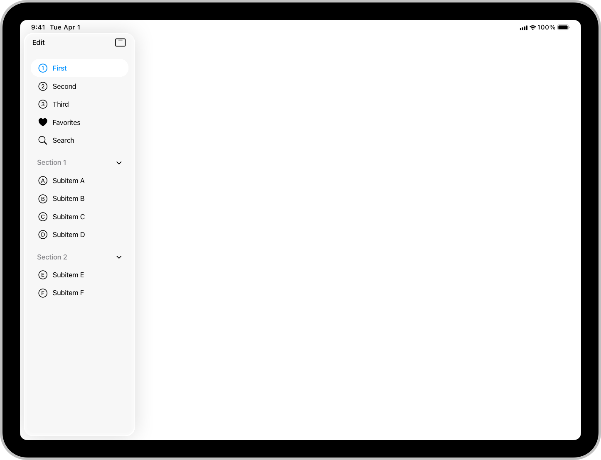
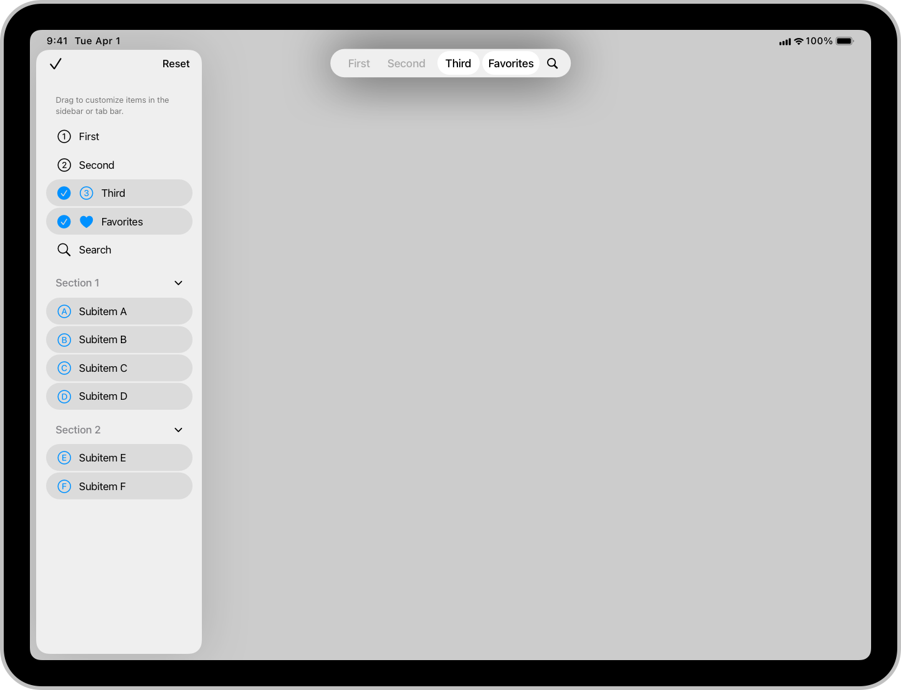
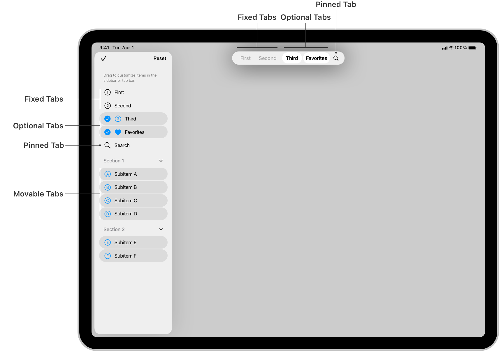

> Navigation: [Technologies](../technologies.md) · [UIKit](../uikit.md) · [App and environment](app-and-environment.md)

# Elevating your iPad app with a tab bar and sidebar

<sub>Article</sub>

Provide a compact, ergonomic tab bar for quick access to key parts of your app, and a sidebar for in-depth navigation.

## Overview

In iPadOS, the tab bar floats over your content at the top, giving you more space for your app’s content. Additionally, because the tab bar shares space with the navigation bar, it places your tabs closer to your app’s other controls.



> [!note] SwiftUI equivalent
> For information about adopting this tab bar appearance in SwiftUI, read [Enhancing your app’s content with tab navigation](../swiftui/enhancing-your-app-content-with-tab-navigation.md).

### Create a tab bar

Create a [UITabBarController](uitabbarcontroller.md) and assign an array of [UITab](uitab.md) objects to its [tabs](uitabbarcontroller/tabs.md) property. To create a tab, call [- initWithTitle:image:identifier:viewControllerProvider:](<uitab/init(title_image_identifier_viewcontrollerprovider_).md>). In the closure, return the view controller your app presents when someone selects the tab. If you use SF Symbols for your tab’s image, be sure to select the outline variant. The system automatically selects the correct variant (outline or filled) based on the context. Additionally, you can change a tab’s properties, such as [title](uitab/title.md) or [image](uitab/image.md), at runtime, and the system automatically updates its appearance.

```swift
// Create the tab bar controller.
let tabBarController = UITabBarController()

// Assign an array of tabs.
tabBarController.tabs = [

   UITab(title: "First",
         image: UIImage(systemName: "1.circle"),
         identifier: "First Tab") { _ in
             // Return the view controller that the tab displays.
             MyFirstViewController()
         },
   
   UITab(title: "Second",
         image: UIImage(systemName: "2.circle"),
         identifier: "Second Tab") { _ in
             // Return the view controller that the tab displays.
             MySecondViewController()
         },
   
   UITab(title: "Third",
         image: UIImage(systemName: "3.circle"),
         identifier: "Third Tab") { _ in
             // Return the view controller that the tab displays.
             MyThirdViewController()
         }
]
```

To add a search tab, create a [UISearchTab](uisearchtab.md) instance and add it to the tabs array.

```swift
// Create a search tab.
UISearchTab { _ in 
    // Return the view controller that the tab displays.
    UINavigationController(
        rootViewController: MySearchViewController()
    )
}

```

In addition to configuring a tab with a system-provided symbol for search, `UISearchTab` also automatically separates the search tab from other tabs when the tab bar is compact.



The iPad tab bar supports an unlimited number of items. If there isn’t enough room to display all the tabs, the system collapses any tabs that can’t fit onscreen, and lets people scroll through them. However, consider limiting your tabs to just those that fit in the tab bar. This ensures that people can access key parts of your app with one tap.

### Integrate the tab bar and sidebar

Although both tab bars and sidebars play a similar navigation role in iPadOS apps, they have different strengths. A tab bar is always available and represents the key parts of your app. A sidebar provides a richer collection of possible destinations; however, people typically need to navigate back to the sidebar to select a different option.

If your app contains a rich hierarchy of views, you can create an array of tab items that the system displays as either a tab bar or a sidebar. This combination provides the best features of both navigation styles. When displaying as a tab bar, people have quick access to the most critical sections of your app. When displaying as a sidebar, they can see the full range and depth of your app.



<sub>An illustration of two iPads side by side. The first iPad shows the sidebar on the left of the screen in landscape orientation. The second iPad shows the tab bar at the top of the screen in portrait orientation.</sub>

Use [UITab](uitab.md) and [UITabGroup](uitabgroup.md) classes to create a hierarchy of tabs. If the tabs array contains at least one tab group, the system automatically displays the tabs as both a tab bar and a sidebar. Otherwise, it only displays the array as a tab bar. You can also explicitly define how the system displays your tabs by setting the [UITabBarController](uitabbarcontroller.md) object’s [mode](uitabbarcontroller/mode-swift.property.md) property.

```swift
// Enable the sidebar.
tabBarController.mode = .tabSidebar

// Get the sidebar.
let sidebar = tabBarController.sidebar

// Show the sidebar.
sidebar.isHidden = false
```

By default, the system presents the sidebar in landscape orientation and hides it in portrait orientation; however, people can toggle between the tab bar and sidebar in either orientation. You can also programmatically show and hide the sidebar by setting its [hidden](uitabbarcontroller/sidebar-swift.class/ishidden.md) property.

### Build a hierarchy of items for the sidebar

You can use [UITabGroup](uitabgroup.md) to define a section of items in the sidebar. Provide an array of tabs for the section’s content and a view controller to display when someone selects the section from the tab bar.

```swift
let sectionOne = UITabGroup(
    title: "Section 1",
    image: UIImage(systemName: "1.square.fill"),
    identifier: "Section one",
    children:
        [
            UITab(
                title: "Subitem A",
                image: UIImage(systemName: "a.circle"),
                identifier: "Section 1, item A"
            ) { _ in
                MyFirstSubitemTabViewController()
            },
            
            UITab(
                title: "Subitem B",
                image: UIImage(systemName: "b.circle"),
                identifier: "Section 1, item B"
            ) { _ in
                MySecondSubitemTabViewController()
            },
            
            UITab(
                title: "Subitem C",
                image: UIImage(systemName: "c.circle"),
                identifier: "Section 1, item C"
            ) { _ in
                MyThirdSubitemTabViewController()
            },
        ]) { _ in
            // Return a view controller that the system displays when someone selects the section in the tab bar.
            MySectionViewController()
        }
```

The tab bar displays a tab group as a single tab item, and the sidebar displays it as a section that contains subitems. The sidebar displays top-level tab items first, followed by the sections.



<sub>An illustration of an iPad in landscape orientation that shows the sidebar displaying a hierarchy of tabs. The top-level tabs appear first, followed by the tab groups.</sub>

You can nest a [UITabGroup](uitabgroup.md) inside another [UITabGroup](uitabgroup.md) to create a deeper hierarchy in the sidebar; however, consider limiting your app to two, or at most three, layers. Also, you can dynamically change a tab group’s content at runtime by modifying its [children](uitabgroup/children.md) property.

### Add actions to the sidebar

You can add actions to the sidebar by setting a tab group’s [sidebarActions](uitabgroup/sidebaractions.md) property. These actions function like buttons that you place inside the tab group.

```swift
// Create the action.
let refreshAction = UIAction(title: "Refresh", image: UIImage(systemName: "arrow.clockwise")) { _ in
    myAction()
}

// Assign the action.
sectionOne.sidebarActions = [refreshAction]
```

To support swipe actions or context menus, assign a delegate to your sidebar that adopts the [Delegate](uitabbarcontroller/sidebar-swift.class/delegate-swift.protocol.md) protocol, and implement the following optional methods:

- [- tabBarController:sidebar:leadingSwipeActionsConfigurationForTab:](<uitabbarcontroller/sidebar-swift.class/delegate-swift.protocol/tabbarcontroller(__sidebar_leadingswipeactionsconfigurationfor_).md>)
- [- tabBarController:sidebar:trailingSwipeActionsConfigurationForTab:](<uitabbarcontroller/sidebar-swift.class/delegate-swift.protocol/tabbarcontroller(__sidebar_trailingswipeactionsconfigurationfor_).md>)
- [- tabBarController:sidebar:contextMenuConfigurationForTab:](<uitabbarcontroller/sidebar-swift.class/delegate-swift.protocol/tabbarcontroller(__sidebar_contextmenuconfigurationfor_).md>)

To support drag-and-drop operations, assign a delegate to your tab bar that adopts the [UITabBarControllerDelegate](uitabbarcontrollerdelegate.md) protocol, and implement the [- tabBarController:tab:operationForAcceptingItemsFromDropSession:](<uitabbarcontrollerdelegate/tabbarcontroller(__tab_operationforacceptingitemsfrom_).md>) and [- tabBarController:tab:acceptItemsFromDropSession:](<uitabbarcontrollerdelegate/tabbarcontroller(__tab_acceptitemsfrom_).md>) methods.

### Enable customization

People can customize the content in both the tab bar and sidebar using a system-provided button that puts the bars into edit mode. While editing, people can:

- Drag items from the sidebar to the tab bar to add them to the tab bar.
- Drag items from the tab bar to remove them from the tab bar.
- Drag items to reorder them in the tab bar.
- Drag items to reorder them inside their tab group.
- Uncheck items in the sidebar to hide them. This also removes them from the tab bar.

The system automatically persists any customizations that someone makes to the bars. You can implement the [- tabBarController:displayOrderDidChangeForGroup:](<uitabbarcontrollerdelegate/tabbarcontroller(__displayorderdidchangefor_).md>) and [- tabBarController:visibilityDidChangeForTabs:](<uitabbarcontrollerdelegate/tabbarcontroller(__visibilitydidchangefor_).md>) delegate methods to receive notifications about the changes.



By default, only the top-level tabs appear in the tab bar. People can add or remove any tab in the sidebar, but can’t hide or reorder the items in it.

To control which items appear in the tab bar, and how people can customize them, set the [UITab](uitab.md) object’s [preferredPlacement](uitab/preferredplacement.md) property. Conceptually, you can think of the tab bar as having three different regions:

- Fixed tabs appear on the leading edge of the tab bar.
- Default, optional, and movable tabs appear after the fixed tabs.
- Pinned tabs are always visible on the trailing edge, and only show the tab’s image.

When possible, make tabs customizable so that people can choose which ones to place in the tab bar. If you have any tabs that are central to your app, consider making them fixed tabs, so that people can’t remove or move them. Use pinned tabs for prominent items, like search. Also, because pinned tabs only display the tab icon, be sure to select an image that people recognize and can easily understand.



<sub>An illustration of an iPad in landscape orientation that shows the fixed, optional, pinned, and movable tabs in the tab bar and sidebar.</sub>

To create an item that appears in the sidebar, but that people can’t add to the tab bar, set the [preferredPlacement](uitab/preferredplacement.md) property to [UITabPlacementSidebarOnly](uitab/placement/sidebaronly.md). To create an item that people can add to or remove from the sidebar, set its [allowsHiding](uitab/allowshiding.md) property to [true](../swift/true.md). If someone removes an item from the sidebar, the system also removes it from the tab bar.

```swift
// Create the tab.
var customizableItem = UITab(
        title: "Optional",
        image: UIImage(systemName: "questionmark.app"),
        identifier: "Optional Item"
) { _ in
    MyOptionalViewController()
}

// Let people add and remove this item in the sidebar.
customizableItem.allowsHiding = true

// Set the item as hidden in the sidebar by default.
customizableItem.isHiddenByDefault = true
```

To let people reorganize items within a tab group, set the group’s [allowsReordering](uitabgroup/allowsreordering.md) property to [true](../swift/true.md).

```swift
sectionOne.allowsReordering = true
```

You can also programmatically set the order of items in a tab group using its [displayOrderIdentifiers](uitabgroup/displayorderidentifiers.md) property. By default, the system sets the tab group’s order based on its [children](uitabgroup/children.md) property.

> [!important] Important
> When someone customizes the tab bar or sidebar, the system persists those changes. The next time your app launches, it sets each tab’s [hidden](uitab/ishidden.md) and [displayOrderIdentifiers](uitabgroup/displayorderidentifiers.md) properties to the customized values. The system assigns these values when it adds the tab to the [UITabBarController](uitabbarcontroller.md). If your app programmatically sets the [hidden](uitab/ishidden.md) or [displayOrderIdentifiers](uitabgroup/displayorderidentifiers.md) properties before adding the tabs, the customized values override the values your app assigns. If, however, you change the values after adding the tabs, your values override the customizations.

### Use the tab bar and sidebar on other platforms

The [UITab](uitab.md) API is available on all platforms that support UIKit. Consider using this API to create tab bars in your UIKit-based projects in iOS, Mac Catalyst, tvOS, and visionOS.

The tab bar configuration appears differently based on the platform and available space:

- On iPad, the system shows the tab bar at the top and the sidebar on the leading edge.
- On iPhone, Apple TV, and iPad when your app displays in a compact size, the system shows the platform’s regular tab bar.
- For Mac Catalyst, the system displays a tab bar if the tab bar controller’s [mode](uitabbarcontroller/mode-swift.property.md) property is [UITabBarControllerModeTabBar](uitabbarcontroller/mode-swift.enum/tabbar.md), and a sidebar if it’s [UITabBarControllerModeTabSidebar](uitabbarcontroller/mode-swift.enum/tabsidebar.md).

In visionOS, the system displays the platform’s regular tabs, but a [UITabGroup](uitabgroup.md) can display a sidebar when it displays the group’s view controller.

## See Also

### iPad, Mac, and Apple Vision Pro

- [Building a desktop-class iPad app](building-a-desktop-class-ipad-app.md) — Optimize your iPad app’s user experience by adopting desktop-class enhancements for multitasking with Stage Manager, document interactions, text editing, search, and more.
- [Supporting desktop-class features in your iPad app](supporting-desktop-class-features-in-your-ipad-app.md) — Enhance your iPad app by adding desktop-class features and document support.
- [Multitasking on iPad, Mac, and Apple Vision Pro](multitasking-on-ipad-mac-and-apple-vision-pro.md) — Implement multitasking APIs to seamlessly integrate your app with iPadOS, macOS, and visionOS.
