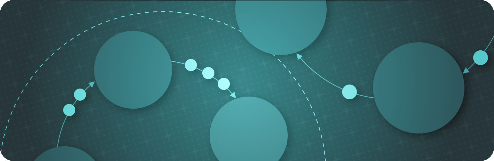
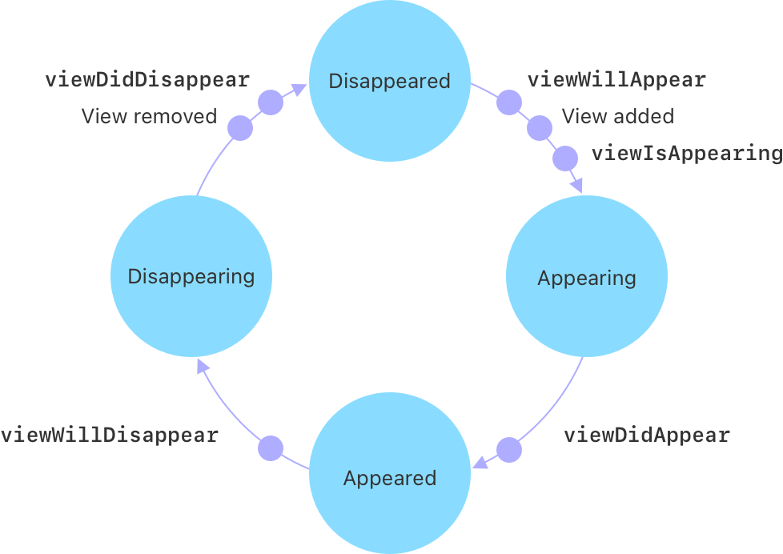
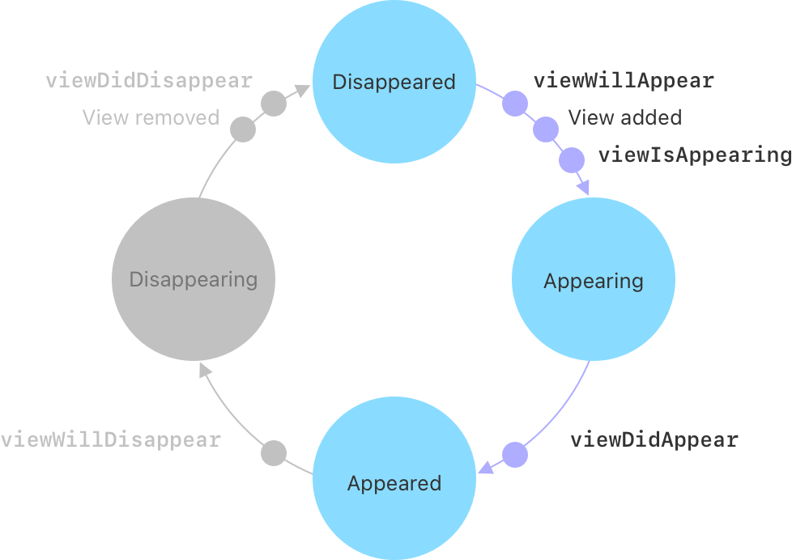
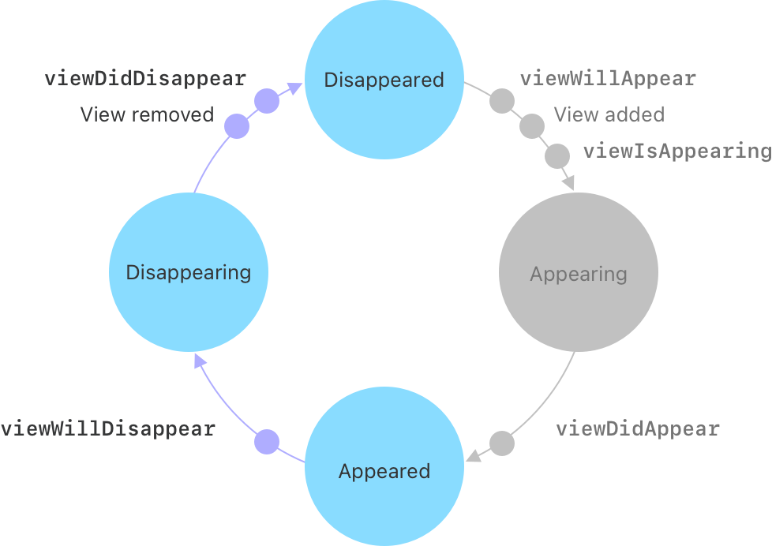
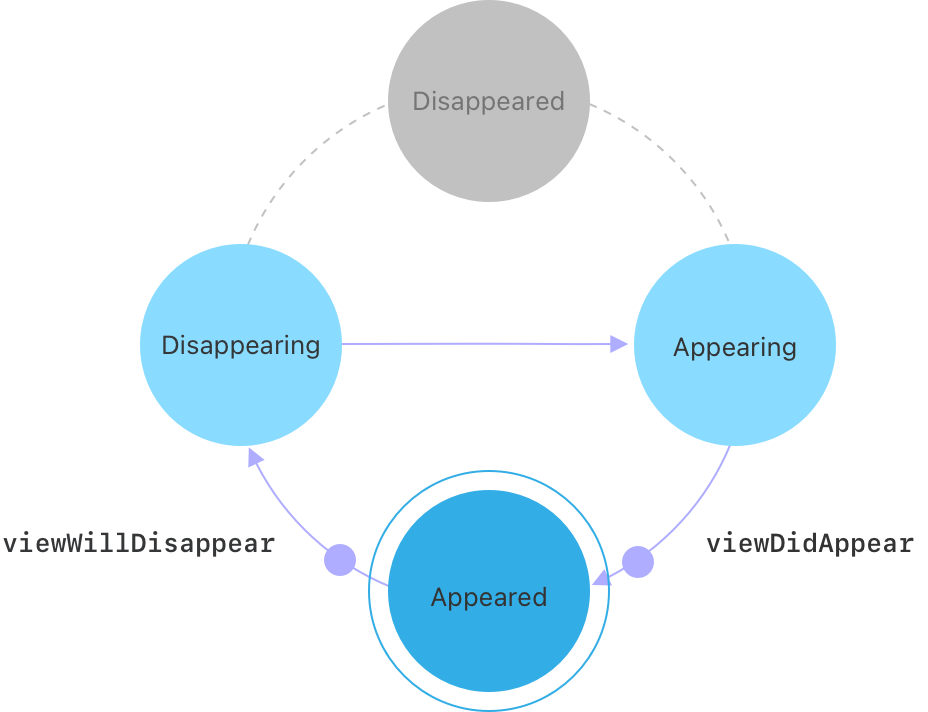
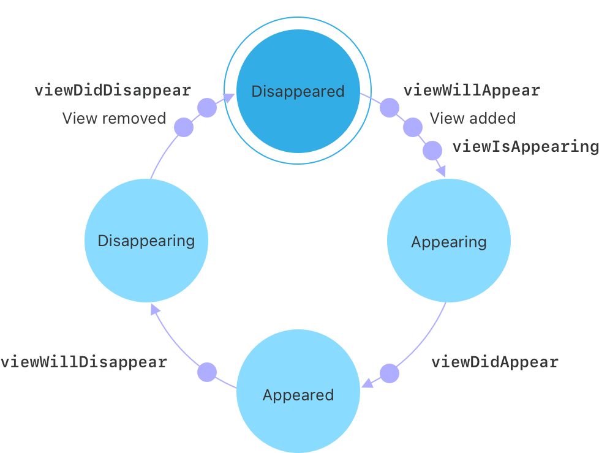

> Navigation: [Technologies](../technologies.md) · [UIKit](../uikit.md) · [Animation and haptics](animation-and-haptics.md) · [View controller transitions](view-controller-transitions.md)

# Enhancing your app with fluid transitions

<sub>Article</sub>

Use the fluid zoom transition to provide a continuously interactive and responsive experience in your app.

## Overview

iOS 18 introduces a fluid, continuously interactive zoom transition. You can use this transition when your app navigates from a large cell or thumbnail to increase the sense of continuity in your app. People can then grab, drag, and control the transitions when they begin and anytime during their animation.



For example, someone taps a thumbnail and your app pushes the corresponding view controller onto the navigation stack. If you’re using the zoom transition, they can stop the transition or drag it to slow it down or reverse it. Both your app’s state and the transition animation seamlessly change based on a person’s gestures.

The fluid zoom transitions are available on iPhone and iPad, including iPad apps running in visionOS. The API is available on other platforms, but the system uses the default transitions based on the current context instead.

### Set up a zoom transition

To use the zoom transition, set the [preferredTransition](uiviewcontroller/preferredtransition.md) property to [zoom(options:sourceViewProvider:)](<uiviewcontroller/transition/zoom(options_sourceviewprovider_).md>) on a new view controller, and pass a closure that returns the view you’re zooming from. Then push the view controller onto the navigation stack.

```swift
// Create a detail view controller for the selected item.
let detailViewController = MyDetailViewController(itemID: itemID)

// Set the preferred transition to zoom.
detailViewController.preferredTransition = .zoom { [self] _ in
    
    // Return the thumbnail view for the selected item.
    return thumbnail(for: itemID)
}

// Push the detail view controller onto the navigation stack.
navigationController?.pushViewController(detailViewController, animated: true)
```

> [!important] Important
> Because the transition runs on both zoom in and zoom out, use a stable identifier to look up the view in the closure instead of capturing a [UIView](uiview.md) or [IndexPath](../foundation/indexpath.md) instance.

If your app lets people swipe between different items without leaving the detail view, the thumbnail you want to zoom back to can change. To look up the correct thumbnail, use the context that the system passes to the closure.

```swift
// Create a detail view controller for the selected item.
let detailViewController = MyDetailViewController(itemID: itemID)

// Set the preferred transition to zoom.
detailViewController.preferredTransition = .zoom { context in
    
    // Use the context to determine the current item.
    guard let controller = context.zoomedViewController as? MyDetailViewController else {
        fatalError("Unable to access the current view controller.")
    }
    
    // Return the thumbnail for the current item.
    return self.thumbnail(for: controller.itemID)
}

// Push the detail view controller onto the navigation stack.
navigationController?.pushViewController(detailViewController, animated: true)
```

> [!note] Note
> You can also use the `preferredTransition` property for other system transitions, such as [coverVertical](uiviewcontroller/transition/coververtical.md), [flipHorizontal](uiviewcontroller/transition/fliphorizontal.md), [crossDissolve](uiviewcontroller/transition/crossdissolve.md), and [partialCurl](uiviewcontroller/transition/partialcurl.md).

### Work with state changes and callbacks

View controllers go through a number of state changes when pushing them onto or popping them off the navigation stack.



<sub>An illustration that shows the relationship between the view controller states, the transitions, and the callback methods. The illustration has four states: disappeared, appearing, appeared, and disappearing. When transitioning from disappeared to appearing, the system calls viewWillAppear, adds the view to the view hierarchy, and then calls viewIsAppearing. When transitioning from appearing to appeared, it calls viewDidAppear. When transitioning from appeared to disappearing, it calls viewWillDisappear. Finally, when transitioning from disappearing to disappeared, it removes the view from the view hierarchy, and then calls viewDidDisappear.</sub>

When you push a view controller onto the navigation stack, the controller begins in the _disappeared_ state. As it transitions to the _appeared_ state, the system performs the following steps:

1. Calls [- viewWillAppear:](<uiviewcontroller/viewwillappear(__).md>).
2. Adds the controller’s view to the view hierarchy.
3. Calls [- viewIsAppearing:](<uiviewcontroller/viewisappearing(__).md>).
4. Transitions to the _appearing_ state.
5. Calls [- viewDidAppear:](<uiviewcontroller/viewdidappear(__).md>).
6. Ends in the appeared state.



<sub>An illustration that shows the view controller’s state changes during a push transition. It starts in the disappeared state. The system calls viewWillAppear, adds the view to the view hierarchy, and then calls viewIsAppearing as the controller moves to the appearing state. The system then calls viewDidAppear as the controller moves to the appeared state.</sub>

When you pop a view controller off the navigation stack, it starts in the appeared state. The system then performs the following steps:

1. Calls [- viewWillDisappear:](<uiviewcontroller/viewwilldisappear(__).md>).
2. Transitions to the _disappearing_ state.
3. Removes the view from the view hierarchy.
4. Calls [- viewDidDisappear:](<uiviewcontroller/viewdiddisappear(__).md>).
5. Ends in the disappeared state.



<sub>An illustration that shows the view controller’s state changes during a pop transition. It starts in the appeared state. The system calls viewWillDisappear as the controller moves to the disappearing state. The system then removes the view from the view hierarchy and calls viewDidDisappear as the view controller transitions to the disappeared state.</sub>

When someone interrupts the fluid zoom transition, the sequence of events changes. If a person cancels a navigation pop, the system calls [- viewWillDisappear:](<uiviewcontroller/viewwilldisappear(__).md>) and transitions to the disappearing state. At that point, the system transitions directly to the appearing state and calls [- viewDidDisappear:](<uiviewcontroller/viewdiddisappear(__).md>) before ending in the appeared state. This transition occurs within one cycle of the run loop, so new events can’t interrupt it.



<sub>An illustration that shows the view controller’s state changes when someone cancels a pop transition. The view controller starts in the appeared state. The system calls viewWillDisappear as the controller transitions to the disappearing state. Then the view controller transitions directly to the appearing state. The system calls viewDidAppear, and the view controller transitions to the appeared state.</sub>

However, if someone interrupts a navigation push, the system doesn’t cancel push transitions. Instead, the system completes the transition to the appeared state and begins the navigation pop within one cycle of the run loop. The pop transition then proceeds as before, and either runs to completion or gets interrupted again.



<sub>An illustration that shows the view controller state changes when someone interrupts a push transition, converting it to a pop transition. The push transition starts in the disappeared state and progresses to the appeared state, even after the push transition is interrupted. It then begins a pop transition, moving from the appeared state back to the disappeared state. The system performs all the actions in the cycle: calls viewWillAppear, adds the view to the view hierarchy, calls viewIsAppearing, calls viewDidAppear, calls viewWillDisappear, removes the view from the view hierarchy, and calls viewDidDisappear.</sub>

> [!important] Important
> The system handles the push and pop transitions differently. It doesn’t cancel a push — instead, it converts it to a pop. This ensures that the view controller reaches the appeared state, and calls the full cycle of appear and disappear callbacks.

### Maintain seamless transitions

When using continuously interactive transitions, your app needs to be ready for a new transition to start or stop at any time. Follow these guidelines to help your transitions run seamlessly and smoothly:

- Don’t avoid starting a new navigation push or pop based on whether a transition is currently running. Let the new push or pop start, and the system handles the transitions.
- Keep temporary transition state to a minimum, and avoid making other code dependent on that state.
- Implement your callback methods so that the system can safely call them multiple times. The system might call these methods more than once before calling anything that uses or cleans up the results.
- If you need to track some state during a transition, clean it up in [- viewDidAppear:](<uiviewcontroller/viewdidappear(__).md>) or [- viewDidDisappear:](<uiviewcontroller/viewdiddisappear(__).md>). The system calls these at the end of the transition.
- If you’re using a navigation control delegate, you can use [- navigationController:willShowViewController:animated:](<uinavigationcontrollerdelegate/navigationcontroller(__willshow_animated_).md>) and [- navigationController:didShowViewController:animated:](<uinavigationcontrollerdelegate/navigationcontroller(__didshow_animated_).md>) to clean up instead of the view controller callback methods.
