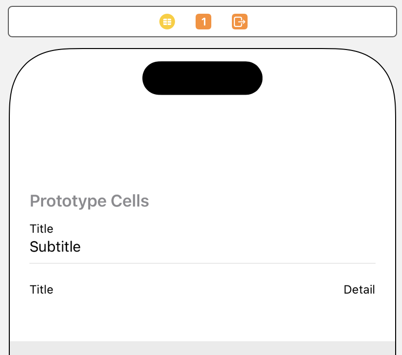

> Navigation: [Technologies](../technologies.md) · [UIKit](../uikit.md) · [Views and controls](views-and-controls.md) · [Table views](table-views.md)

# Filling a table with data

<sub>Article</sub>

Create and configure cells for your table dynamically using a data source object, or provide them statically from your storyboard.

## Overview

Table views are data-driven elements of your interface. You provide your app’s data, along with the views needed to render each piece of that data onscreen, using a data source object (an object that adopts the [UITableViewDataSource](uitableviewdatasource.md) protocol). The table view arranges your views onscreen and works with your data source object to keep that data up to date.

Table views organize your data into rows and sections. Rows display individual data items, and sections group related rows together. Sections aren’t required, but they’re a good way to organize data that’s already hierarchical. For example, the Contacts app displays the name of each contact in a row, and groups rows into sections based on the first letter of the person’s last name.


<sub>Illustration showing the Contacts app. Sections in the main table of the Contacts app correspond to letters of the alphabet. Rows correspond to individual contacts.</sub>

### Provide the numbers of rows and sections

Before it appears onscreen, a table view asks you to specify the total number of rows and sections. Your data source object provides this information using two methods:

```swift
func numberOfSections(in tableView: UITableView) -> Int  // Optional 
func tableView(_ tableView: UITableView, numberOfRowsInSection section: Int) -> Int
```

In your implementations of these methods, return the row and section counts as quickly as possible. Doing so might require you to structure your data in a way that makes it easy to retrieve the row and section information. For example, consider using arrays to manage your table’s data. Arrays are good tools for organizing both sections and rows because they match the natural organization of the table view itself.

The example code below shows an implementation of the data source methods that return the number of rows and sections in a multisection table. In this table, each row displays a string, so the implementation stores an array of strings for each section. To manage the sections, the implementation uses an array (called `hierarchicalData`) of arrays. To get the number of sections, the data source returns the number of items in the `hierarchicalData` array. To get the number of rows in a specific section, the data source returns the number of items in the respective child array.

```swift
var hierarchicalData = [[String]]() 
 
override func numberOfSections(in tableView: UITableView) -> Int {
   return hierarchicalData.count
}
   
override func tableView(_ tableView: UITableView, 
                        numberOfRowsInSection section: Int) -> Int {
   return hierarchicalData[section].count
}

```

### Define the appearance of rows

You define the appearance of your table’s rows in your storyboard file using cells. A cell is a [UITableViewCell](uitableviewcell.md) object that acts like a template for the rows of your table. Cells are views, and they can contain any subviews that you need to display your content. You can add labels, image views, and other views to their content area and arrange those views using constraints.

When you add a table view to your app’s interface, it includes one prototype cell for you to configure. To add more prototype cells, select the table view and update its Prototype Cells attribute. Each cell has a style, which defines its appearance. You may select one of the standard styles provided by UIKit, or define your own custom styles.

The following illustration shows a table with two prototype cells, each of which uses one of the standard cell styles.



In your storyboard file, perform the following actions for each prototype cell:

- Set the cell style to `custom`, or set it to one of the standard cell styles.
- Assign a nonempty string to the cell’s Identifier attribute.
- For custom cells, add views and constraints to the cell.
- Specify the class of custom cells in the Identity inspector.

When creating a cell with custom views, define a subclass of [UITableViewCell](uitableviewcell.md) to manage those views. In your subclass, add outlets for the custom views that display your app’s data, and connect those outlets to the actual views in your storyboard file. You’ll need these outlets to configure the cell at runtime.

For more information about how to configure the appearance of your cells, see [Configuring the cells for your table](configuring-the-cells-for-your-table.md).

### Create and configure cells for each row

Before a table view appears onscreen, it asks its data source object to provide cells for the rows in or near the visible portion of the table. Respond quickly from your data source object’s [- tableView:cellForRowAtIndexPath:](<uitableviewdatasource/tableview(__cellforrowat_).md>) method to avoid performance issues. Implement this method with the following pattern:

1. Call the table view’s [- dequeueReusableCellWithIdentifier:forIndexPath:](<uitableview/dequeuereusablecell(withidentifier_for_).md>) method to retrieve a cell object.
2. Configure the cell’s views with your app’s custom data.
3. Return the cell to the table view.

For standard cell styles, [UITableViewCell](uitableviewcell.md) contains properties with the views you need to configure. For custom cells, you add views to your cell at design time and outlets to access them.

The example code below shows a version of the data source method that configures a cell containing a single text label. The cell uses the Basic style, one of the standard cell styles. For Basic-style cells, the [textLabel](uitableviewcell/textlabel.md) property of [UITableViewCell](uitableviewcell.md) contains a label view that you configure with your data.

```swift
override func tableView(_ tableView: UITableView,
                        cellForRowAt indexPath: IndexPath) -> UITableViewCell {
   // Ask for a cell of the appropriate type.
   let cell = tableView.dequeueReusableCell(withIdentifier: "basicStyleCell", for: indexPath)
        
   // Configure the cell’s contents with the row and section number.
   // The Basic cell style guarantees a label view is present in textLabel.
   cell.textLabel!.text = "Row \(indexPath.row)"
   return cell
}
```

Table views don’t ask you to create cells for each of the table’s rows. Instead, table views manage cells lazily, asking you only for those cells that are in or near the visible portion of the table. Creating cells lazily reduces the amount of memory the table uses. However, it also means your data source object must create cells quickly. Don’t use your [- tableView:cellForRowAtIndexPath:](<uitableviewdatasource/tableview(__cellforrowat_).md>) method to load your table’s data or perform lengthy operations.

> [!note] Note
> In addition to using the standard cell styles, you can define custom cells that contain any views you want. For detailed information about configuring your cells, see [Configuring the cells for your table](configuring-the-cells-for-your-table.md).

### Prefetch data to improve performance

Scrolling performance for table views is critical. If fetching the data for your table involves an expensive operation, such as fetching it from a database, use a prefetching data source object—an object that adopts the [UITableViewDataSourcePrefetching](uitableviewdatasourceprefetching.md) protocol—to begin loading that data asynchronously before it scrolls into view.

For information about how to implement a prefetching data source, see [UITableViewDataSourcePrefetching](uitableviewdatasourceprefetching.md).

### Specify data statically in the storyboard

Use static tables to save time during prototyping or when your table’s contents never change. With static tables, you specify all of your table’s data up front in your storyboard file; you don’t implement a data source object. At runtime, UIKit loads that data from your storyboard and manages it for you. Because you can’t change the data in static tables at runtime, use them sparingly in your shipping apps.

Configure static tables in your storyboard file:

1. Add a [UITableViewController](uitableviewcontroller.md) object to your storyboard.
2. Select the table view controller’s table view.
3. Change the table view’s Content attribute (in the Attributes inspector) to `Static Cells`.
4. Specify the number of sections for your table using the table view’s Sections attribute.
5. Set the Row attribute of each section to the number of rows you want.
6. Configure each cell with the views and content you want.

> [!important] Important
> Table views with static data require a [UITableViewController](uitableviewcontroller.md) object to manage that data.

Don’t use static data if there’s a chance you might want to update your table view’s content in the future. It’s a programmer error to assign a data source object to a [UITableViewController](uitableviewcontroller.md) whose table view contains static data.

## See Also

### Data

- [Asynchronously loading images into table and collection views](asynchronously-loading-images-into-table-and-collection-views.md) — Store and fetch images asynchronously to make your app more responsive.
- [UITableViewDataSource](uitableviewdatasource.md) — The methods that an object adopts to manage data and provide cells for a table view.
- [UITableViewDataSourcePrefetching](uitableviewdatasourceprefetching.md) — A protocol that provides advance warning of the data requirements for a table view, allowing you to start potentially long-running data operations early.
- [UITableViewDiffableDataSource](uitableviewdiffabledatasource-2euir.md) — The object you use to manage data and provide cells for a table view.
- [NSDiffableDataSourceSnapshot](nsdiffabledatasourcesnapshot-swift.struct.md) — A representation of the state of the data in a view at a specific point in time.
- [UILocalizedIndexedCollation](uilocalizedindexedcollation.md) — An object that organizes, sorts, and localizes the data for a table view that has a section index.
- [UIDataSourceTranslating](uidatasourcetranslating.md) — An advanced interface for managing a data source object.
- [UIRefreshControl](uirefreshcontrol.md) — A standard control that can initiate the refreshing of a scroll view’s contents.
