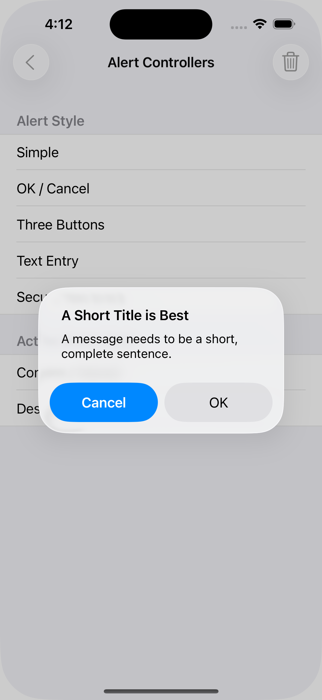
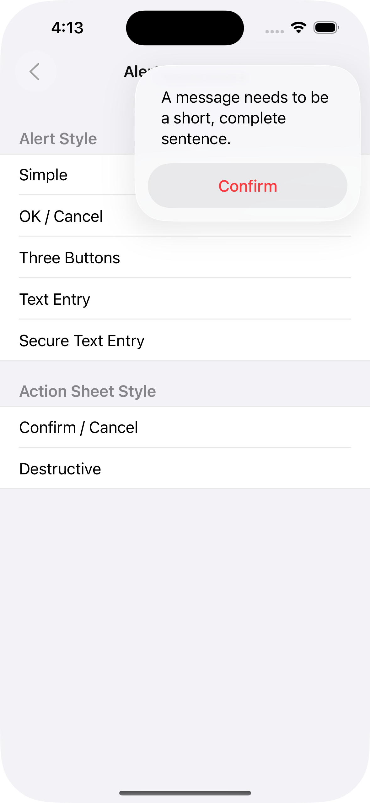

> Navigation: [Technologies](../technologies.md) · [UIKit](../uikit.md) · [Windows and screens](windows-and-screens.md)

# Getting the user’s attention with alerts and action sheets

<sub>Article</sub>

Present important information to a person or prompt them about an important choice.

## Overview

Display an alert or action sheet when your app requires additional information or acknowledgment from a person. Alerts and action sheets interrupt your app’s normal flow to display a message to the person. The following image shows an alert, which the person dismisses by selecting one of the listed options.



<sub>An alert with a title that says 'A Short Title is Best', a message that says 'A message needs to be a short, complete sentence.', and has buttons for OK and Cancel.</sub>

The following image shows an action sheet. A person dismisses an action sheet by selecting one of the listed options, or by tapping outside an action sheet.



<sub>An action sheet shows with a message that says 'A message needs to be a short, complete sentence.', and has a button for Confirm.</sub>

> [!important] Important
> Alerts and action sheets are interruptions to someone’s current task, so use them sparingly and only when absolutely needed. For detailed guidance on when to use them, see “Action sheets” and “Alerts” in [Human Interface Guidelines](https://developer.apple.com/design/human-interface-guidelines/presentation).

### Present an alert

To display an alert, create a [UIAlertController](uialertcontroller.md) object, configure it, and then call [- presentViewController:animated:completion:](<uiviewcontroller/present(__animated_completion_).md>) with the object as a parameter, as shown in the following code. Configuring the alert controller includes specifying the title and message that you want the person to see and the actions they can select. Add at least one action — represented by a [UIAlertAction](uialertaction.md) object — to an alert controller before you present it.

```swift
@IBAction func agreeToTerms() {
   // Create the action buttons for the alert.
   let defaultAction = UIAlertAction(title: "Agree", 
                        style: .default) { (action) in
	// Respond to the person's selection of the action.
   }
   let cancelAction = UIAlertAction(title: "Disagree", 
                        style: .cancel) { (action) in
	// Respond to the person's selection of the action.
   }
   
   // Create and configure the alert controller.     
   let alert = UIAlertController(title: "Terms and Conditions",
         message: "Click Agree to accept the terms and conditions.",
         preferredStyle: .alert)
   alert.addAction(defaultAction)
   alert.addAction(cancelAction)
        
   self.present(alert, animated: true) {
      // The system presented the alert.
   }
}
```

### Present an action sheet

Display an action sheet inside a popover on both iPhone and iPad. To display your action sheet in a popover, specify your popover’s anchor point using the [popoverPresentationController](uiviewcontroller/popoverpresentationcontroller.md) property of your alert controller.

```swift
@IBAction func deleteItem() {
   let destroyAction = UIAlertAction(title: "Delete", 
             style: .destructive) { (action) in
	// Respond to user selection of the action.
   }
   let cancelAction = UIAlertAction(title: "Cancel", 
             style: .cancel) { (action) in
	// Respond to user selection of the action.
   }
        
   let alert = UIAlertController(title: "Delete the image?", 
               message: "", 
               preferredStyle: .actionSheet)
   alert.addAction(destroyAction)
   alert.addAction(cancelAction)
        
   alert.popoverPresentationController?.sourceItem = 
               self.trashButton
        
   self.present(alert, animated: true) {
      // The system presented the alert.
   }
}
```

Configure the popover presentation controller’s [sourceItem](uipopoverpresentationcontroller/sourceitem.md) to anchor the popover to a [UIBarButtonItem](uibarbuttonitem.md) or [NSToolbarItem](../appkit/nstoolbaritem.md). When a person taps the button, the popover animates from and replaces the specified item until they select an action item or dismiss the popover.

Alternatively, specify the anchor location for the popover using the [sourceView](uipopoverpresentationcontroller/sourceview.md) and [sourceRect](uipopoverpresentationcontroller/sourcerect.md) properties.

> [!note] Note
> If your set of actions includes a button configured with the [UIAlertActionStyleCancel](uialertaction/style-swift.enum/cancel.md) style, UIKit removes that button when displaying your action sheet in a popover. Tapping anywhere outside of the popover has the same effect as tapping the Cancel button, including calling your action handler.

## See Also

### Alerts

- [UIAlertController](uialertcontroller.md) — An object that displays an alert message.
- [UIAlertAction](uialertaction.md) — An action that can be taken when the user taps a button in an alert.
