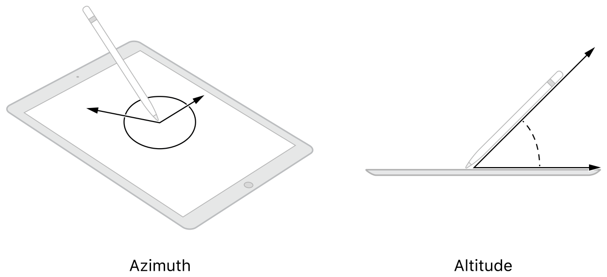

> Navigation: [Technologies](../technologies.md) · [UIKit](../uikit.md) · [Apple Pencil interactions](apple-pencil-interactions.md)

# Handling input from Apple Pencil

Learn how to detect and respond to touches from Apple Pencil.

## Overview

UIKit reports touches from Apple Pencil in the same way it reports touches from a person’s fingers. Specifically, UIKit delivers a [UITouch](uitouch.md) object containing the location of the touch in your app. However, a touch object originating from Apple Pencil contains additional information, including the azimuth and altitude of Apple Pencil and the amount of force recorded at its tip.



<sub>An illustration of how azimuth (shown on the left) and altitude (shown on the right) are determined when using Apple Pencil on a screen.</sub>

Because Apple Pencil is a separate device, there’s a delay between the time Apple Pencil gathers altitude, azimuth, and force values and the time that those values are reported to your app. As a result, UIKit may provide _estimated_ values for those properties initially, and then provide the real values at a later time. If you use altitude, azimuth, or force information from Apple Pencil, you must explicitly handle estimated properties.

> [!note] Note
> Devices that work with Apple Pencil can report touches at up to 240 Hz. Because UIKit usually reports touches at around 60 Hz, any additional touches are coalesced into a single touch representing the last location. For information about how to get the additional touch data, see [Getting high-fidelity input with coalesced touches](getting-high-fidelity-input-with-coalesced-touches.md).

### Handle estimated properties

When UIKit has only an estimate of a property’s value, it includes a flag in the [estimatedPropertiesExpectingUpdates](uitouch/estimatedpropertiesexpectingupdates.md) property of the corresponding [UITouch](uitouch.md) object. When handling a touch event, check that property to determine if you need to update the touch information later.

When a touch object contains estimated properties, UIKit also provides a value in the [estimationUpdateIndex](uitouch/estimationupdateindex.md) property. Use this value as a key to a dictionary that you maintain to identify the touch later. Set the value of that key to the app-specific object that you use to store the touch information. When UIKit later reports the real values, use the index to look up your app-specific object and replace the estimated values with the real values.

The following code shows the `addSamples` method of an app that captures touch data. For each touch, the method creates a custom `StrokeSample` object with the touch information. If the force value of the touch is only an estimate, the `registerForEstimates` method caches the sample in a dictionary using the value in the [estimationUpdateIndex](uitouch/estimationupdateindex.md) property as the key.

```swift
var estimates: [NSNumber: StrokeSample]
 
func addSamples(for touches: [UITouch]) {
   if let stroke = strokeCollection?.activeStroke {
      for touch in touches {
         if touch == touches.last {
            let sample = StrokeSample(point: touch.location(in: self), 
                                 forceValue: touch.force)
            stroke.add(sample: sample)
            registerForEstimates(touch: touch, sample: sample)
         } else {
            let sample = StrokeSample(point: touch.location(in: self), 
                                 forceValue: touch.force, coalesced: true)
            stroke.add(sample: sample)
            registerForEstimates(touch: touch, sample: sample)
         }
      }
      self.setNeedsDisplay()
   }
}
 
func registerForEstimates(touch : UITouch, sample : StrokeSample) {
   if touch.estimatedPropertiesExpectingUpdates.contains(.force) {
      estimates[touch.estimationUpdateIndex!] = sample
   }
}
```

When UIKit receives the actual values for a touch, it calls the [- touchesEstimatedPropertiesUpdated:](<uiresponder/touchesestimatedpropertiesupdated(__).md>) method of your responder or gesture recognizer. Use that method to replace estimated data with the real values provided by UIKit.

The following code shows an example of the [- touchesEstimatedPropertiesUpdated:](<uiresponder/touchesestimatedpropertiesupdated(__).md>) method, which updates the force value for the cached `StrokeSample` objects created in the previous code example. The method uses the value in the [estimationUpdateIndex](uitouch/estimationupdateindex.md) property to retrieve the `StrokeSample` object from the `estimates` dictionary. It then updates the force value and removes the sample from the dictionary.

```swift
override func touchesEstimatedPropertiesUpdated(_ touches: Set<UITouch>) {
   for touch in touches {
      // If the force value is no longer an estimate, update it.
      if !touch.estimatedPropertiesExpectingUpdates.contains(.force) {
         let index = touch.estimationUpdateIndex!
         var sample = estimates[index]
         sample?.force = touch.force
 
         // Remove the key and value from the dictionary.
         estimates.removeValue(forKey: index)
      }
   }
}
```

## Topics

### Related articles

- [Computing the perpendicular force of Apple Pencil](computing-the-perpendicular-force-of-apple-pencil.md) — Adjust the force values reported by Apple Pencil so that they’re consistent with 3D Touch force values.

## See Also

### Essentials

- [Handling double taps from Apple Pencil](../applepencil/handling-double-taps-from-apple-pencil.md) — Detect and respond to double taps a person makes on Apple Pencil.
- [Handling squeezes from Apple Pencil](../applepencil/handling-squeezes-from-apple-pencil.md) — Detect and respond to squeezes a person makes on Apple Pencil Pro.
