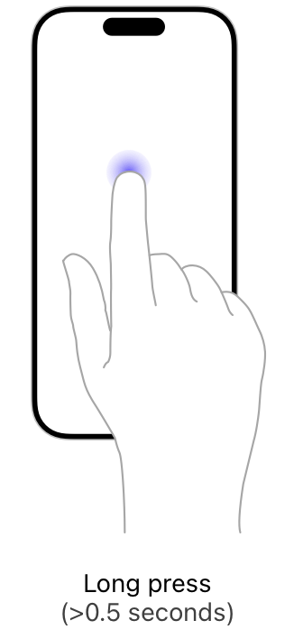

> Navigation: [Technologies](../technologies.md) · [UIKit](../uikit.md) · [Touches, presses, and gestures](touches-presses-and-gestures.md) · [Handling UIKit gestures](handling-uikit-gestures.md)

# Handling long-press gestures

<sub>Article</sub>

Detect extended duration taps on the screen, and use them to reveal contextually relevant content.

## Overview

Long-press (also known as press-and-hold) gestures detect one or more fingers (or a stylus) touching the screen for an extended period of time. You configure the minimum duration required to recognize the press and the number of times the fingers must be touching the screen. (The gesture recognizer is triggered only by the duration of the touches and not by the force associated with them.) You might use a long-press gesture to initiate an action on the object being pressed. For example, you might use it to display a context-sensitive menu.

You can attach a gesture recognizer in one of these ways:

- Programmatically. Call the [- addGestureRecognizer:](<uiview/addgesturerecognizer(__).md>) method of your view.
- In Interface Builder. Drag the appropriate object from the library and drop it onto your view.



Long-press gestures are continuous gestures, meaning that your action method may be called multiple times as the state changes. After a person’s fingers have touched the screen for the minimum amount of time, a long-press gesture recognizer enters the [UIGestureRecognizerStateBegan](uigesturerecognizer/state-swift.enum/began.md) state. The gesture recognizer moves to the [UIGestureRecognizerStateChanged](uigesturerecognizer/state-swift.enum/changed.md) state if the fingers move or if any other changes occur to the touches. The gesture recognizer remains in the [UIGestureRecognizerStateChanged](uigesturerecognizer/state-swift.enum/changed.md) state as long as the fingers remain down, even if those fingers move outside of the initial view. When a person’s fingers lift from the screen, the gesture recognizer enters the [UIGestureRecognizerStateEnded](uigesturerecognizer/state-swift.enum/ended.md) state.

The following code shows an action method that displays a context menu on top of the view. It displays the context menu at the beginning of the gesture, while a person’s finger is still on the screen. The view controller that implements this method also sets itself as the first responder so that it can respond to menu actions selected by a person.

```swift
@IBAction func showResetMenu(_ gestureRecognizer: UILongPressGestureRecognizer) {
   if gestureRecognizer.state == .began {
      self.becomeFirstResponder()
      self.viewForReset = gestureRecognizer.view

      // Configure the menu item to display
      let menuItemTitle = NSLocalizedString("Reset", comment: "Reset menu item title")
      let action = #selector(ViewController.resetPiece(controller:))
      let resetMenuItem = UIMenuItem(title: menuItemTitle, action: action)

      // Configure the shared menu controller
      let menuController = UIMenuController.shared
      menuController.menuItems = [resetMenuItem]

      // Set the location of the menu in the view.
      let location = gestureRecognizer.location(in: gestureRecognizer.view)
      let menuLocation = CGRect(x: location.x, y: location.y, width: 0, height: 0)
      menuController.setTargetRect(menuLocation, in: gestureRecognizer.view!)

      // Show the menu.
      menuController.setMenuVisible(true, animated: true)
   }
}
```

If the code for your long-press gesture recognizer isn’t called, check to see if the following conditions are true, and make corrections as needed:

- The [userInteractionEnabled](uiview/isuserinteractionenabled.md) property of the view is set to [true](../swift/true.md). Image views and labels set this property to [false](../swift/false.md) by default.
- The tap duration was greater than what is specified in the [minimumPressDuration](uilongpressgesturerecognizer/minimumpressduration.md) property.
- The number of taps was equal to the number specified in the [numberOfTapsRequired](uilongpressgesturerecognizer/numberoftapsrequired.md) property.
- The number of fingers was equal to the number specified in the [numberOfTouchesRequired](uilongpressgesturerecognizer/numberoftouchesrequired.md) property.

## See Also

### Gestures

- [Handling tap gestures](handling-tap-gestures.md) — Use brief taps on the screen to implement button-like interactions with your content.
- [Handling pan gestures](handling-pan-gestures.md) — Trace the movement of fingers around the screen, and apply that movement to your content.
- [Handling swipe gestures](handling-swipe-gestures.md) — Detect a horizontal or vertical swipe motion on the screen, and use it to trigger navigation through your content.
- [Handling pinch gestures](handling-pinch-gestures.md) — Track the distance between two fingers and use that information to scale or zoom your content.
- [Handling rotation gestures](handling-rotation-gestures.md) — Measure the relative rotation of two fingers on the screen, and use that motion to rotate your content.
