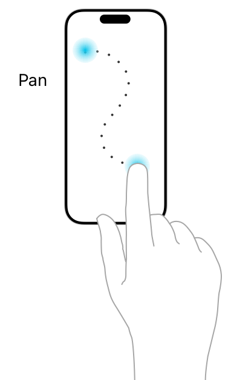

> Navigation: [Technologies](../technologies.md) · [UIKit](../uikit.md) · [Touches, presses, and gestures](touches-presses-and-gestures.md) · [Handling UIKit gestures](handling-uikit-gestures.md)

# Handling pan gestures

<sub>Article</sub>

Trace the movement of fingers around the screen, and apply that movement to your content.

## Overview

A pan gesture occurs any time a person moves one or more fingers around the screen. A screen-edge pan gesture is a specialized pan gesture that originates from the edge of the screen. Use the [UIPanGestureRecognizer](uipangesturerecognizer.md) class for pan gestures and the [UIScreenEdgePanGestureRecognizer](uiscreenedgepangesturerecognizer.md) class for screen-edge pan gestures.

You can attach a gesture recognizer in one of these ways:

- Programmatically. Call the [- addGestureRecognizer:](<uiview/addgesturerecognizer(__).md>) method of your view.
- In Interface Builder. Drag the appropriate object from the library and drop it onto your view.



Use pan gesture recognizers for tasks that require you to track the movement of the person’s fingers onscreen. You might use a pan gesture recognizer to drag objects around in your interface or update their appearance based on the position of the person’s finger. Pan gestures are continuous, so your action method is called whenever the touch information changes, giving you a chance to update your content.

A pan gesture recognizer enters the [UIGestureRecognizerStateBegan](uigesturerecognizer/state-swift.enum/began.md) state as soon as the required amount of initial movement is achieved. After that initial change, subsequent changes cause the gesture recognizer to enter the [UIGestureRecognizerStateChanged](uigesturerecognizer/state-swift.enum/changed.md) state. When the person’s fingers lift from the screen, the gesture recognizer enters the [UIGestureRecognizerStateEnded](uigesturerecognizer/state-swift.enum/ended.md) state.

To simplify tracking, use the pan gesture recognizer’s [- translationInView:](<uipangesturerecognizer/translation(in_).md>) method to get the distance that the person’s finger has moved from the original touch location. At the beginning of the gesture, a pan gesture recognizer stores the initial point of contact for the person’s fingers. (If the gesture involves multiple fingers, the gesture recognizer uses the center point of the set of touches.) Each time the fingers move, the [- translationInView:](<uipangesturerecognizer/translation(in_).md>) method reports the distance from the original location.

The following code shows an action method used to drag a view around the screen. When the gesture begins, this method saves the initial position of the view. It then updates the position of the view based on the movement of a person’s fingers.

```swift
var initialCenter = CGPoint()  // The initial center point of the view.
@IBAction func panPiece(_ gestureRecognizer: UIPanGestureRecognizer) {   
   guard gestureRecognizer.view != nil else { return }
   let piece = gestureRecognizer.view!
   // Get the changes in the X and Y directions relative to
   // the superview's coordinate space.
   let translation = gestureRecognizer.translation(in: piece.superview)
   if gestureRecognizer.state == .began {
      // Save the view's original position. 
      self.initialCenter = piece.center
   }
      // Update the position for the .began, .changed, and .ended states
   if gestureRecognizer.state != .cancelled {
      // Add the X and Y translation to the view's original position.
      let newCenter = CGPoint(x: initialCenter.x + translation.x, y: initialCenter.y + translation.y)
      piece.center = newCenter
   }
   else {
      // On cancellation, return the piece to its original location.
      piece.center = initialCenter
   }
}

```

If the code for your pan gesture recognizer isn’t called, check to see if the following conditions are true, and make corrections as needed:

- The [userInteractionEnabled](uiview/isuserinteractionenabled.md) property of the view is set to [true](../swift/true.md). Image views and labels set this property to [false](../swift/false.md) by default.
- The number of touches is between the values specified in the [minimumNumberOfTouches](uipangesturerecognizer/minimumnumberoftouches.md) and [maximumNumberOfTouches](uipangesturerecognizer/maximumnumberoftouches.md) properties.
- For a [UIScreenEdgePanGestureRecognizer](uiscreenedgepangesturerecognizer.md) object, the [edges](uiscreenedgepangesturerecognizer/edges.md) property is configured and touches start at the appropriate edge.

## See Also

### Gestures

- [Handling tap gestures](handling-tap-gestures.md) — Use brief taps on the screen to implement button-like interactions with your content.
- [Handling long-press gestures](handling-long-press-gestures.md) — Detect extended duration taps on the screen, and use them to reveal contextually relevant content.
- [Handling swipe gestures](handling-swipe-gestures.md) — Detect a horizontal or vertical swipe motion on the screen, and use it to trigger navigation through your content.
- [Handling pinch gestures](handling-pinch-gestures.md) — Track the distance between two fingers and use that information to scale or zoom your content.
- [Handling rotation gestures](handling-rotation-gestures.md) — Measure the relative rotation of two fingers on the screen, and use that motion to rotate your content.
