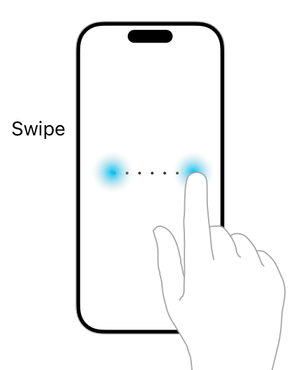

> Navigation: [Technologies](../technologies.md) · [UIKit](../uikit.md) · [Touches, presses, and gestures](touches-presses-and-gestures.md) · [Handling UIKit gestures](handling-uikit-gestures.md)

# Handling swipe gestures

<sub>Article</sub>

Detect a horizontal or vertical swipe motion on the screen, and use it to trigger navigation through your content.

## Overview

A swipe gesture occurs when a person moves one or more fingers across the screen in a specific horizontal or vertical direction. Use the [UISwipeGestureRecognizer](uiswipegesturerecognizer.md) class to detect swipe gestures.

You can attach a gesture recognizer in one of these ways:

- Programmatically. Call the [- addGestureRecognizer:](<uiview/addgesturerecognizer(__).md>) method of your view.
- In Interface Builder. Drag the appropriate object from the library and drop it onto your view.



A [UISwipeGestureRecognizer](uiswipegesturerecognizer.md) object tracks the motion of a person’s finger across the screen either horizontally or vertically. A swipe requires a person’s finger to move in a specific direction and not deviate significantly from the main direction of travel. (The direction and number of fingers required for the gesture are configurable.) Swipe gestures are discrete, so your action method is called only after the gesture ends successfully. As a result, swipes are most appropriate when you care only about the results of the gesture and not about tracking the movement of a person’s finger.

> [!note] Note
> Because swipes are discrete, use them only for flicks or quick panning gestures where the resulting action is understood. Swipes aren’t intended for interactive gestures, such as interactive transitions. For design guidance, see [Human Interface Guidelines](https://developer.apple.com/design/human-interface-guidelines/inputs/touchscreen-gestures/).

The following code shows a skeletal action method for a swipe gesture recognizer. You use a method like this to perform a task when the gesture is recognized. Because the gesture is discrete, the gesture recognizer doesn’t enter the began or changed states.

```swift
@IBAction func swipeHandler(_ gestureRecognizer : UISwipeGestureRecognizer) {
    if gestureRecognizer.state == .ended {
        // Perform action.
    }
}
```

If the code for your swipe gesture recognizer isn’t called, check to see if the following conditions are true, and make corrections as needed:

- The [userInteractionEnabled](uiview/isuserinteractionenabled.md) property of the view is set to [true](../swift/true.md). Image views and labels set this property to [false](../swift/false.md) by default.
- The number of touches is equal to the value specified in the [numberOfTouchesRequired](uiswipegesturerecognizer/numberoftouchesrequired.md) property.
- The direction of the swipe matches the value in the [direction](uiswipegesturerecognizer/direction-swift.property.md) property.

## See Also

### Gestures

- [Handling tap gestures](handling-tap-gestures.md) — Use brief taps on the screen to implement button-like interactions with your content.
- [Handling long-press gestures](handling-long-press-gestures.md) — Detect extended duration taps on the screen, and use them to reveal contextually relevant content.
- [Handling pan gestures](handling-pan-gestures.md) — Trace the movement of fingers around the screen, and apply that movement to your content.
- [Handling pinch gestures](handling-pinch-gestures.md) — Track the distance between two fingers and use that information to scale or zoom your content.
- [Handling rotation gestures](handling-rotation-gestures.md) — Measure the relative rotation of two fingers on the screen, and use that motion to rotate your content.
