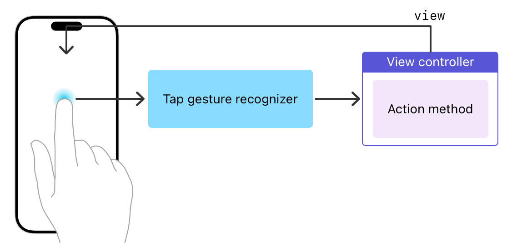

> Navigation: [Technologies](../technologies.md) · [UIKit](../uikit.md) · [Touches, presses, and gestures](touches-presses-and-gestures.md)

# Handling UIKit gestures

Use gesture recognizers to simplify touch handling and create a consistent user experience.

## Overview

Gesture recognizers are the simplest way to handle touch or press events in your views. You can attach one or more gesture recognizers to any view. Gesture recognizers encapsulate all of the logic needed to process and interpret incoming events for that view and match them to a known pattern. When a match is detected, the gesture recognizer notifies its assigned target object, which can be a view controller, the view itself, or any other object in your app.

Gesture recognizers use the target-action design pattern to send notifications. When the [UITapGestureRecognizer](uitapgesturerecognizer.md) object detects a single-finger tap in the view, it calls an action method of the view’s view controller, which you use to provide a response.



Gesture recognizers come in two types: discrete and continuous. A _discrete gesture recognizer_ calls your action method exactly once after the gesture is recognized. After its initial recognition criteria are met, a _continuous gesture recognizer_ performs calls to your action method many times, notifying you whenever the information in the gesture’s event changes. For example, a [UIPanGestureRecognizer](uipangesturerecognizer.md) object calls your action method each time the touch position changes.

Interface Builder includes objects for each of the standard UIKit gesture recognizers. It also includes a custom gesture recognizer object that you can use to represent your custom [UIGestureRecognizer](uigesturerecognizer.md) subclasses.

### Configuring a gesture recognizer

To configure a gesture recognizer:

1. In your storyboard, drag the gesture recognizer onto your view.
2. Implement an action method to be called when the gesture is recognized; see the following code.
3. Connect your action method to the gesture recognizer.

You can create this connection in Interface Builder by right-clicking the gesture recognizer and connecting its Sent Action selector to the appropriate object in your interface. You can also configure the action method programmatically using the [- addTarget:action:](<uigesturerecognizer/addtarget(__action_).md>) method of the gesture recognizer.

The following code shows the generic format for the action method of a gesture recognizer. If you prefer, you can change the parameter type to match a specific gesture recognizer subclass.

**Swift**

```swift
@IBAction func myActionMethod(_ sender: UIGestureRecognizer)
```

**Objective-C**

```objc
- (IBAction)myActionMethod:(UIGestureRecognizer*)sender
```

### Responding to gestures

The action method associated with a gesture recognizer provides your app’s response to that gesture. For discrete gestures, your action method is similar to the action method for a button. Once the action method is called, you perform whatever task is appropriate for that gesture. For continuous gestures, your action method can respond to the recognition of the gesture, but it can also track events before the gesture is recognized. Tracking events lets you create a more interactive experience. For example, you might use the updates from a [UIPanGestureRecognizer](uipangesturerecognizer.md) object to reposition content in your app.

The [state](uigesturerecognizer/state-swift.property.md) property of a gesture recognizer communicates the object’s current state of recognition. For continuous gestures, the gesture recognizer updates the value of this property from [UIGestureRecognizerStateBegan](uigesturerecognizer/state-swift.enum/began.md) to [UIGestureRecognizerStateChanged](uigesturerecognizer/state-swift.enum/changed.md) to [UIGestureRecognizerStateEnded](uigesturerecognizer/state-swift.enum/ended.md), or to [UIGestureRecognizerStateCancelled](uigesturerecognizer/state-swift.enum/cancelled.md). Your action methods use this property to determine an appropriate course of action. For example, you might use the began and changed states to make temporary changes to your content, use the ended state to make those changes permanent, and use the cancelled state to discard the changes. Always check the value of the [state](uigesturerecognizer/state-swift.property.md) property of a gesture recognizer before taking actions.

For examples of how to handle specific types of gestures, see the following information:

- [Handling tap gestures](handling-tap-gestures.md)
- [Handling long-press gestures](handling-long-press-gestures.md)
- [Handling pan gestures](handling-pan-gestures.md)
- [Handling swipe gestures](handling-swipe-gestures.md)
- [Handling pinch gestures](handling-pinch-gestures.md)
- [Handling rotation gestures](handling-rotation-gestures.md)

For more information about gesture recognizer states and how they affect your code, see [Implementing a custom gesture recognizer](implementing-a-custom-gesture-recognizer.md).

## Topics

### Gestures

- [Handling tap gestures](handling-tap-gestures.md) — Use brief taps on the screen to implement button-like interactions with your content.
- [Handling long-press gestures](handling-long-press-gestures.md) — Detect extended duration taps on the screen, and use them to reveal contextually relevant content.
- [Handling pan gestures](handling-pan-gestures.md) — Trace the movement of fingers around the screen, and apply that movement to your content.
- [Handling swipe gestures](handling-swipe-gestures.md) — Detect a horizontal or vertical swipe motion on the screen, and use it to trigger navigation through your content.
- [Handling pinch gestures](handling-pinch-gestures.md) — Track the distance between two fingers and use that information to scale or zoom your content.
- [Handling rotation gestures](handling-rotation-gestures.md) — Measure the relative rotation of two fingers on the screen, and use that motion to rotate your content.

## See Also

### Standard gestures

- [Coordinating multiple gesture recognizers](coordinating-multiple-gesture-recognizers.md) — Discover how to use multiple gesture recognizers on the same view.
- [Adopting hover support for Apple Pencil](adopting-hover-support-for-apple-pencil.md) — Enhance user feedback for your iPadOS app with a hover preview for Apple Pencil input.
- [Supporting gesture interaction in your apps](supporting-gesture-interaction-in-your-apps.md) — Enrich your app’s user experience by supporting standard and custom gesture interaction.
- [UIHoverGestureRecognizer](uihovergesturerecognizer.md) — A continuous gesture recognizer that interprets pointer movement over a view.
- [UILongPressGestureRecognizer](uilongpressgesturerecognizer.md) — A continuous gesture recognizer that interprets long-press gestures.
- [UIPanGestureRecognizer](uipangesturerecognizer.md) — A continuous gesture recognizer that interprets panning gestures.
- [UIPinchGestureRecognizer](uipinchgesturerecognizer.md) — A continuous gesture recognizer that interprets pinching gestures involving two touches.
- [UIRotationGestureRecognizer](uirotationgesturerecognizer.md) — A continuous gesture recognizer that interprets rotation gestures involving two touches.
- [UIScreenEdgePanGestureRecognizer](uiscreenedgepangesturerecognizer.md) — A continuous gesture recognizer that interprets panning gestures that start near an edge of the screen.
- [UISwipeGestureRecognizer](uiswipegesturerecognizer.md) — A discrete gesture recognizer that interprets swiping gestures in one or more directions.
- [UITapGestureRecognizer](uitapgesturerecognizer.md) — A discrete gesture recognizer that interprets single or multiple taps.
