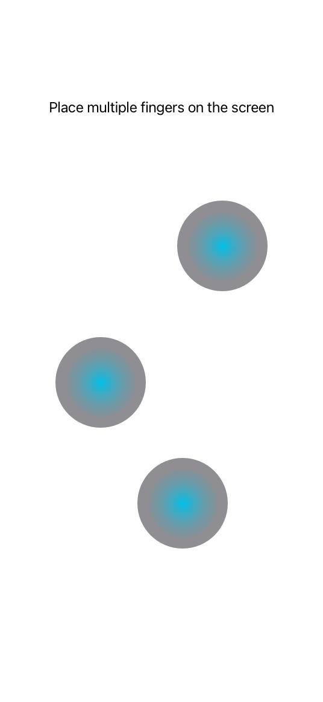
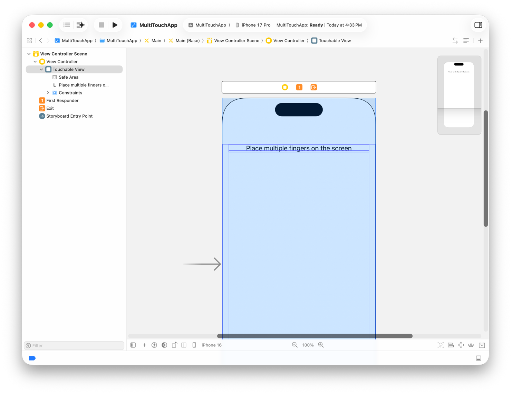

> Navigation: [Technologies](../technologies.md) · [UIKit](../uikit.md) · [Touches, presses, and gestures](touches-presses-and-gestures.md) · [Handling touches in your view](handling-touches-in-your-view.md)

# Implementing a Multi-Touch app

<sub>Article</sub>

Learn how to create a simple app that handles multitouch input.

## Overview

Consider the app shown in the following image, where a single main view draws a gray circle at each touch location. When a touch ends, the circle disappears. When the user’s fingers move, the underlying circles move with them.



The creation of this app begins with the Single View app template in Xcode. This type of app has a single view controller whose view — in this case, a custom subclass of [UIView](uiview.md) called `TouchableView` — fills the screen. The view contains only a label initially, but the app programmatically adds subviews later. The following image shows the storyboard for the view controller.



<sub>A screenshot of a storyboard in Interface Builder showing a single view controller, whose view is of the custom type TouchableView.</sub>

### Implement the TouchableView class

The `TouchableView` class overrides the inherited [- touchesBegan:withEvent:](<uiresponder/touchesbegan(__with_).md>), [- touchesMoved:withEvent:](<uiresponder/touchesmoved(__with_).md>), [- touchesEnded:withEvent:](<uiresponder/touchesended(__with_).md>), and [- touchesCancelled:withEvent:](<uiresponder/touchescancelled(__with_).md>) methods. These methods handle the creation and management of subviews that draw the gray circles at each touch location. Specifically, these methods do the following:

- The [- touchesBegan:withEvent:](<uiresponder/touchesbegan(__with_).md>) method creates a new subview at the location of each touch event.
- The [- touchesMoved:withEvent:](<uiresponder/touchesmoved(__with_).md>) method updates the position of the subview associated with each touch.
- The [- touchesEnded:withEvent:](<uiresponder/touchesended(__with_).md>) and [- touchesCancelled:withEvent:](<uiresponder/touchescancelled(__with_).md>) methods remove the subview associated with each touch that ended.

The following code shows the main implementation of the `TouchableView` class and its touch handling methods. Each method iterates through the touches and performs the needed actions. The `touchViews` dictionary uses the [UITouch](uitouch.md) objects as keys to retrieve the subviews the user is manipulating onscreen.

```swift
class TouchableView: UIView {
   var touchViews = [UITouch:TouchSpotView]() 
 
   override init(frame: CGRect) {
      super.init(frame: frame)
      isMultipleTouchEnabled = true
   }
 
   required init?(coder aDecoder: NSCoder) {
      super.init(coder: aDecoder)
      isMultipleTouchEnabled = true
   }
 
   override func touchesBegan(_ touches: Set<UITouch>, with event: UIEvent?) {
      for touch in touches {
         createViewForTouch(touch: touch)
      }
   }
 
   override func touchesMoved(_ touches: Set<UITouch>, with event: UIEvent?) {
      for touch in touches {
         let view = viewForTouch(touch: touch) 
         // Move the view to the new location.
         let newLocation = touch.location(in: self)
         view?.center = newLocation
      }
   }
 
   override func touchesEnded(_ touches: Set<UITouch>, with event: UIEvent?) {
      for touch in touches {
         removeViewForTouch(touch: touch)
      }
   }
 
   override func touchesCancelled(_ touches: Set<UITouch>, with event: UIEvent?) {
      for touch in touches {
         removeViewForTouch(touch: touch)
      }
   }
  
   // Other methods... 
}
```

Several helper methods handle creation, management, and disposal of the subviews, as shown in the following code. The `createViewForTouch` method creates a new `TouchSpotView` object and adds it to the `TouchableView` object, animating the view to its full size. The `removeViewForTouch` method removes the corresponding subview and updates the class data structures. The `viewForTouch` method is a convenience method for retrieving the view associated with a given touch event.

```swift
func createViewForTouch( touch : UITouch ) {
   let newView = TouchSpotView()
   newView.bounds = CGRect(x: 0, y: 0, width: 1, height: 1)
   newView.center = touch.location(in: self)
 
   // Add the view and animate it to a new size.
   addSubview(newView)
   UIView.animate(withDuration: 0.2) {
      newView.bounds.size = CGSize(width: 100, height: 100)
   }
 
   // Save the views internally.
   touchViews[touch] = newView
}
 
func viewForTouch (touch : UITouch) -> TouchSpotView? {
   return touchViews[touch]
}
 
func removeViewForTouch (touch : UITouch ) {
   if let view = touchViews[touch] {
      view.removeFromSuperview()
      touchViews.removeValue(forKey: touch)
   }
}
```

### Implement the TouchSpotView class

The `TouchSpotView` class (shown in the following code) represents the custom subviews that draw the gray circles onscreen. `TouchSpotView` maintains its circular shape by setting the [cornerRadius](../quartzcore/calayer/cornerradius.md) property of the layer each time its [bounds](uiview/bounds.md) property changes.

```swift
class TouchSpotView : UIView {
   override init(frame: CGRect) {
      super.init(frame: frame)
      backgroundColor = UIColor.lightGray
   }
 
   // Update the corner radius when the bounds change.
   override var bounds: CGRect {
      get { return super.bounds }
      set(newBounds) {
         super.bounds = newBounds
         layer.cornerRadius = newBounds.size.width / 2.0
      }
   }
}
```

## See Also

### Advanced touch handling

- [Getting high-fidelity input with coalesced touches](getting-high-fidelity-input-with-coalesced-touches.md) — Learn how to support high-precision touches in your app.
- [Minimizing latency with predicted touches](minimizing-latency-with-predicted-touches.md) — Create a smooth and responsive drawing experience using UIKit’s predictions for touch locations.
