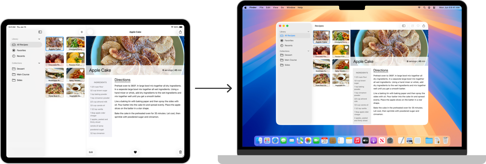

> Navigation: [Technologies](../technologies.md) · [UIKit](../uikit.md)

# Mac Catalyst

API Collection

Create a version of your iPad app that users can run on a Mac device.

## Overview

With Mac Catalyst, you can make a Mac version of your iPad app. Click the Mac checkbox in your iPad app’s project settings to configure the project to build both Mac and iPad versions of your app. The two apps share the same project and source code, making it easy to change your code in one place.

A photograph of an iPad and a Mac laptop, with an arrow pointing from the iPad to the Mac. The screen of the iPad shows a sample recipes app and the laptop displays a Mac version of the sample app.

For information about designing a Mac version of your iPad app, see [Mac Catalyst](https://developer.apple.com/design/human-interface-guidelines/ios/overview/mac-catalyst/) in the Human Interface Guidelines.

> [!important] Important
> Mac apps built with Mac Catalyst can only use [AppKit](../appkit.md) APIs marked as available in Mac Catalyst, such as [NSToolbar](../appkit/nstoolbar.md) and [NSTouchBar](../appkit/nstouchbar.md). Mac Catalyst doesn’t support accessing unavailable AppKit APIs.

## Topics

### Essentials

- [Creating a Mac version of your iPad app](creating-a-mac-version-of-your-ipad-app.md) — Bring your iPad app to macOS with Mac Catalyst.

### App support

- [Bring an iPad App to the Mac with Mac Catalyst](../tutorials/mac-catalyst.md) — Build a native Mac app from the same codebase as your iPad app.
- [Choosing a user interface idiom for your Mac app](choosing-a-user-interface-idiom-for-your-mac-app.md) — Select the iPad or the Mac user interface idiom in your Mac app built with Mac Catalyst.
- [Optimizing your iPad app for Mac](optimizing-your-ipad-app-for-mac.md) — Make your iPad app more like a Mac app by taking advantage of system features in macOS.
- [LSMinimumSystemVersion](../bundleresources/information-property-list/lsminimumsystemversion.md) — The minimum version of the operating system required for the app to run in macOS.
- [UIApplicationSupportsTabbedSceneCollection](../bundleresources/information-property-list/uiapplicationscenemanifest/uiapplicationsupportstabbedscenecollection.md) — A Boolean value indicating whether an app built with Mac Catalyst supports automatic tabbing mode.

### User interface

- [UIKit Catalog: Creating and customizing views and controls](uikit-catalog-creating-and-customizing-views-and-controls.md) — Customize your app’s user interface with views and controls.
- [Building and improving your app with Mac Catalyst](building-and-improving-your-app-with-mac-catalyst.md) — Improve your iPadOS app with Mac Catalyst by supporting native controls, multiple windows, sharing, printing, menus and keyboard shortcuts.
- [Displaying a checkbox in your Mac app built with Mac Catalyst](displaying-a-checkbox-in-your-mac-app-built-with-mac-catalyst.md) — Present a switch control as a Mac-style checkbox when your app runs in the Mac user interface idiom.
- [Removing the title bar in your Mac app built with Mac Catalyst](removing-the-title-bar-in-your-mac-app-built-with-mac-catalyst.md) — Display content that fills the entire height of a window by removing the title bar.
- [Toolbar](toolbar.md) — Provide a space for controls under a window’s title bar and above your custom content.
- [Touch Bar](../appkit/touch-bar.md) — Display interactive content and controls in the Touch Bar.

### User interactions

- [Navigating an app’s user interface using a keyboard](navigating-an-app-s-user-interface-using-a-keyboard.md) — Navigate between user interface elements using a keyboard and focusable UI elements in iPad apps and apps built with Mac Catalyst.
- [Adding menus and shortcuts to the menu bar and user interface](adding-menus-and-shortcuts-to-the-menu-bar-and-user-interface.md) — Provide quick access to useful actions by adding menus and keyboard shortcuts to your Mac app built with Mac Catalyst.
- [Handling key presses made on a physical keyboard](handling-key-presses-made-on-a-physical-keyboard.md) — Detect when someone presses and releases keys on a physical keyboard.
- [UIHoverGestureRecognizer](uihovergesturerecognizer.md) — A continuous gesture recognizer that interprets pointer movement over a view.

### User preferences

- [Displaying a Settings window](displaying-a-settings-window.md) — Provide a Settings window in your Mac app built with Mac Catalyst so users can manage app settings defined in a Settings bundle.
- [Detecting changes in the preferences window](detecting-changes-in-the-preferences-window.md) — Listen for and respond to a user’s preference changes in your Mac app built with Mac Catalyst using Combine.

### Tooltips

- [Showing help tags for views and controls using tooltip interactions](showing-help-tags-for-views-and-controls-using-tooltip-interactions.md) — Explain the purpose of interface elements by showing a tooltip when a person positions the pointer over the element.
- [UIToolTipInteraction](uitooltipinteraction.md) — An interaction object that makes it possible to show a tooltip when hovering a pointer over a view or control.
- [UIToolTipInteractionDelegate](uitooltipinteractiondelegate.md) — An interface that provides tooltip settings to an interaction.

## See Also

### App structure

- [App and environment](app-and-environment.md) — Manage life-cycle events and your app’s UI scenes, and get information about traits and the environment in which your app runs.
- [Documents, data, and pasteboard](documents-data-and-pasteboard.md) — Organize your app’s data and share that data on the pasteboard.
- [Resource management](resource-management.md) — Manage the images, strings, storyboards, and nib files that you use to implement your app’s interface.
- [App extensions](app-extensions.md) — Extend your app’s basic functionality to other parts of the system.
- [Interprocess communication](interprocess-communication.md) — Display activity-based services to people.
