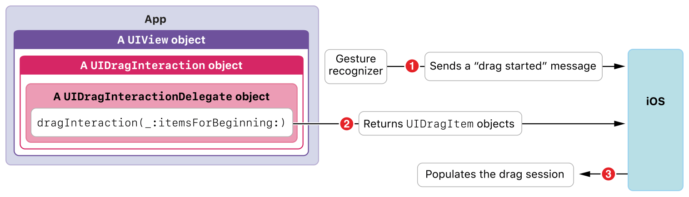

> Navigation: [Technologies](../technologies.md) · [UIKit](../uikit.md) · [Drag and drop](drag-and-drop.md)

# Making a view into a drag source

<sub>Article</sub>

Adopt drag interaction APIs to provide items for dragging.

## Overview

By implementing a drag interaction delegate ([UIDragInteractionDelegate](uidraginteractiondelegate.md)) for a view, you enable that view to function as a drag source in your app.

> [!note] Note
> The [UITextView](uitextview.md), [UITableView](uitableview.md), and [UICollectionView](uicollectionview.md) classes each provide their own, specialized support for creating drag items. See these classes for more information.

### Enable a view as a drag source

Any instance or subclass of [UIView](uiview.md) can act as a drag source. Your first steps to make this happen are:

1. Create a drag interaction (a [UIDragInteraction](uidraginteraction.md) instance).
2. Specify the drag interaction’s delegate (an object that conforms to the [UIDragInteractionDelegate](uidraginteractiondelegate.md) protocol).
3. Add the interaction to the view’s [interactions](uiview/interactions.md) property.

Here’s how to do this using a custom helper method, which you’d typically call within a view controller’s [- viewDidLoad](<uiviewcontroller/viewdidload().md>) method:

```swift
func customEnableDragging(on view: UIView, dragInteractionDelegate: UIDragInteractionDelegate) {
    let dragInteraction = UIDragInteraction(delegate: dragInteractionDelegate)
    view.addInteraction(dragInteraction)
}
```

### Create a drag item

A drag item encapsulates a source app’s promises for providing a variety of data representations for one model object.

To create a drag item, implement the [- dragInteraction:itemsForBeginningSession:](<uidraginteractiondelegate/draginteraction(__itemsforbeginning_).md>) method in your drag interaction delegate, as shown here in a minimal form:

```swift
func dragInteraction(_ interaction: UIDragInteraction, itemsForBeginning session: UIDragSession) -> [UIDragItem] {
    // Cast to NSString is required for NSItemProviderWriting support.
    let stringItemProvider = NSItemProvider(object: "Hello World" as NSString)
    return [
        UIDragItem(itemProvider: stringItemProvider)
    ]
}
```

> [!note] Note
> The cast from the Swift [String](../swift/string.md) type to the Foundation [NSString](../foundation/nsstring.md) class, in the code snippet above, is required because model objects for drag and drop must support the [NSItemProviderWriting](../foundation/nsitemproviderwriting.md) protocol.

This implementation uses the [init(object:)](<../foundation/nsitemprovider/init(object_).md>) convenience initializer. When you instantiate a drag item, pass an object in your app’s native representation, or in the highest-fidelity representation you support. In general, ensure that the first element in the item provider’s [registeredTypeIdentifiers](../foundation/nsitemprovider/registeredtypeidentifiers.md) array represents the highest-fidelity data your drag interaction delegate can deliver.

To add more data representations to a drag item, as you typically would in your app, add them in fidelity order, from highest to lowest. When adding representations, you have choices:

- The best option for adding multiple data representations to a drag item, in many cases, is to adopt the [NSItemProviderWriting](../foundation/nsitemproviderwriting.md) protocol in your model class. Using this protocol, you place the code for providing multiple data representations within the model class.
- You can use the [registerObject(_:visibility:)](<../foundation/nsitemprovider/registerobject(__visibility_).md>) method, or related methods, from the [NSItemProvider](../foundation/nsitemprovider.md) class, to explicitly register data representations.

### Understand a drag source in context

In the [- dragInteraction:itemsForBeginningSession:](<uidraginteractiondelegate/draginteraction(__itemsforbeginning_).md>) protocol method, your source app responds to a request from the system. This request is itself triggered by the user starting to drag an item in your app’s UI. The conversation between your app and the system proceeds as shown here:



The figure above depicts the steps for constructing a drag item, in context:

1. The user initiates a drag activity with a long press on a view in your app, followed by moving their finger while still touching the screen. The system instantiates a drag session (an object that conforms to the [UIDragSession](uidragsession.md) protocol, not shown in the figure) for managing the drag activity.
2. The system calls the drag interaction delegate’s [- dragInteraction:itemsForBeginningSession:](<uidraginteractiondelegate/draginteraction(__itemsforbeginning_).md>) protocol method. Your delegate returns one or more drag items.
3. Finally, the system populates the drag session with your drag items, ready for the user to move the drag session to a destination.

## See Also

### Essentials

- [Understanding a drag item as a promise](understanding-a-drag-item-as-a-promise.md) — Use drag items to convey data representation promises between a source app and a destination app.
- [Making a view into a drop destination](making-a-view-into-a-drop-destination.md) — Adopt drop interaction APIs to selectively consume dragged content.
- [Adopting drag and drop in a custom view](adopting-drag-and-drop-in-a-custom-view.md) — Demonstrates how to enable drag and drop for a `UIImageView` instance.
- [Adopting drag and drop in a table view](adopting-drag-and-drop-in-a-table-view.md) — Demonstrates how to enable and implement drag and drop for a table view.
