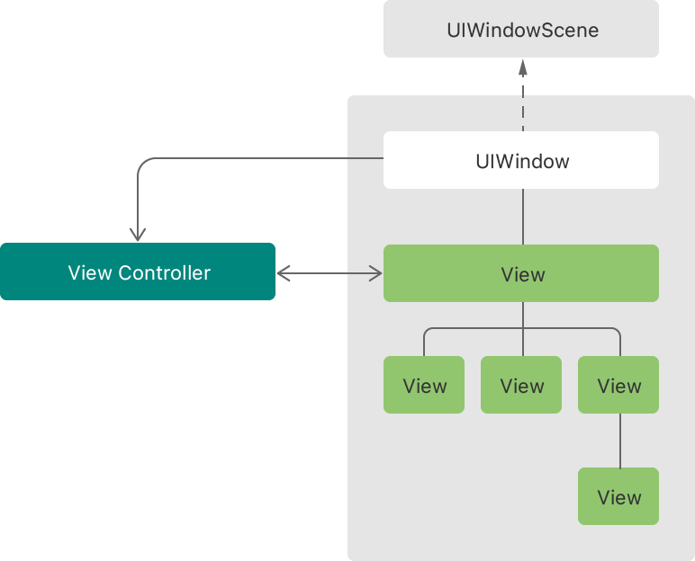
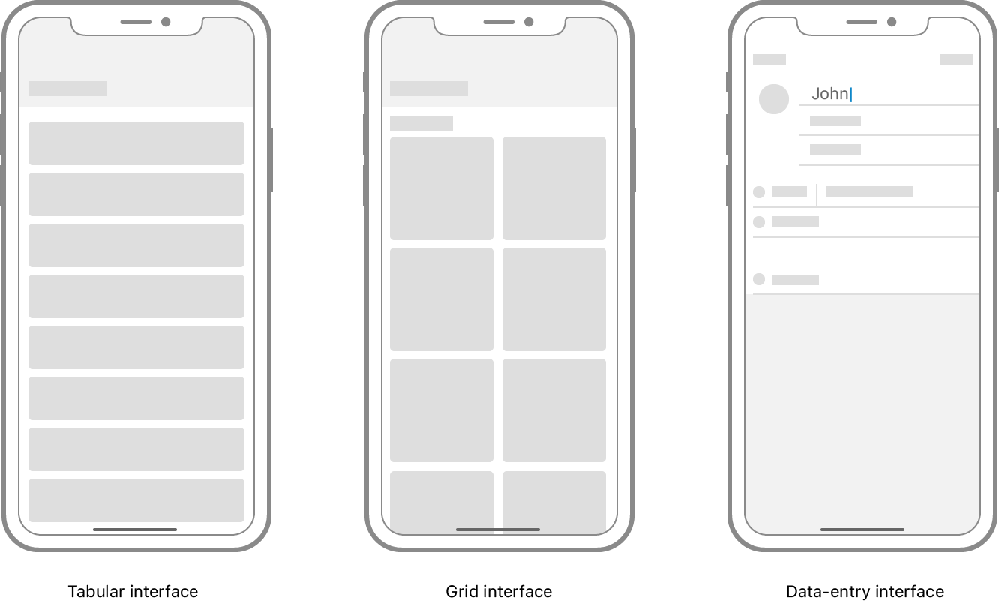
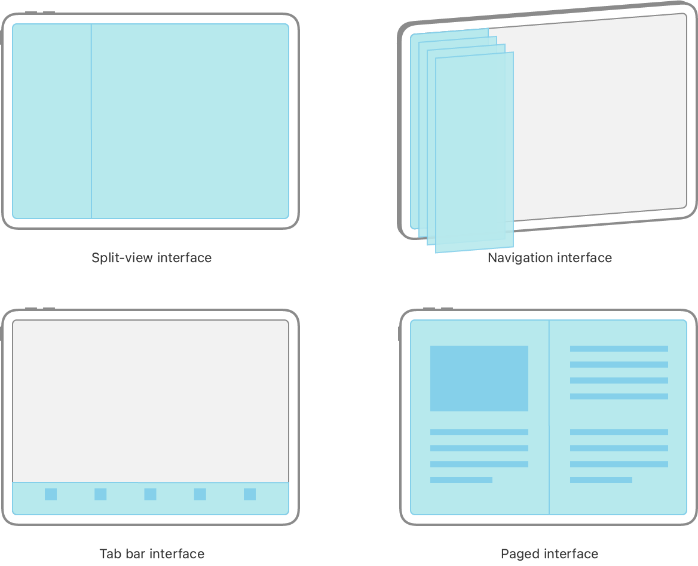
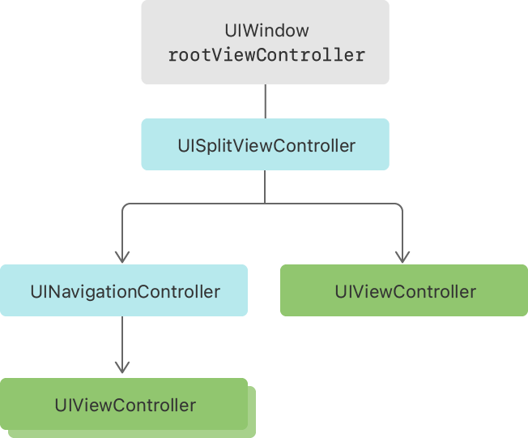

> Navigation: [Technologies](../technologies.md) · [UIKit](../uikit.md) · [View controllers](view-controllers.md)

# Managing content in your app’s windows

Article

Build your app’s user interface from view controllers, and change the currently visible view controller when you want to display new content.

## Overview

Each scene in your app’s UI contains a window object and one or more view objects. The window serves as an invisible container for the rest of your UI, acts as a top-level container for your views, and routes events to them. The views provide the actual content that users see onscreen, drawing text, images, and other types of custom content. Windows are long-lived objects, and you dismiss them only when tearing down your scene’s entire UI. By contrast, you might change the views in that window frequently, particularly when you want to display new content or information.

An architectural diagram showing a window containing several views. A view controller manages the views, and the window has a reference to the view controller.

To manage your views effectively and to make it easy to add and remove them from a window, UIKit provides view controllers. A view controller manages a single set of views for your app, and it keeps the information in those views up-to-date. Each window has a root view controller, which you use to specify the window’s initial set of views. When you want to change that set of views, you tell UIKit to present or dismiss additional view controllers. UIKit handles the transition from one set of views to another, and manages your app’s entire interface through your view controller objects. As a result, view controllers play an important role in implementing your UI.

### Define view controllers for each unique page of content

When designing the UI for a new app, first divide that UI into distinct pages of content. Each page represents a unique way to display your app’s custom information. For example, one page might display rows of data in a table, another might display images in a grid, and another might display a set of text fields for capturing data. Only the structure and overall appearance of each page is important; the specific data you display from each page isn’t. In fact, many apps use the same type of page in multiple places, filling each copy with different sets of data.

An illustration showing three interfaces. One contains a table, the second contains a grid of cells, and the third contains a data-entry interface.

For each distinct page, define a view controller to represent that page and manage its corresponding views. Defining a view controller always involves subclassing and adding custom behavior. Every view controller needs to do the following:

- Fill its views with data, and update those views when data changes.
- Report data changes back to your data model objects.
- Adjust the size, position, and visibility of views to match the current environment.
- Facilitate transitions to other pages of content.

For more information, see [Displaying and managing views with a view controller](displaying-and-managing-views-with-a-view-controller.md).

### Choose the navigation model for your content

Simple apps might display only one screen of content, but most apps have multiple screens of content to display. To make navigating between those view controllers easy, UIKit provides container view controllers that implement common navigation models.

A container view controller is a special type of view controller that manages other view controllers, which are known as its child view controllers. The container’s job is to position the root view of each child view controller within the bounds of its own view. Containers may present only one child at a time, or multiple children simultaneously. Containers may also animate their children’s views on and off screen, to provide visual feedback about the type of navigation in effect.

Always use the UIKit container view controllers to implement the common navigation models:

- [UINavigationController](uinavigationcontroller.md) manages a stack of child view controllers in a _navigation interface_. Pushing a new view controller onto the stack replaces the previous view controller. Popping a view controller reveals the view controller underneath.
- [UISplitViewController](uisplitviewcontroller.md) manages two child view controllers side-by-side (when space is available) in a _split-view interface_. (When space is constrained, the system displays those view controllers in a navigation interface.) This type of interface is also known as a primary-detail interface.
- [UITabBarController](uitabbarcontroller.md) displays a row of buttons along the bottom of a _tab-bar interface_. Selecting a button displays the child view controller associated with that button.
- [UIPageViewController](uipageviewcontroller.md) manages an ordered sequence of child view controllers, presenting only one or two at a time, in a _paged interface_. The user navigates between those view controllers by swiping or tapping.

An illustration of the standard UIKit container interface types, including split-view controller, navigation controller, tab-bar controller, and page-view controller.

You can combine multiple UIKit container view controllers to create new navigation models. For example, it’s common to place a [UINavigationController](uinavigationcontroller.md) in the left pane (or primary pane) of a split-view interface. You can also create new container view controllers of your own, allowing you to create entirely new navigation models that are unique to your app.

In addition to container view controllers, you can replace the contents of the current view controller with a new view controller at any time. Presenting a new view controller covers the previous view controller wholly or partially. Typically, you present new view controllers only as a temporary interruption to the current flow or when your app’s UI is very simple. Don’t use them for more complex navigation schemes.

For information about how to create your own container view controllers, see [Creating a custom container view controller](creating-a-custom-container-view-controller.md).

### Assign a root view controller to each window

The root view controller defines the initial navigation model of your window. If you use storyboards, the root view controller is the initial view controller of your scene’s storyboard file. If you create your windows programmatically, assign a value to the [rootViewController](uiwindow/rootviewcontroller.md) property of the window before showing the window.

When the root view controller is a container, you must also configure any child view controllers displayed by that container. Most container view controllers provide minimal UI of their own; the children provide the rest of the content. For example, the only visible content provided by a [UISplitViewController](uisplitviewcontroller.md) is the separator line between its left and right child view controllers.

## See Also

### Essentials

- [UIKit Catalog: Creating and customizing views and controls](uikit-catalog-creating-and-customizing-views-and-controls.md) — Customize your app’s user interface with views and controls.
