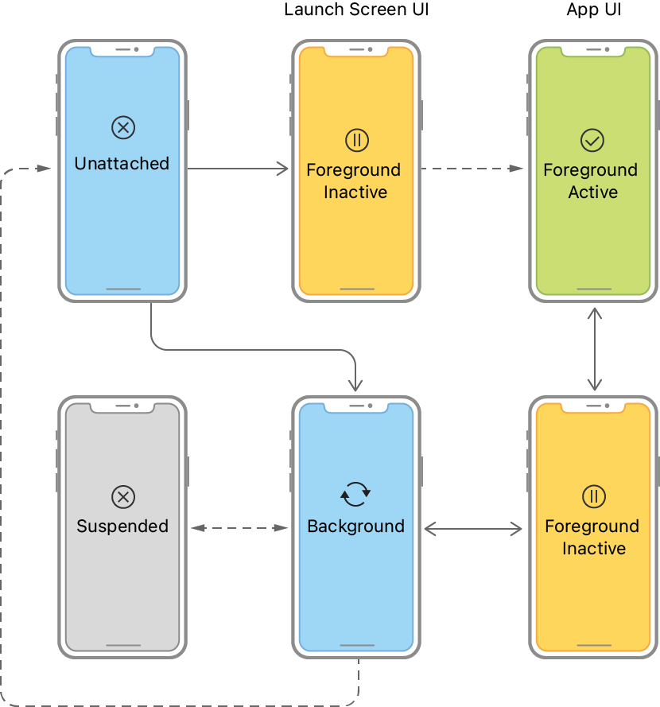
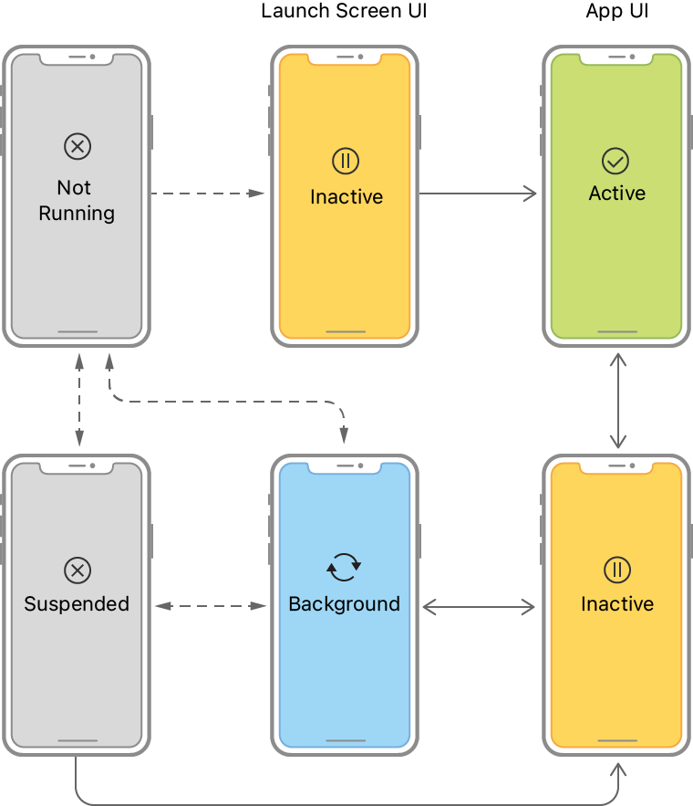

> Navigation: [Technologies](../technologies.md) · [UIKit](../uikit.md) · [App and environment](app-and-environment.md)

# Managing your app’s life cycle

Respond to system notifications when your app is in the foreground or background, and handle other significant system-related events.

## Overview

The current state of your app determines what it can and can’t do at any time. For example, a foreground app has someone’s attention, so it has priority over system resources, including the CPU. By contrast, a background app must do as little work as possible, and preferably nothing, because it’s offscreen. As your app changes from state to state, you must adjust its behavior accordingly.

When your app’s state changes, UIKit notifies you by calling methods of the appropriate delegate object:

- In iOS 13 and later, use [UISceneDelegate](uiscenedelegate.md) objects to respond to life-cycle events.
- In iOS 12 and earlier, use the [UIApplicationDelegate](uiapplicationdelegate.md) object to respond to life-cycle events.

> [!note] Note
> When you enable scene support in your app, iOS always uses your scene delegates in iOS 13 and later. In iOS 12 and earlier, the system uses your app delegate.

### Respond to scene-based life-cycle events

UIKit delivers separate life-cycle events for each scene. A scene represents one instance of your app’s UI running on a device. A person can create multiple scenes for each app, and show and hide them separately. Because each scene has its own life cycle, each can be in a different state of execution. For example, one scene might be in the foreground while others are in the background or are suspended.

> [!important] Important
> Scene support is an opt-in feature. To enable basic support, add the [UIApplicationSceneManifest](../bundleresources/information-property-list/uiapplicationscenemanifest.md) key to your app’s `Info.plist` file as described in [Specifying the scenes your app supports](specifying-the-scenes-your-app-supports.md).

The following figure shows the state transitions for scenes. When a person or the system requests a new scene for your app, UIKit creates it and puts it in the unattached state. Person-requested scenes move quickly to the foreground, where they appear onscreen. A system-requested scene typically moves to the background so that it can process an event. For example, the system might launch the scene in the background to process a location event. When someone dismisses your app’s UI, UIKit moves the associated scene to the background state and eventually to the suspended state. UIKit can disconnect a background or suspended scene at any time to reclaim its resources, returning that scene to the unattached state.

An illustration showing the state transitions for a scene-based app. Scenes start in the unattached state and move to the foreground-active or background state. The foreground-inactive state acts as a transition state.

Use scene transitions to perform the following tasks:

- When UIKit connects a scene to your app, configure your scene’s initial UI and load the data your scene needs.
- When transitioning to the foreground-active state, configure your UI and prepare to interact with a person. See [Preparing your UI to run in the foreground](preparing-your-ui-to-run-in-the-foreground.md).
- Upon leaving the foreground-active state, save data and quiet your app’s behavior. See [Preparing your UI to run in the background](preparing-your-ui-to-run-in-the-background.md).
- Upon entering the background state, finish crucial tasks, free up as much memory as possible, and prepare for your app snapshot. See [Preparing your UI to run in the background](preparing-your-ui-to-run-in-the-background.md).
- At scene disconnection, clean up any shared resources associated with the scene.
- In addition to scene-related events, you must also respond to the launch of your app using your [UIApplicationDelegate](uiapplicationdelegate.md) object. For information about what to do at app launch, see [Responding to the launch of your app](responding-to-the-launch-of-your-app.md).

### Respond to app-based life-cycle events

In iOS 12 and earlier, UIKit delivers all life-cycle events to the [UIApplicationDelegate](uiapplicationdelegate.md) object. The app delegate manages all of your app’s windows, including those displayed on separate screens. As a result, app state transitions affect your app’s entire UI, including content on external displays.

The following figure shows the state transitions involving the app delegate object. After launch, the system puts the app in the inactive or background state, depending on whether the UI is about to appear onscreen. When launching to the foreground, the system transitions the app to the active state automatically. After that, the state fluctuates between active and background until the app terminates.

An illustration showing the state transitions for an app without scenes. The app launches into the active or background state. An app transitions through the inactive state. 

Use app transitions to perform the following tasks:

- At launch, initialize your app’s data structures and UI. See [Responding to the launch of your app](responding-to-the-launch-of-your-app.md).
- At activation, finish configuring your UI and prepare to interact with a person. See [Preparing your UI to run in the foreground](preparing-your-ui-to-run-in-the-foreground.md).
- Upon deactivation, save data and quiet your app’s behavior. See [Preparing your UI to run in the background](preparing-your-ui-to-run-in-the-background.md).
- Upon entering the background state, finish crucial tasks, free up as much memory as possible, and prepare for your app snapshot. See [Preparing your UI to run in the background](preparing-your-ui-to-run-in-the-background.md).
- At termination, stop all work immediately and release any shared resources. See [- applicationWillTerminate:](<uiapplicationdelegate/applicationwillterminate(__).md>).

### Respond to other significant events

In addition to handling life-cycle events, apps must also be prepared to handle the events listed in the following table. Use your [UIApplicationDelegate](uiapplicationdelegate.md) object to handle most of these events. In some cases, you may also be able to handle them using notifications, allowing you to respond from other parts of your app.

| Event | Response |
|---|---|
| Memory warnings | Received when your app’s memory usage is too high. Reduce the amount of memory your app uses; see [Responding to memory warnings](responding-to-memory-warnings.md). |
| Protected data becomes available/unavailable | Received when someone locks or unlocks their device. See [- applicationProtectedDataDidBecomeAvailable:](<uiapplicationdelegate/applicationprotecteddatadidbecomeavailable(__).md>) and [- applicationProtectedDataWillBecomeUnavailable:](<uiapplicationdelegate/applicationprotecteddatawillbecomeunavailable(__).md>). |
| Handoff tasks | Received when an [NSUserActivity](../foundation/nsuseractivity.md) object needs to be processed. See [- application:didUpdateUserActivity:](<uiapplicationdelegate/application(__didupdate_).md>). |
| Time changes | Received for several different time changes, such as when the phone carrier sends a time update. See [- applicationSignificantTimeChange:](<uiapplicationdelegate/applicationsignificanttimechange(__).md>). |
| Open URLs | Received when your app needs to open a resource. See [- application:openURL:options:](<uiapplicationdelegate/application(__open_options_).md>). |

## Topics

### Behavioral events

- [Responding to memory warnings](responding-to-memory-warnings.md) — Free up memory when asked to do so by the system.

## See Also

### Life cycle

- [Responding to the launch of your app](responding-to-the-launch-of-your-app.md) — Initialize your app’s data structures, prepare your app to run, and respond to any launch-time requests from the system.
- [UIApplication](uiapplication.md) — The centralized point of control and coordination for apps running in iOS.
- [UIApplicationDelegate](uiapplicationdelegate.md) — A set of methods to manage shared behaviors for your app.
- [Scenes](scenes.md) — Manage multiple instances of your app’s UI simultaneously, and direct resources to the appropriate instance of your UI.
- [Transitioning to the UIKit scene-based life cycle](transitioning-to-the-uikit-scene-based-life-cycle.md) — Adopt the scene-based life cycle to replace the app delegate life cycle in UIKit.
