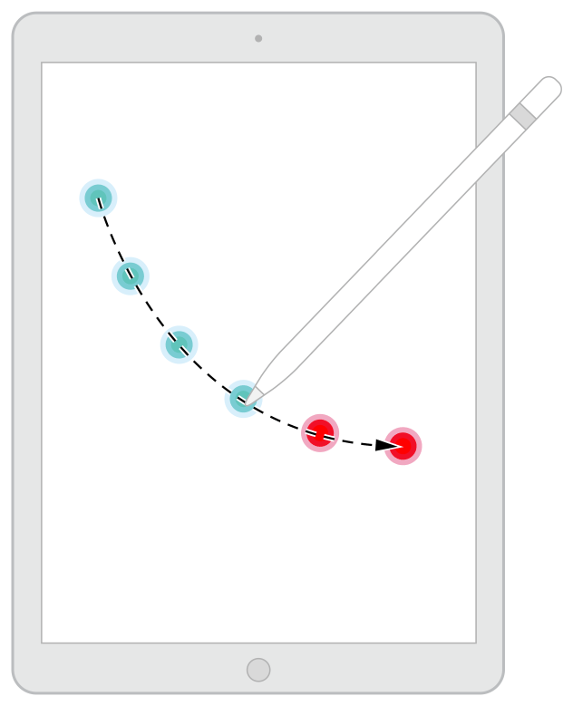

> Navigation: [Technologies](../technologies.md) · [UIKit](../uikit.md) · [Touches, presses, and gestures](touches-presses-and-gestures.md) · [Handling touches in your view](handling-touches-in-your-view.md)

# Minimizing latency with predicted touches

Create a smooth and responsive drawing experience using UIKit’s predictions for touch locations.

## Overview

It takes time for UIKit to generate and deliver touch events to your app, and it takes time for your app to process those events and render the results. In fact, it takes enough time that there can be a visible lag between the movements of a person’s finger or Apple Pencil and the rendered results. To minimize the perceived latency between touch input and rendered content, you can incorporate predicted touches into your event handling.

Predicted touches are the system’s best guess of where the next touch events will occur. The following image illustrates the concept in a drawing app. When a drawing sequence begins, UIKit uses previous touch locations from a person’s finger or Apple Pencil to predict where the next touch may occur. UIKit generates additional [UITouch](uitouch.md) objects for these predicted locations and makes them available to your app.

To retrieve predicted touch data, call the [- predictedTouchesForTouch:](<uievent/predictedtouches(for_).md>) method of the [UIEvent](uievent.md) object containing the original [UITouch](uitouch.md) object. That method returns an array of touches predicted to occur after the last actual touch. Always treat predicted touches as temporary data in your app and discard them upon receipt of each new touch event.

## Topics

### Example

- [Incorporating predicted touches into an app](incorporating-predicted-touches-into-an-app.md) — Learn how to create a simple app that incorporates predicted touches into its drawing code.

## See Also

### Advanced touch handling

- [Implementing a Multi-Touch app](implementing-a-multi-touch-app.md) — Learn how to create a simple app that handles multitouch input.
- [Getting high-fidelity input with coalesced touches](getting-high-fidelity-input-with-coalesced-touches.md) — Learn how to support high-precision touches in your app.
