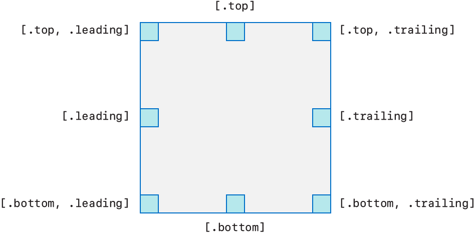

> Navigation: [Technologies](../technologies.md) · [UIKit](../uikit.md)

# NSCollectionLayoutAnchor

<sub>Class</sub>

An object that defines how to attach a supplementary item to an item in a collection view.

<sub>iOS, iPadOS, Mac Catalyst, tvOS, visionOS</sub>

```swift
@MainActor class NSCollectionLayoutAnchor
```

## Overview

You use an anchor to attach a supplementary item to a specific item. An anchor contains information about where on the item your supplementary item is attached, including:

- An edge or set of edges. You can attach a supplementary item to a single edge, or to a corner by specifying two adjacent edges.
- An offset from the item. By default, the supplementary item is anchored within the specified edges of the item it’s attached to. You can change this location by providing a custom offset when you create an anchor.

### Edges

The leading and trailing edges for anchors differ in left-to-right versus right-to-left environments. In a left-to-right environment, the leading edge is on the left, and the trailing edge is on the right. In a right-to-left environment, the leading edge is on the right, and the trailing edge is on the left. This difference ensures that your collection view layout is built with support for right-to-left languages.

The following diagram shows anchor placement for the specified edges in a left-to-right environment.



<sub>Diagram showing anchor positions. Top, bottom, leading, and trailing anchors are on the halfway point on their respective edges. The anchors defined by the edge combinations top and leading, top and trailing, bottom and leading, and bottom and trailing are in the corners between each of those sets of edges.</sub>

### Offset

You can express anchor offset in these ways:

- Absolute value. The offset is calculated as a point value. For example, an absolute x offset of `30.0` means that the origin of the supplementary item is offset by 30 points in the positive x direction.
- Fractional value. The offset is calculated as a fraction of the supplementary item’s dimensions. For example, a fractional x offset of `0.3` means that the origin of the supplementary item is offset by 30% of the supplementary item’s width in the positive x direction.

The following code creates a basic badge and attaches it to an item’s top trailing corner.

**Swift**

```swift
let itemSize = NSCollectionLayoutSize(widthDimension: .absolute(44),
                                     heightDimension: .absolute(44))
    
let badgeAnchor = NSCollectionLayoutAnchor(edges: [.top, .trailing],
                                fractionalOffset: CGPoint(x: 0.3, y: -0.3))
    
let badgeSize = NSCollectionLayoutSize(widthDimension: .absolute(20),
                                      heightDimension: .absolute(20))
    
let badge = NSCollectionLayoutSupplementaryItem(layoutSize: badgeSize,
                                               elementKind: "badge",
                                           containerAnchor: badgeAnchor)
    
let item = NSCollectionLayoutItem(layoutSize: itemSize,
                          supplementaryItems: [badge])

```

**Objective-C**

```objc
NSCollectionLayoutSize *itemSize = [NSCollectionLayoutSize sizeWithWidthDimension:[NSCollectionLayoutDimension absoluteDimension:44.0] heightDimension:[NSCollectionLayoutDimension absoluteDimension:44.0]];

NSCollectionLayoutAnchor *badgeAnchor = [NSCollectionLayoutAnchor layoutAnchorWithEdges: NSDirectionalRectEdgeTop|NSDirectionalRectEdgeTrailing fractionalOffset:CGPointMake(0.3, -0.3)];

NSCollectionLayoutSize *badgeSize = [NSCollectionLayoutSize sizeWithWidthDimension:[NSCollectionLayoutDimension absoluteDimension:20.0] heightDimension:[NSCollectionLayoutDimension absoluteDimension:20.0]];

NSCollectionLayoutSupplementaryItem *badge = [NSCollectionLayoutSupplementaryItem supplementaryItemWithLayoutSize:badgeSize elementKind:ELEMENT_KIND_BADGE containerAnchor:badgeAnchor];

NSCollectionLayoutItem *item = [NSCollectionLayoutItem itemWithLayoutSize:itemSize supplementaryItems:@[badge]];
```

## Relationships

- **Inherits From**: [NSObject](../objectivec/nsobject-swift.class.md)

- **Conforms To**: [CVarArg](../swift/cvararg.md), [CustomDebugStringConvertible](../swift/customdebugstringconvertible.md), [CustomStringConvertible](../swift/customstringconvertible.md), [Equatable](../swift/equatable.md), [Hashable](../swift/hashable.md), [NSCopying](../foundation/nscopying.md), [NSObjectProtocol](../objectivec/nsobjectprotocol.md), [Sendable](../swift/sendable.md)

## Topics

### Creating an anchor

- [+ layoutAnchorWithEdges:](<nscollectionlayoutanchor/init(edges_).md>) — Creates an anchor with the specified edges to attach to.
- [+ layoutAnchorWithEdges:absoluteOffset:](<nscollectionlayoutanchor/init(edges_absoluteoffset_).md>) — Creates an anchor with the specified edges to attach to, offset by the provided absolute value.
- [+ layoutAnchorWithEdges:fractionalOffset:](<nscollectionlayoutanchor/init(edges_fractionaloffset_).md>) — Creates an anchor with the specified edges to attach to, offset by the provided fractional value.

### Getting the edges

- [edges](nscollectionlayoutanchor/edges.md) — The edges of the item an anchor is attached to.

### Getting the offset

- [offset](nscollectionlayoutanchor/offset.md) — The floating-point value of the anchor’s offset from the item it’s attached to.
- [isAbsoluteOffset](nscollectionlayoutanchor/isabsoluteoffset.md) — A Boolean value that indicates whether the anchor’s offset is expressed as an absolute value.
- [isFractionalOffset](nscollectionlayoutanchor/isfractionaloffset.md) — A Boolean value that indicates whether the anchor’s offset is expressed as a fraction of its supplementary item’s dimension.

## See Also

### Appearance

- [NSCollectionLayoutSupplementaryItem](nscollectionlayoutsupplementaryitem.md) — An object used to add an extra visual decoration to an item in a collection view.
- [NSCollectionLayoutBoundarySupplementaryItem](nscollectionlayoutboundarysupplementaryitem.md) — An object used to add headers or footers to a collection view.
- [NSCollectionLayoutDecorationItem](nscollectionlayoutdecorationitem.md) — An object used to add a background to a section of a collection view.
