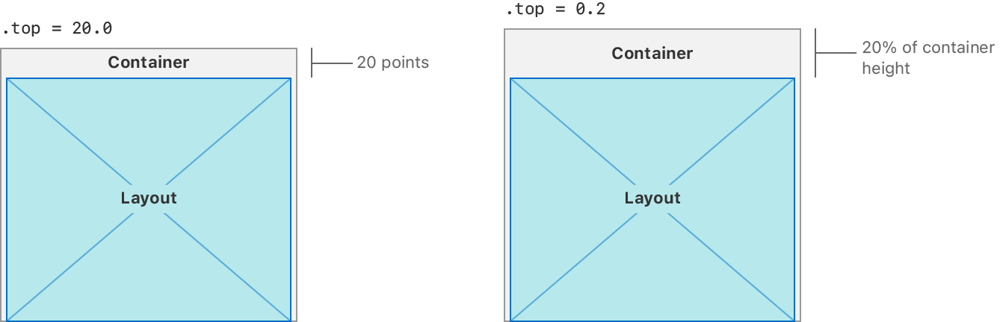

> Navigation: [Technologies](../../technologies.md) · [UIKit](../../uikit.md) · [NSCollectionLayoutContainer](../nscollectionlayoutcontainer.md)

# contentInsets

<sub>Instance Property</sub>

The amount of space added around the content of the container to adjust its final size.

<sub>iOS, iPadOS, Mac Catalyst, tvOS, visionOS</sub>

```swift
var contentInsets: NSDirectionalEdgeInsets { get }
```

## Discussion

If the value of a content inset is less than `1.0`, the content inset is fractional. For example, a top content inset of `20.0` adds 20 points of space between the top of the layout and the top of its container. A top content inset of `0.2` adds space equal to 20% of the container’s height between the top of the layout and the top of its container.



<sub>Two diagrams that compare two ways of specifying content insets. Both diagrams show a container box with a layout box inside of it. The first diagram shows a top content inset with the value 20.0. The space between the top of the container box and the top of the layout box displays the value 20 points. The second diagram shows a top content inset with the value 0.2. The space between the top of the container box and the top of the layout box displays the value 20% of container height.</sub>

## See Also

### Getting content insets

- [effectiveContentInsets](effectivecontentinsets.md) — The amount of space added around the content of the container to adjust its final size after item content insets are applied.
