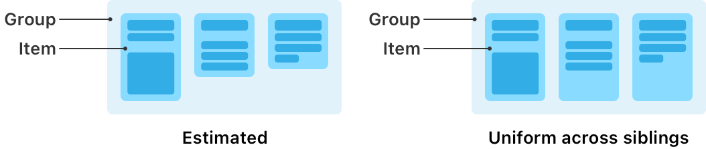

> Navigation: [Technologies](../../technologies.md) · [UIKit](../../uikit.md) · [NSCollectionLayoutDimension](../nscollectionlayoutdimension.md)

# uniformAcrossSiblings(estimate:)

<sub>Type Method</sub>

Creates a dimension in which each item receives as much room as it requires and grows to match the dimension of its largest sibling.

<sub>iOS, iPadOS, Mac Catalyst, tvOS, visionOS</sub>

```swift
class func uniformAcrossSiblings(estimate estimatedDimension: CGFloat) -> Self
```

## Discussion

Use the [+ uniformAcrossSiblingsWithEstimate:](<uniformacrosssiblings(estimate_).md>) dimension to ensure that self-sizing items have a consistent size across their group. This dimension provides an alternative to using the [+ estimatedDimension:](<estimated(__).md>) dimension, which might not result in a uniform layout for items that vary in size.



<sub>Two diagrams that each show a horizontal layout group with three items. The left diagram is labeled “Estimated,” and its items vary in size according to their content. The right diagram is labeled “Uniform across siblings,” and its items match the size of the largest item.</sub>

Items with this dimension receive at least as much room as they require, and they increase in size to match the dimension of the largest self-sizing sibling in their parent group. The parent group’s dimension needs to be [+ estimatedDimension:](<estimated(__).md>) on the axis where items specify this dimension so the group can grow to fit the items.

For example, items using this dimension in a horizontal [NSCollectionLayoutGroup](../nscollectionlayoutgroup.md) all have a height equal to the tallest item in that group. That group’s [heightDimension](../nscollectionlayoutsize/heightdimension.md) is [+ estimatedDimension:](<estimated(__).md>) to allow for it to grow to fit the tallest item. The following code shows an example of this layout.

```swift
// Item width: To lay out 3 items horizontally, use 1/3 of the width of the group.
// Item height: To achieve a consistent height for the items, use `uniformAcrossSiblings(estimate:)`.
let itemCount = 3
let itemSize = NSCollectionLayoutSize(widthDimension: .fractionalWidth(1.0 / CGFloat(itemCount)),
                                      heightDimension: .uniformAcrossSiblings(estimate: 50))
let item = NSCollectionLayoutItem(layoutSize: itemSize)

// Group width: To use the entire horizontal width of the section, use the full fractional width.
// Group height: To allow the group's height to grow for the items, use `estimated(_:)`.
let groupSize = NSCollectionLayoutSize(widthDimension: .fractionalWidth(1.0),
                                       heightDimension: .estimated(50))
let group = NSCollectionLayoutGroup.horizontal(layoutSize: groupSize,
                                               repeatingSubitem: item,
                                               count: itemCount)

let section = NSCollectionLayoutSection(group: group)
```

> [!important] Important
> If you use a [+ uniformAcrossSiblingsWithEstimate:](<uniformacrosssiblings(estimate_).md>) dimension on the outermost group in a section, the size of the largest item in that group applies across the entire section, including nested groups.

Only use this dimension in layouts where the number of items is relatively small. To compute the size for this type of dimension, the layout needs to retrieve attributes for all siblings in the parent group, so the performance is linear to the number of items in the group.

> [!note] Related sessions from WWDC23
> Session 10055: [What’s new in UIKit](https://developer.apple.com/videos/play/wwdc2023/10055/)

## See Also

### Creating a dimension

- [+ absoluteDimension:](<absolute(__).md>) — Creates a dimension with an absolute point value.
- [+ estimatedDimension:](<estimated(__).md>) — Creates a dimension with an estimated point value.
- [+ fractionalHeightDimension:](<fractionalheight(__).md>) — Creates a dimension that is computed as a fraction of the height of the containing group.
- [+ fractionalWidthDimension:](<fractionalwidth(__).md>) — Creates a dimension that is computed as a fraction of the width of the containing group.
