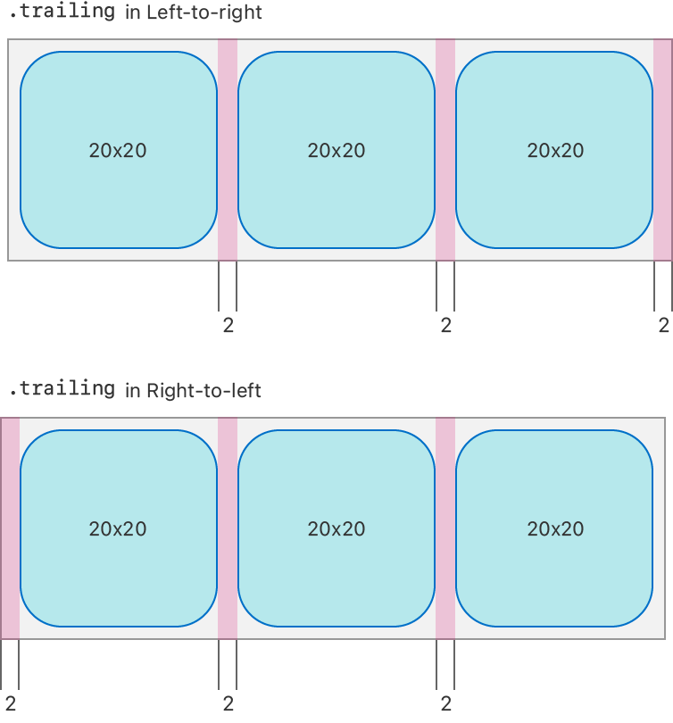

> Navigation: [Technologies](../technologies.md) · [UIKit](../uikit.md)

# NSCollectionLayoutEdgeSpacing

<sub>Class</sub>

An object that defines the space around the edges of items in a collection view.

<sub>iOS, iPadOS, Mac Catalyst, tvOS, visionOS</sub>

```swift
@MainActor class NSCollectionLayoutEdgeSpacing
```

## Overview

You use edge spacing to create additional spacing around the edges of an item to adjust the position of the item in relation to its container and other items.

The leading and trailing spaces within edge spacing differ in left-to-right versus right-to-left environments. In a left-to-right environment, the leading space is on the left, and the trailing space is on the right. In a right-to-left environment, the leading space is on the right, and the trailing space is on the left. This difference ensures that your collection view layout is built with support for right-to-left languages.

The following diagram shows the difference between adding 2 points of trailing edge spacing in a left-to-right versus a right-to-left environment.



<sub>Two diagrams that compare edge spacing in a left-to-right and a right-to-left environment. Both diagrams show a group of three square items in a row. The first diagram, labeled trailing in left-to-right environment, shows trailing space on the right of each item, implying that leading space is on the left. The second diagram, labeled trailing in right-to-left environment, shows trailing space on the left of each item, implying that leading space is on the right.</sub>

## Relationships

- **Inherits From**: [NSObject](../objectivec/nsobject-swift.class.md)

- **Conforms To**: [CVarArg](../swift/cvararg.md), [CustomDebugStringConvertible](../swift/customdebugstringconvertible.md), [CustomStringConvertible](../swift/customstringconvertible.md), [Equatable](../swift/equatable.md), [Hashable](../swift/hashable.md), [NSCopying](../foundation/nscopying.md), [NSObjectProtocol](../objectivec/nsobjectprotocol.md), [Sendable](../swift/sendable.md)

## Topics

### Creating edge spacing

- [+ spacingForLeading:top:trailing:bottom:](<nscollectionlayoutedgespacing/init(leading_top_trailing_bottom_).md>) — Creates an edge spacing object with the specified leading, top, trailing, and bottom spacing.

### Getting the edge spacing

- [leading](nscollectionlayoutedgespacing/leading.md) — The leading edge spacing value.
- [top](nscollectionlayoutedgespacing/top.md) — The top edge spacing value.
- [trailing](nscollectionlayoutedgespacing/trailing.md) — The trailing edge spacing value.
- [bottom](nscollectionlayoutedgespacing/bottom.md) — The bottom edge spacing value.

### Initializers

- [init(forLeading:top:trailing:bottom:)](<nscollectionlayoutedgespacing/init(forleading_top_trailing_bottom_).md>)

## See Also

### Size and spacing

- [NSCollectionLayoutDimension](nscollectionlayoutdimension.md) — An individual dimension representing an item’s width or height in a collection view.
- [NSCollectionLayoutSize](nscollectionlayoutsize.md) — The width and the height of an item in a collection view.
- [NSCollectionLayoutSpacing](nscollectionlayoutspacing.md) — An object that defines the space between or around items in a collection view.
- [NSCollectionLayoutContainer](nscollectionlayoutcontainer.md) — A protocol used to provide information about the size and content insets of a layout’s container.
