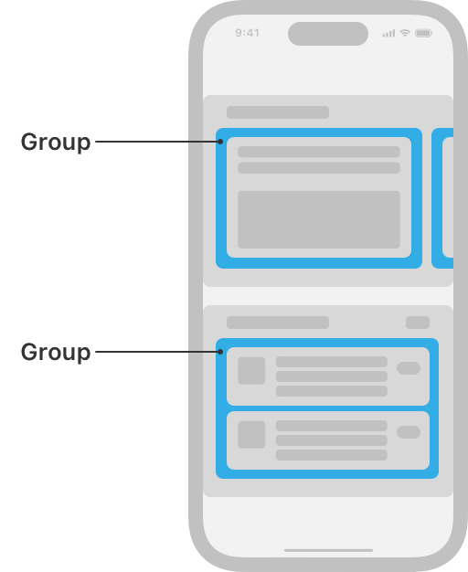
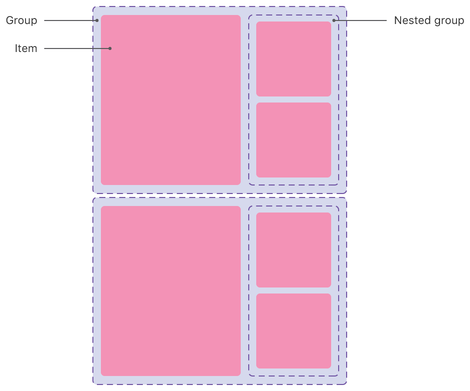

> Navigation: [Technologies](../technologies.md) · [UIKit](../uikit.md)

# NSCollectionLayoutGroup

<sub>Class</sub>

A container for a set of items that lays out the items along a path.

<sub>iOS, iPadOS, Mac Catalyst, tvOS, visionOS</sub>

```swift
@MainActor class NSCollectionLayoutGroup
```

## Overview

Groups determine how the items in a collection view lay out in relation to each other. A group might lay out its items in a horizontal row, a vertical column, or a custom arrangement. A group determines the rules for how items are rendered in relation to each other, but in itself doesn’t render any content.

For example, in the Photos app, a group of items is a row of photos. In the App Store app, a group might be a single column of cells (items) arranged in a vertical column.



<sub>Schematic representation of the App Store app on iOS, showing a collection view with a compositional layout. The layout is composed of horizontally-scrolling sections that have different layouts. The top section shows one group with one item visible onscreen, with other groups peeking in from the sides of the screen. The bottom section shows one group that’s a column of three cells, each of those cells being an item. The two different types of groups are highlighted and labeled as groups.</sub>

Each group specifies its own size in terms of a width dimension and a height dimension. Groups can express their dimensions relative to their container, as an absolute value, or as an estimated value that might change at runtime, like in response to a change in system font size. For more information, see [NSCollectionLayoutDimension](nscollectionlayoutdimension.md).

Because a group is a subclass of [NSCollectionLayoutItem](nscollectionlayoutitem.md), it behaves like an item. You can combine a group with other items and groups into more complex layouts.



<sub>Illustration of group nesting in a compositional layout. A larger group contains one large item on the leading side and two smaller items stacked vertically in a nested group on the trailing side.</sub>

After you configure a group, you must initialize a section ([NSCollectionLayoutSection](nscollectionlayoutsection.md)) of your collection view layout with that group.

## Relationships

- **Inherits From**: [NSCollectionLayoutItem](nscollectionlayoutitem.md)

- **Conforms To**: [CVarArg](../swift/cvararg.md), [CustomDebugStringConvertible](../swift/customdebugstringconvertible.md), [CustomStringConvertible](../swift/customstringconvertible.md), [Equatable](../swift/equatable.md), [Hashable](../swift/hashable.md), [NSCopying](../foundation/nscopying.md), [NSObjectProtocol](../objectivec/nsobjectprotocol.md), [Sendable](../swift/sendable.md), [SendableMetatype](../swift/sendablemetatype.md)

## Topics

### Creating a horizontal group

- [+ horizontalGroupWithLayoutSize:subitems:](<nscollectionlayoutgroup/horizontal(layoutsize_subitems_).md>) — Creates a group of the specified size, containing an array of items arranged in a horizontal line.
- [+ horizontalGroupWithLayoutSize:repeatingSubitem:count:](<nscollectionlayoutgroup/horizontal(layoutsize_repeatingsubitem_count_).md>) — Creates a group that repeats the specified subitem a certain number of times along the horizontal axis.

### Creating a vertical group

- [+ verticalGroupWithLayoutSize:subitems:](<nscollectionlayoutgroup/vertical(layoutsize_subitems_).md>) — Creates a group of the specified size, containing an array of items arranged in a vertical line.
- [+ verticalGroupWithLayoutSize:repeatingSubitem:count:](<nscollectionlayoutgroup/vertical(layoutsize_repeatingsubitem_count_).md>) — Creates a group that repeats the specified subitem a certain number of times along the vertical axis.

### Creating a custom group

- [+ customGroupWithLayoutSize:itemProvider:](<nscollectionlayoutgroup/custom(layoutsize_itemprovider_).md>) — Creates a group of the specified size, with an item provider that creates a custom arrangement for those items.

### Getting the group’s items

- [subitems](nscollectionlayoutgroup/subitems.md) — An array of the items contained in the group.
- [supplementaryItems](nscollectionlayoutgroup/supplementaryitems.md) — An array of the supplementary items that are anchored to the group.

### Configuring group spacing

- [interItemSpacing](nscollectionlayoutgroup/interitemspacing.md) — The amount of space between the items in the group.

### Debugging group layout

- [- visualDescription](<nscollectionlayoutgroup/visualdescription().md>) — Returns a string with an ASCII representation of the group.

### Deprecated

- [+ horizontalGroupWithLayoutSize:subitem:count:](<nscollectionlayoutgroup/horizontal(layoutsize_subitem_count_).md>) — Creates a group of the specified size, containing an array of equally sized items arranged in a horizontal line up to the number specified by count. _(deprecated)_
- [horizontalGroup(with:repeatingSubitem:count:)](<nscollectionlayoutgroup/horizontalgroup(with_repeatingsubitem_count_).md>) — Creates a group that repeats the specified subitem a certain number of times along the horizontal axis. _(deprecated)_
- [+ verticalGroupWithLayoutSize:subitem:count:](<nscollectionlayoutgroup/vertical(layoutsize_subitem_count_).md>) — Creates a group of the specified size, containing an array of equally sized items arranged in a vertical line up to the number specified by count. _(deprecated)_
- [verticalGroup(with:repeatingSubitem:count:)](<nscollectionlayoutgroup/verticalgroup(with_repeatingsubitem_count_).md>) — Creates a group that repeats the specified subitem a certain number of times along the vertical axis. _(deprecated)_

## See Also

### Components

- [NSCollectionLayoutItem](nscollectionlayoutitem.md) — The most basic component of a collection view’s layout.
- [NSCollectionLayoutSection](nscollectionlayoutsection.md) — A container that combines a set of groups into distinct visual groupings.
