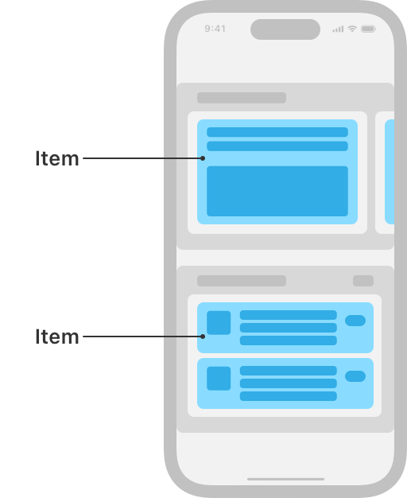

> Navigation: [Technologies](../technologies.md) · [UIKit](../uikit.md)

# NSCollectionLayoutItem

<sub>Class</sub>

The most basic component of a collection view’s layout.

<sub>iOS, iPadOS, Mac Catalyst, tvOS, visionOS</sub>

```swift
@MainActor class NSCollectionLayoutItem
```

## Overview

An item is a blueprint for how to size, space, and arrange an individual piece of content in your collection view. An item represents a single view that’s rendered onscreen. Generally, an item is a cell, but items can be supplementary views like headers, footers, and other decorations.

For example, in the Photos app, an item might represent a single photo. In the App Store app, an item might be a cell displaying information about an individual app in a list of featured apps, such as the app icon, app name, tagline, and download button.



<sub>Schematic representation of the App Store app on iOS, showing a collection view with a compositional layout. The layout is composed of two horizontally-scrolling sections that have different layouts. The top section shows one group with one item visible onscreen, with other groups peeking in from the sides of the screen. The bottom section shows one group that’s a column of three cells, each of those cells being an item. The two different types of items are highlighted and labeled as items.</sub>

Each item specifies its own size in terms of a width dimension and a height dimension. Items can express their dimensions relative to their container, as an absolute value, or as an estimated value that might change at runtime, like in response to a change in system font size. For more information, see [NSCollectionLayoutDimension](nscollectionlayoutdimension.md).

You combine items into groups that determine how those items are arranged in relation to each other. For more information, see [NSCollectionLayoutGroup](nscollectionlayoutgroup.md).

## Relationships

- **Inherits From**: [NSObject](../objectivec/nsobject-swift.class.md)

- **Inherited By**: [NSCollectionLayoutDecorationItem](nscollectionlayoutdecorationitem.md), [NSCollectionLayoutGroup](nscollectionlayoutgroup.md), [NSCollectionLayoutSupplementaryItem](nscollectionlayoutsupplementaryitem.md)

- **Conforms To**: [CVarArg](../swift/cvararg.md), [CustomDebugStringConvertible](../swift/customdebugstringconvertible.md), [CustomStringConvertible](../swift/customstringconvertible.md), [Equatable](../swift/equatable.md), [Hashable](../swift/hashable.md), [NSCopying](../foundation/nscopying.md), [NSObjectProtocol](../objectivec/nsobjectprotocol.md), [Sendable](../swift/sendable.md)

## Topics

### Creating an item

- [+ itemWithLayoutSize:](<nscollectionlayoutitem/init(layoutsize_).md>) — Creates an item of the specified size.
- [+ itemWithLayoutSize:supplementaryItems:](<nscollectionlayoutitem/init(layoutsize_supplementaryitems_).md>) — Creates an item of the specified size with an array of supplementary items to attach to the item.

### Getting an item’s size

- [layoutSize](nscollectionlayoutitem/layoutsize.md) — The item’s size expressed in width and height dimensions.

### Getting supplementary items

- [supplementaryItems](nscollectionlayoutitem/supplementaryitems.md) — An array of the supplementary items attached to the item.

### Configuring spacing and insets

- [edgeSpacing](nscollectionlayoutitem/edgespacing.md) — The amount of space added around the boundaries of the item between other items and this item’s container.
- [contentInsets](nscollectionlayoutitem/contentinsets.md) — The amount of space added around the content of the item to adjust its final size after its position is computed.

## See Also

### Components

- [NSCollectionLayoutGroup](nscollectionlayoutgroup.md) — A container for a set of items that lays out the items along a path.
- [NSCollectionLayoutSection](nscollectionlayoutsection.md) — A container that combines a set of groups into distinct visual groupings.
