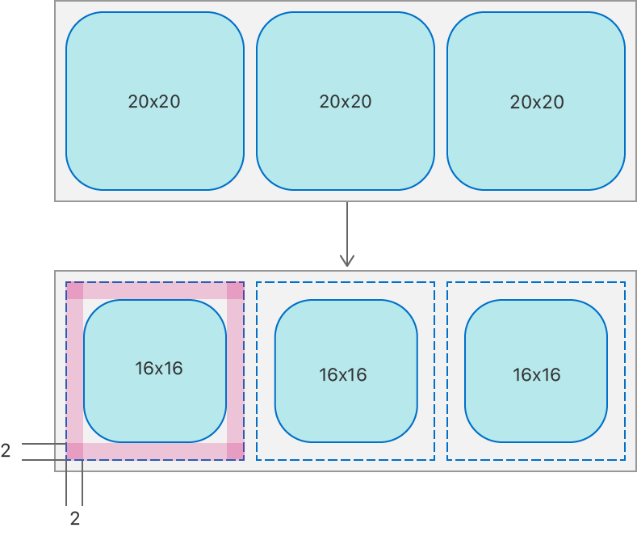

> Navigation: [Technologies](../../technologies.md) · [UIKit](../../uikit.md) · [NSCollectionLayoutItem](../nscollectionlayoutitem.md)

# contentInsets

<sub>Instance Property</sub>

The amount of space added around the content of the item to adjust its final size after its position is computed.

<sub>iOS, iPadOS, Mac Catalyst, tvOS, visionOS</sub>

```swift
var contentInsets: NSDirectionalEdgeInsets { get set }
```

## Discussion

You can use this property within a grid layout to apply even spacing around each edge of each item. Content insets are applied after applying [edgeSpacing](edgespacing.md).

The following diagram shows the result of applying 2 points of content insets to each edge of each item in a group.



<sub>Two diagrams that show the result of content insets applied to a group of items. The first diagram shows a group of three square items in a row, each item measuring 20 by 20 points. The second diagram shows content insets of 2 applied to each edge of each item, resulting in each item becoming 16 by 16 points. The group remains the same size.</sub>

> [!note] Note
> The value of this property is ignored for any axis that uses an estimated value for its dimension. For more information, see [+ estimatedDimension:](<../nscollectionlayoutdimension/estimated(__).md>).

## See Also

### Configuring spacing and insets

- [edgeSpacing](edgespacing.md) — The amount of space added around the boundaries of the item between other items and this item’s container.
