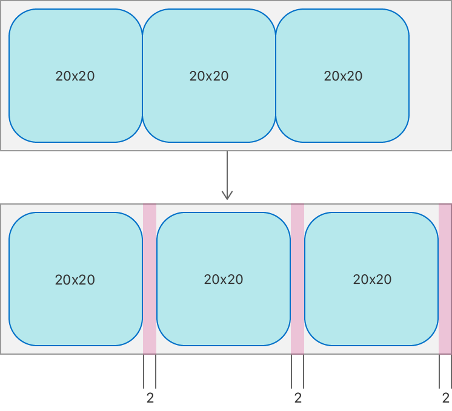

> Navigation: [Technologies](../../technologies.md) · [UIKit](../../uikit.md) · [NSCollectionLayoutItem](../nscollectionlayoutitem.md)

# edgeSpacing

<sub>Instance Property</sub>

The amount of space added around the boundaries of the item between other items and this item’s container.

<sub>iOS, iPadOS, Mac Catalyst, tvOS, visionOS</sub>

```swift
@NSCopying var edgeSpacing: NSCollectionLayoutEdgeSpacing? { get set }
```

## Discussion

Use this property to adjust the position of the item in relation to its container and other items. For example, you can use this property to apply extra space to the trailing edge of each item. Edge spacing is applied before applying [contentInsets](contentinsets.md).

The following diagram shows the result of applying 2 points of trailing edge spacing to the items in a group:



<sub>Two diagrams that show the result of edge spacing applied to a group of items. The first diagram shows a group of three square items in a row, each item measuring 20 by 20 points. The second diagram shows a trailing edge spacing of 2 points applied to each item. Each item remains the same size, but moves 2 points if it’s on the trailing edge of the previous item in the group.</sub>

## See Also

### Configuring spacing and insets

- [contentInsets](contentinsets.md) — The amount of space added around the content of the item to adjust its final size after its position is computed.
