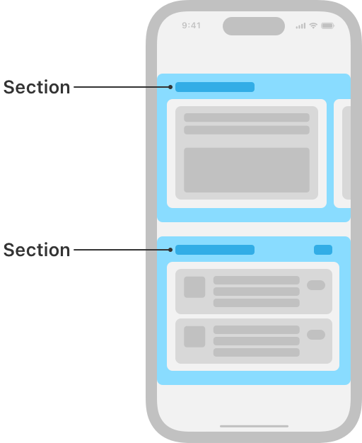

> Navigation: [Technologies](../technologies.md) · [UIKit](../uikit.md)

# NSCollectionLayoutSection

<sub>Class</sub>

A container that combines a set of groups into distinct visual groupings.

<sub>iOS, iPadOS, Mac Catalyst, tvOS, visionOS</sub>

```swift
@MainActor class NSCollectionLayoutSection
```

## Overview

A collection view layout has one or more sections. Sections provide a way to separate the layout into distinct pieces.

Each section can have the same layout or a different layout than the other sections in the collection view. A section’s layout is determined by the properties of the group ([NSCollectionLayoutGroup](nscollectionlayoutgroup.md)) that’s used to create the section.

In the Photos app, each section in the Years page uses the same layout. In the App Store, the Apps page displays several sections with different content arrangements.



<sub>Schematic representation of the App Store app on iOS, showing a collection view with a compositional layout. The layout is composed of two horizontally-scrolling sections that have different layouts. The top section shows one group with one item visible onscreen, with other groups peeking in from the sides of the screen. The bottom section shows one group that’s a column of three cells, each of those cells being an item. The two different sections are highlighted and labeled as sections.</sub>

Each section can have its own background, header, and footer to distinguish it from other sections.

## Relationships

- **Inherits From**: [NSObject](../objectivec/nsobject-swift.class.md)

- **Conforms To**: [CVarArg](../swift/cvararg.md), [CustomDebugStringConvertible](../swift/customdebugstringconvertible.md), [CustomStringConvertible](../swift/customstringconvertible.md), [Equatable](../swift/equatable.md), [Hashable](../swift/hashable.md), [NSCopying](../foundation/nscopying.md), [NSObjectProtocol](../objectivec/nsobjectprotocol.md), [Sendable](../swift/sendable.md)

## Topics

### Creating a section

- [+ sectionWithGroup:](<nscollectionlayoutsection/init(group_).md>) — Creates a section containing the specified group.
- [list(using:layoutEnvironment:)](<nscollectionlayoutsection/list(using_layoutenvironment_).md>) — Creates a list section with the specified list configuration and layout environment.
- [+ orthogonalLayoutSectionForMediaItems](<nscollectionlayoutsection/orthogonallayoutsectionformediaitems().md>) — Creates an orthogonally scrolling section with system default spacing.

### Specifying scrolling behavior

- [orthogonalScrollingBehavior](nscollectionlayoutsection/orthogonalscrollingbehavior.md) — The section’s scrolling behavior in relation to the main layout axis.
- [orthogonalScrollingProperties](nscollectionlayoutsection/orthogonalscrollingproperties.md) — The section’s orthogonal scrolling properties.
- [UICollectionLayoutSectionOrthogonalScrollingProperties](uicollectionlayoutsectionorthogonalscrollingproperties.md) — An object that specifies properties for a layout section that scrolls orthogonally in relation to the main layout axis.

### Configuring section spacing

- [interGroupSpacing](nscollectionlayoutsection/intergroupspacing.md) — The amount of space between the groups in the section.
- [contentInsets](nscollectionlayoutsection/contentinsets.md) — The amount of space between the content of the section and its boundaries.
- [contentInsetsReference](nscollectionlayoutsection/contentinsetsreference.md) — The boundary to reference when defining content insets.
- [supplementaryContentInsetsReference](nscollectionlayoutsection/supplementarycontentinsetsreference.md) — The reference boundary for content insets on boundary supplementary items.
- [UIContentInsetsReference](uicontentinsetsreference.md) — Constants that describe the reference point of the content insets.

### Configuring additional views

- [boundarySupplementaryItems](nscollectionlayoutsection/boundarysupplementaryitems.md) — An array of the supplementary items that are associated with the boundary edges of the section, such as headers and footers.
- [decorationItems](nscollectionlayoutsection/decorationitems.md) — An array of the decoration items that are anchored to the section, such as background decoration views.

### Rendering items

- [visibleItemsInvalidationHandler](nscollectionlayoutsection/visibleitemsinvalidationhandler.md) — A closure called before each layout cycle to allow modification of the items in the section immediately before they’re displayed.

### Deprecated

- [supplementariesFollowContentInsets](nscollectionlayoutsection/supplementariesfollowcontentinsets.md) — A Boolean value that indicates whether the section’s supplementary items follow the specified content insets for the section. _(deprecated)_

## See Also

### Components

- [NSCollectionLayoutItem](nscollectionlayoutitem.md) — The most basic component of a collection view’s layout.
- [NSCollectionLayoutGroup](nscollectionlayoutgroup.md) — A container for a set of items that lays out the items along a path.
