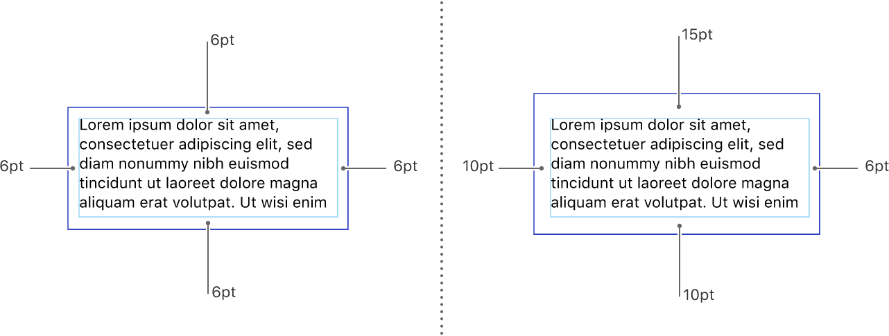
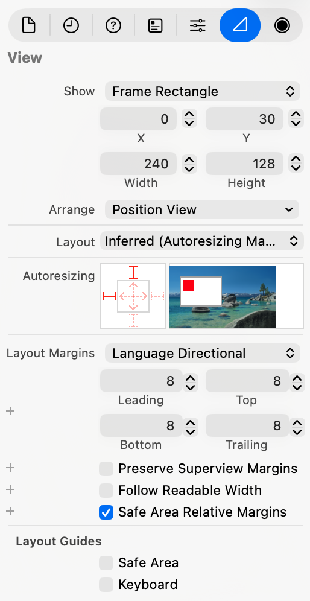

> Navigation: [Technologies](../technologies.md) · [UIKit](../uikit.md) · [View layout](view-layout.md)

# Positioning content within layout margins

Article

Position views so that they aren’t crowded by other content.

## Overview

Layout margins provide a visual buffer between a view’s content and any content outside of the view’s bounds. The layout margins consist of inset values for each edge (top, bottom, leading, and trailing) of the view. These inset values create a space between the edges of the view’s bounds rectangle and the content inside the view. The following image shows two views with different sets of layout margins. Apart from the empty space they add around your content, margins have no visible representation.

To set up constraints that respect the layout margins, enable the `Constrain to margins` option in Xcode, as shown in the following image. (If you don’t enable that option, Xcode creates your constraints relative to the view’s bounds rectangle.) If the superview’s margins change later, the positions of elements tied to those margins are updated accordingly.

Even if you aren’t using constraints to position your content, you can still manually position content relative to a view’s layout margins. The [directionalLayoutMargins](uiview/directionallayoutmargins.md) property of each view contains the edge inset values to use for the view’s margins. Take those margin values into account when computing the position of items in your view.

### Change the default layout margins

UIKit provides default layout margins for each view, but you can change the default values to values that are more appropriate for your view. To change a view’s margin values, update the view’s [directionalLayoutMargins](uiview/directionallayoutmargins.md) property. (You can also use the Size inspector to set the value of that property at design time. In the Layout Margins section, choose the Language Directional option and enter the margin values for each of the view’s edges, as shown in the following image.)

For the root view of a view controller, UIKit enforces a set of minimum layout margins to ensure that content is displayed correctly. When the values in the [directionalLayoutMargins](uiview/directionallayoutmargins.md) property are less than the minimum values, UIKit uses the minimum values instead. You can get the minimum margin values from the [systemMinimumLayoutMargins](uiviewcontroller/systemminimumlayoutmargins.md) property of the view controller. To prevent UIKit from applying the minimum margins altogether, set the [viewRespectsSystemMinimumLayoutMargins](uiviewcontroller/viewrespectssystemminimumlayoutmargins.md) property of your view controller to false.

The view’s actual margins are computed using the view’s configuration and the value of its [directionalLayoutMargins](uiview/directionallayoutmargins.md) property. A view’s margins are affected by the settings of its [insetsLayoutMarginsFromSafeArea](uiview/insetslayoutmarginsfromsafearea.md) and [preservesSuperviewLayoutMargins](uiview/preservessuperviewlayoutmargins.md) properties, which can increase the default margin values to ensure appropriate spacing of your content.

## See Also

### Constraints

- [Positioning content relative to the safe area](positioning-content-relative-to-the-safe-area.md) — Position views so that they aren’t obstructed by other content.
- [NSLayoutConstraint](nslayoutconstraint.md) — The relationship between two user interface objects that must be satisfied by the constraint-based layout system.
- [UILayoutSupport](uilayoutsupport.md) — A set of methods that provide layout support and access to layout anchors.
