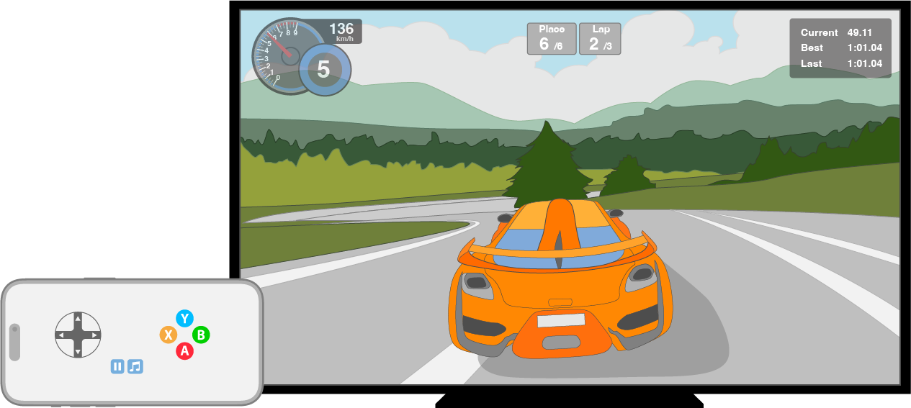

> Navigation: [Technologies](../technologies.md) · [UIKit](../uikit.md) · [Windows and screens](windows-and-screens.md)

# Presenting content on a connected display

<sub>Article</sub>

Fill connected displays with additional content from your app.

## Overview

The user can connect additional displays to an iOS device at any time using AirPlay or a physical cable. When an external display connects, the system mirrors your app’s primary display, or, on compatible iPad models with extended display enabled, presents your app’s interactive windows on the external display.

Each additional display represents new space on which to present your app’s content. To present content on a connected display, you attach windows to [UIWindowScene](uiwindowscene.md) objects that the system provides and respond to life-cycle events using scene delegates.

UIKit defines different [Role](uiscenesession/role-swift.struct.md) types to indicate how the user interacts with the content for a scene. The following types relate to content displayed on a connected screen:

- Scenes with the [UIWindowSceneSessionRoleApplication](uiscenesession/role-swift.struct/windowapplication.md) role present interactive windows. The windows render on the built-in display or a connected display for some iPad models. Windows for more than one scene may present concurrently and may not take up the full screen.
- Scenes with the [UIWindowSceneSessionRoleExternalDisplayNonInteractive](uiscenesession/role-swift.struct/windowexternaldisplaynoninteractive.md) role present noninteractive windows on connected displays. When an app presents content for this scene, it spans the full screen.

### Configure your project for scenes

You provide the system with scene configurations to specify the information it uses to create scenes for your app and indicate the types of scenes your app supports.

By default, Xcode preconfigures new projects to use scenes with the [UIWindowSceneSessionRoleApplication](uiscenesession/role-swift.struct/windowapplication.md) role. iPad models with the M1 chip can present interactive content on the connected screen through this type of scene, when using Stage Manager, an external keyboard, and a pointing device.

Register a scene accessory to present noninteractive content on the connected display that supplements the interactive content your app presents on the built-in screen. For example, a game might show its content on a connected display and show game controls on the built-in screen.



For more information, see [Specifying the scenes your app supports](specifying-the-scenes-your-app-supports.md).

### Register a scene accessory for noninteractive content

A _scene accessory_ declares supplementary content that the system presents on your app’s behalf when associated functionality becomes available, such as an external display connected by cable or AirPlay. Your app declares what content to provide, and the system decides when and where to present it. Because the content appears only when a display is available, design your app to remain fully functional without the external display.

Beginning in iOS 27, your app receives a scene with the [UIWindowSceneSessionRoleExternalDisplayNonInteractive](uiscenesession/role-swift.struct/windowexternaldisplaynoninteractive.md) role only after it registers a scene accessory. In earlier releases, the system connected this scene automatically, and your app opted out by declining to provide content for it. If your app previously provided content by checking the connecting scene’s role in [- application:configurationForConnectingSceneSession:options:](<uiapplicationdelegate/application(__configurationforconnecting_options_).md>) or your scene delegate, remove that role-specific logic and register a scene accessory instead. You can reuse your existing scene delegate as the accessory’s delegate class, or create a new one dedicated to the external-display scene.

To register a scene accessory, create a [UISceneAccessory](uisceneaccessory.md) for noninteractive external-display content and register it on a view controller in your app’s main interface. Choose the view controller whose content the external display supplements, then pass a [UISceneConfiguration](uisceneconfiguration.md) that identifies the scene delegate to use, either by setting its [delegateClass](uisceneconfiguration/delegateclass.md) directly or by giving it a name that matches a configuration in your information property list scene manifest. Registering returns a [UISceneAccessoryRegistration](uisceneaccessoryregistration.md) that you keep to observe and control the accessory:

```swift
class PlayerViewController: UIViewController {
    var displayRegistration: UISceneAccessoryRegistration?

    override func viewDidLoad() {
        super.viewDidLoad()

        // Describe the scene to present, including the delegate that attaches its window.
        let configuration = UISceneConfiguration()
        configuration.delegateClass = ExternalDisplaySceneDelegate.self

        // Register the accessory so the system can present this content on an external display.
        let accessory = UISceneAccessory.externalNonInteractive(sceneConfiguration: configuration)
        displayRegistration = registerSceneAccessory(accessory)
    }
}
```

While your app presents the view controller, the registration is enabled, and an external display is available, the system connects the noninteractive external-display scene. The system then calls [- scene:willConnectToSession:options:](<uiscenedelegate/scene(__willconnectto_options_).md>) on the scene delegate you specified, where you attach a [UIWindow](uiwindow.md) to present your content. Content for this scene spans the full screen. When the app dismisses the view controller or the display disconnects, the system disconnects the scene and calls [- sceneDidDisconnect:](<uiscenedelegate/scenediddisconnect(__).md>).

If more than one view controller in your app registers an external-display accessory, the system presents the registration that belongs to the topmost, most recently presented view controller.

Use the [UISceneAccessoryRegistration](uisceneaccessoryregistration.md) to control and observe the accessory:

- Set [enabled](uisceneaccessoryregistration/isenabled.md) to `false` to stop presenting your content without giving up the registration, and set it back to `true` to resume.
- Read [available](uisceneaccessoryregistration/isavailable.md) to find out whether the system can currently present the accessory. This property supports observation tracking in [- updateProperties](<uiviewcontroller/updateproperties().md>) and [- layoutSubviews](<uiview/layoutsubviews().md>).

To stop offering the content entirely, unregister the accessory with [- unregisterSceneAccessory:](<uiviewcontroller/unregistersceneaccessory(__).md>). If the system is presenting the accessory at the time, it dismisses the scene:

```swift
if let displayRegistration {
    unregisterSceneAccessory(displayRegistration)
    self.displayRegistration = nil
}
```

To pass additional context to the scene delegate when the scene connects, create the accessory with [+ externalNonInteractiveSceneAccessoryWithConfiguration:userInfo:](<uisceneaccessory/externalnoninteractive(sceneconfiguration_userinfo_).md>) and read the value from [sceneAccessoryUserInfo](uiscene/connectionoptions/sceneaccessoryuserinfo.md) in [- scene:willConnectToSession:options:](<uiscenedelegate/scene(__willconnectto_options_).md>).

### Attach a window to a scene

Your scene delegate receives the connecting scene through its [- scene:willConnectToSession:options:](<uiscenedelegate/scene(__willconnectto_options_).md>) method. Use the method and the session object it provides to configure and attach a window to the scene. The system displays the window you provide on the window scene’s current screen.

This example configures a window to render on a scene’s display.

```swift
func scene(_ scene: UIScene, willConnectTo session: UISceneSession, options connectionOptions: UIScene.ConnectionOptions) {
    guard let windowScene = (scene as? UIWindowScene) else { return }

    let window = UIWindow(windowScene: windowScene)
    window.rootViewController = ViewController()
    self.window = window
    window.makeKeyAndVisible()
}
```

When using a storyboard, the system initializes and attaches a window to the scene for you.

In addition to calling this method, UIKit also posts the [UISceneWillConnectNotification](uiscene/willconnectnotification.md) notification.

### Handle disconnection

When the system disconnects a scene from your app, which may occur if a user disconnects the display, your app receives a call through the [- sceneDidDisconnect:](<uiscenedelegate/scenediddisconnect(__).md>) method on the scene’s delegate. Use this method to perform any final cleanup and update the content other scenes present, when necessary.

UIKit also posts the [UISceneDidDisconnectNotification](uiscene/diddisconnectnotification.md) notification in addition to calling this method.

### Handle transitions to and from connected displays

Scenes may appear on different displays during their lifetime. If you use information from a [UIScreen](uiscreen.md) object, obtain it contextually using a windows scene’s [screen](uiwindowscene/screen.md) property.

Use the scene delegate’s [- windowScene:didUpdateCoordinateSpace:interfaceOrientation:traitCollection:](<uiwindowscenedelegate/windowscene(__didupdate_interfaceorientation_traitcollection_).md>) method if your app needs to know when a scene is changing screens.

This example uses a display link and updates the link when the scene changes screens.

```swift
class ExternalDisplaySceneDelegate: UIResponder, UIWindowSceneDelegate {
    var window: UIWindow?
    var screen: UIScreen?

    func scene(_ scene: UIScene, willConnectTo session: UISceneSession, options connectionOptions: UIScene.ConnectionOptions) {
        guard let windowScene = (scene as? UIWindowScene) else { return }

        if session.role == .windowExternalDisplayNonInteractive {
            let window = UIWindow(windowScene: windowScene)
            window.rootViewController = ExternalDisplayViewController()
            self.window = window
            window.makeKeyAndVisible()
            ...
            setupDisplayLinkIfNecessary()
        }
    }

    func windowScene(_ windowScene: UIWindowScene, didUpdate previousCoordinateSpace: UICoordinateSpace, interfaceOrientation previousInterfaceOrientation: UIInterfaceOrientation, traitCollection previousTraitCollection: UITraitCollection) {
        setupDisplayLinkIfNecessary()
    }

    weak var linkedScreen: UIScreen?

    func setupDisplayLinkIfNecessary() {
        let currentScreen = self.screen
        if currentScreen != linkedScreen {
            // Set up display link
            ...
            self.linkedScreen = currentScreen
        }
    }

    ...
}
```

### Change the screen mode of an external display

Many displays support multiple resolutions, some of which use different pixel aspect ratios. Screen objects use the most common screen mode by default, but they support changing that mode when they display content for a scene with the [UIWindowSceneSessionRoleExternalDisplayNonInteractive](uiscenesession/role-swift.struct/windowexternaldisplaynoninteractive.md) role. For example, if you’re implementing a game using textures for a 640 x 480 pixel screen, you might change the screen mode for screens with higher default resolutions. Don’t attempt to change the mode of a screen for a scene with the [UIWindowSceneSessionRoleApplication](uiscenesession/role-swift.struct/windowapplication.md) role.

If you plan to use a screen mode other than the default one, apply that mode to the [UIScreen](uiscreen.md) object before associating the screen with a window. The [UIScreenMode](uiscreenmode.md) class defines the attributes of a single screen mode. You can get a list of the modes supported by a screen from its [availableModes](uiscreen/availablemodes.md) property and then iterate through the list for one that matches your needs.

For more information about screen modes, see [UIScreenMode](uiscreenmode.md).

## See Also

### Related Documentation

- [Multitasking on iPad, Mac, and Apple Vision Pro](multitasking-on-ipad-mac-and-apple-vision-pro.md) — Implement multitasking APIs to seamlessly integrate your app with iPadOS, macOS, and visionOS.
- [Managing your app’s life cycle](managing-your-app-s-life-cycle.md) — Respond to system notifications when your app is in the foreground or background, and handle other significant system-related events.
- [Building a desktop-class iPad app](building-a-desktop-class-ipad-app.md) — Optimize your iPad app’s user experience by adopting desktop-class enhancements for multitasking with Stage Manager, document interactions, text editing, search, and more.

### Screens

- [UIScreen](uiscreen.md) — An object that defines the properties associated with a hardware-based display.
- [UIScreenMode](uiscreenmode.md) — A possible set of attributes that can apply to a screen object.
