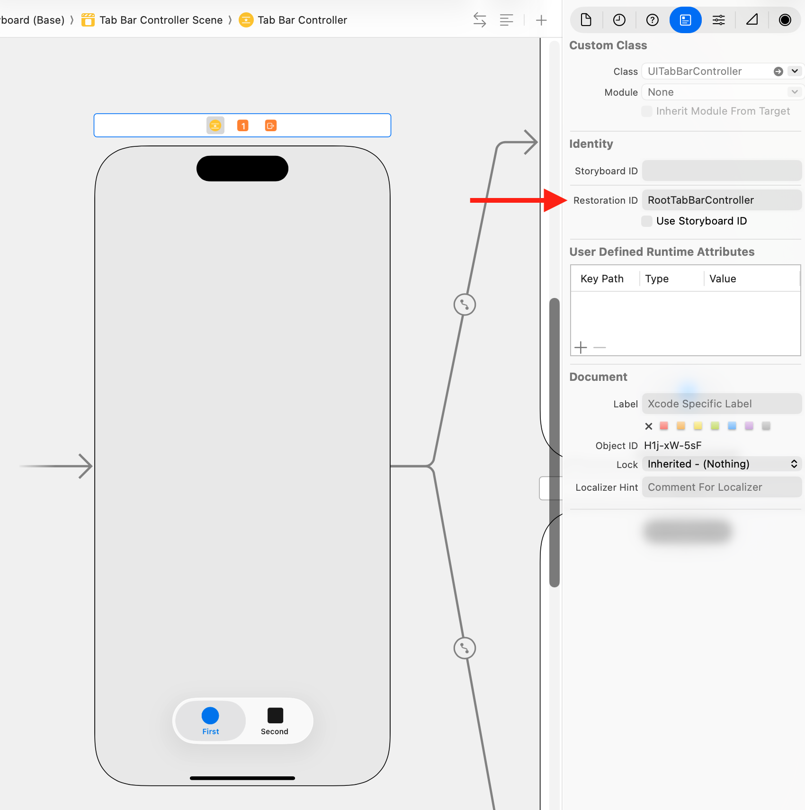

> Navigation: [Technologies](../technologies.md) · [UIKit](../uikit.md) · [View controllers](view-controllers.md)

# Preserving your app’s UI across launches

Return your app to its previous state after the system terminates it.

## Overview

Preserving your app’s user interface helps maintain the illusion that your app is always running. Interruptions can occur frequently on iOS devices, and a prolonged interruption might cause the system to terminate your app to free up resources. However, users don’t know that your app has been terminated and won’t expect the state of your app to change. Instead, they expect your app to be in the same state as when they left it. State preservation and restoration ensures that your app returns to its previous state when it launches again.

At appropriate times, UIKit preserves the state of your app’s views and view controllers to an encrypted file on disk. When your app is terminated and relaunched later, UIKit reconstructs your views and view controllers from the preserved data. The preservation and restoration processes are initiated automatically, but you must also do some specific work to support those processes:

- Enable support for state preservation and restoration.
- Assign restoration identifiers to the view controllers that you want to preserve.
- Recreate view controllers, as needed, at restoration time.
- Encode and decode the custom data that you need to restore your view controller to its previous state.

If you define your interface entirely in storyboards, UIKit knows how to recreate your view controllers, and does so automatically. If you don’t use storyboards, or if you want more control over the creation and initialization of your view controllers, you can create them yourself.

To see an example of state preservation and restoration, see [Restoring your app’s state](restoring-your-app-s-state.md).

### Enable state preservation and restoration for your app

You opt-in to state preservation and restoration by implementing your app delegate’s [- application:shouldSaveSecureApplicationState:](<uiapplicationdelegate/application(__shouldsavesecureapplicationstate_).md>) and [- application:shouldRestoreSecureApplicationState:](<uiapplicationdelegate/application(__shouldrestoresecureapplicationstate_).md>) methods. Both methods return a Boolean value indicating whether the associated process should occur, and in most cases you simply return [true](../swift/true.md). However, you can return [false](../swift/false.md) at times when restoring your app’s interface might not be appropriate.

When UIKit calls your [- application:shouldSaveSecureApplicationState:](<uiapplicationdelegate/application(__shouldsavesecureapplicationstate_).md>) method, you can save data in addition to returning [true](../swift/true.md). You might save data that you intend to use during the restoration process. For example, the following code shows an example that saves the app’s current version number. At restoration time, the [- application:shouldRestoreSecureApplicationState:](<uiapplicationdelegate/application(__shouldrestoresecureapplicationstate_).md>) method checks the version number in the archive and prevents restoration from occurring if it doesn’t match the expected version.

```swift
func application(_ application: UIApplication, 
            shouldSaveSecureApplicationState coder: NSCoder) -> Bool {
   // Save the current app version to the archive.
   coder.encode(11.0, forKey: "MyAppVersion")
        
   // Always save state information.
   return true
}
    
func application(_ application: UIApplication, 
            shouldRestoreSecureApplicationState coder: NSCoder) -> Bool {
   // Restore the state only if the app version matches.
   let version = coder.decodeFloat(forKey: "MyAppVersion")
   if version == 11.0 {
      return true
   }
    
   // Don't restore from old data.    
   return false
}
```

If you prevent restoration from occurring, you can still configure your app’s interface manually in the [- application:didFinishLaunchingWithOptions:](<uiapplicationdelegate/application(__didfinishlaunchingwithoptions_).md>) method of your app delegate.

### Assign restoration identifiers to your view controllers

You explicitly tell UIKit which view controllers to preserve by assigning restoration identifiers to them. A restoration identifier is a unique string that you assign to the view controller programmatically or in Interface Builder. The name of the view controller class is usually a suitable restoration identifier, but you may use any string. Add that string to the view controller in your storyboard file or assign it to the view controller’s [restorationIdentifier](uiviewcontroller/restorationidentifier.md) property at runtime.



At preservation time, UIKit attempts to preserve the root view controllers of your app’s windows. For each root view controller with a restoration identifier, UIKit asks that view controller to encode its custom data in an archive. A container view controller can encode references to its child view controllers as part of its custom data. If it does, and if those view controllers also have restoration identifiers, UIKit attempts to preserve the child view controllers and their contents. This process continues recursively, following the connections from one view controller to the next until all of them are saved or ignored.

You aren’t required to assign a restoration identifier to every view controller. In fact, there are times when you might not want to preserve all of your view controllers. For example, if your app displays a temporary login screen, you might not want that screen preserved. Instead, you’d want to determine at restoration time whether to display it. In that case, you wouldn’t assign a restoration identifier to the view controller for your login screen.

For detailed information about what gets preserved, see [About the UI preservation process](about-the-ui-preservation-process.md).

### Encode and decode custom information for your app

During the preservation process, UIKit calls the [- encodeRestorableStateWithCoder:](<uistaterestoring/encoderestorablestate(with_).md>) method of each preserved view and view controller. Use this method to preserve the information that you need to return the view or view controller to its current state.

- **Do** save details about the visual state of views and controls.
- **Do** save references to child view controllers that you also want to preserve.
- **Do** save information that can be discarded without affecting the user’s data.
- **Don’t** include data that’s already in your app’s persistent storage. Instead, include an identifier that you can use to locate that data later.

State preservation isn’t a substitute for saving your app’s data to disk. UIKit can discard state preservation data at its discretion, allowing your app to return to its default state. Use the preservation process to store information about the state of your app’s user interface, such as the currently selected row of a table. Don’t use it to store the data contained in that table.

The following code shows an example of a view controller with text fields for gathering a first and last name. If one of the text fields contains an unsaved value, the method saves the unsaved value and an identifier for which text field contains that value. In this case, the unsaved value isn’t part of the app’s persistent data; it’s a temporary value that can be discarded if needed.

```swift
override func encodeRestorableState(with coder: NSCoder) {
   super.encodeRestorableState(with: coder)
        
   // Save the user ID so that we can load that user later.
   coder.encode(userID, forKey: "UserID")

   // Write out any temporary data if editing is in progress.
   if firstNameField!.isFirstResponder {
      coder.encode(firstNameField?.text, forKey: "EditedText")
      coder.encode(Int32(1), forKey: "EditField")
   }
   else if lastNameField!.isFirstResponder {
      coder.encode(lastNameField?.text, forKey: "EditedText")
      coder.encode(Int32(2), forKey: "EditField")
   }
   else {
      // No editing was in progress.
      coder.encode(Int32(0), forKey: "EditField")
   }
}
```

For more information about how UIKit preserves your app’s views, view controllers, and state information, see [About the UI preservation process](about-the-ui-preservation-process.md).

### Create view controllers when asked

If preserved state information is available when your app is launched, the system attempts to restore your app’s interface using the preserved data.

1. UIKit calls your app delegate’s [- application:shouldRestoreSecureApplicationState:](<uiapplicationdelegate/application(__shouldrestoresecureapplicationstate_).md>) method to determine if restoration should proceed.
2. UIKit uses your app’s storyboards to recreate your view controllers.
3. UIKit calls each view controller’s [- decodeRestorableStateWithCoder:](<uistaterestoring/decoderestorablestate(with_).md>) method to restore its state information.

UIKit loads both the view controller and its views from your storyboard initially. After those objects have been loaded and initialized, UIKit begins restoring their state information. Use your [- decodeRestorableStateWithCoder:](<uistaterestoring/decoderestorablestate(with_).md>) methods to return your view controller to its previous state.

The following code shows the method for decoding the state that was encoded in the previous example. This method restores the view controller’s data from the preserved user ID. If a text field was being edited, this method also restores the in-progress value and makes the corresponding text field the first responder, which displays the keyboard for that text field.

```swift
override func decodeRestorableState(with coder: NSCoder) {
   super.decodeRestorableState(with: coder)
   
   // Restore the first name and last name from the user ID.
   let identifier = coder.decodeObject(forKey: "UserID") as! String
   setUserID(identifier: identifier)

   // Restore an in-progress value that was not saved.
   let activeField = coder.decodeInteger(forKey: "EditField")
   let editedText = coder.decodeObject(forKey: "EditedText") as! 
                         String?

   switch activeField {
      case 1:
         firstNameField?.text = editedText
         firstNameField?.becomeFirstResponder()
         break
            
      case 2:
         lastNameField?.text = editedText
         lastNameField?.becomeFirstResponder()
         break
            
     default:
         break  // Do nothing.
  }
}
```

Defining your view controllers in storyboards is the easiest way to manage state restoration, but it isn’t the only way. For more information about other ways to recreate your view controllers, see [About the UI restoration process](about-the-ui-restoration-process.md).

## Topics

### Process details

- [About the UI preservation process](about-the-ui-preservation-process.md) — Learn how to customize the UIKit state preservation process.
- [About the UI restoration process](about-the-ui-restoration-process.md) — Learn how to customize the UIKit state restoration process.

## See Also

### Interface restoration

- [Restoring your app’s state](restoring-your-app-s-state.md) — Provide continuity for the user by preserving current activities.
- [Restoring your app’s state with SwiftUI](../swiftui/restoring-your-app-s-state-with-swiftui.md) — Provide app continuity for users by preserving their current activities.
- [UIViewControllerRestoration](uiviewcontrollerrestoration.md) — The methods that objects adopt so that they can act as a restoration class for view controllers during state restoration.
- [UIObjectRestoration](uiobjectrestoration.md) — The interface that restoration classes use to restore preserved objects.
- [UIStateRestoring](uistaterestoring.md) — Methods for adding objects to your state restoration archives.
