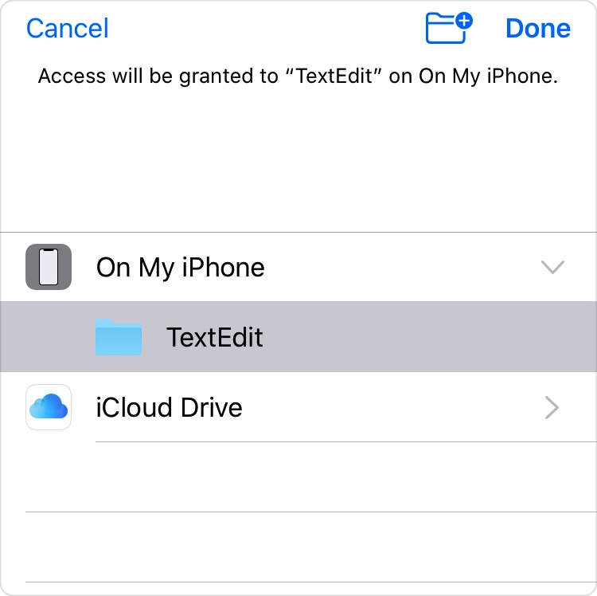

> Navigation: [Technologies](../technologies.md) · [UIKit](../uikit.md) · [View controllers](view-controllers.md)

# Providing access to directories

<sub>Article</sub>

Use a document picker to access the content of a directory outside your app’s container.

## Overview

In iOS 12 and earlier, users can open and interact with files outside the app’s container. The [UIDocumentBrowserViewController](uidocumentbrowserviewcontroller.md) and [UIDocumentPickerViewController](uidocumentpickerviewcontroller.md) provide access to files in the system’s local file provider, in iCloud, or in third-party services that use a File Provider extension. Users can select multiple files at a time — but they need to select each file individually.

In iOS 13, users can select a directory from any of the available file providers using a [UIDocumentPickerViewController](uidocumentpickerviewcontroller.md). The document picker returns a _security-scoped URL_ for the directory that permits your app to access content outside its container. In this case, the URL lets your app recursively access the directory and all of its contents, which includes accessing any new items you add to the directory in the future. Your app can even save a bookmark for this URL, letting it access the directory the next time it launches.

### Ask the user to select a directory

To prompt the user to select a directory, create a document picker and set the content type to open to the type [folder](../uniformtypeidentifiers/uttype-swift.struct/folder.md). Then set the document picker’s delegate and present it.

```swift
// Create a document picker for directories.
let documentPicker =
    UIDocumentPickerViewController(forOpeningContentTypes: [.folder])
documentPicker.delegate = self

// Set the initial directory.
documentPicker.directoryURL = startingDirectory

// Present the document picker.
present(documentPicker, animated: true, completion: nil)
```

As soon as you call the [- presentViewController:animated:completion:](<uiviewcontroller/present(__animated_completion_).md>) method, the system displays the document picker to the user. If you specify the [directoryURL](uidocumentpickerviewcontroller/directoryurl.md) property, the document picker starts with the selected directory. Otherwise, it starts with the most recent directory the user chose.



After the user taps Done, the system calls your delegate’s [- documentPicker:didPickDocumentsAtURLs:](<uidocumentpickerdelegate/documentpicker(__didpickdocumentsat_).md>) method, passing an array of security-scoped URLs for the user’s selected directories. Use a security-scoped URL to enumerate the content of the directory and any of its subdirectories, or to add, remove, or modify any files.

If the user taps Cancel, the system calls [- documentPickerWasCancelled:](<uidocumentpickerdelegate/documentpickerwascancelled(__).md>) instead.

> [!note] Note
> The [UIDocumentBrowserViewController](uidocumentbrowserviewcontroller.md) doesn’t support the [folder](../uniformtypeidentifiers/uttype-swift.struct/folder.md) document type. To provide access to directories, use the [UIDocumentPickerViewController](uidocumentpickerviewcontroller.md) instead.

### Access the directory’s content

When the user selects a directory in the document picker, the system gives your app permission to access that directory and all of its contents. The document picker returns a security-scoped URL for the directory. When you use one of these URLs to enumerate the directory’s content, the resulting URLs are also security-scoped. You can save a security-scoped URL as a bookmark and later resolve it back into a security-scoped URL.

To access the content of a security-scoped URL, you must do the following:

1. Before accessing the URL, call [startAccessingSecurityScopedResource()](<../foundation/nsurl/startaccessingsecurityscopedresource().md>).
2. Use a file coordinator to perform read or write operations on the URL’s contents.
3. After you access the URL, call [stopAccessingSecurityScopedResource()](<../foundation/nsurl/stopaccessingsecurityscopedresource().md>).

```swift
func documentPicker(_ controller:UIDocumentPickerViewController, didPickDocumentsAt urls: [URL]) {
    // Start accessing a security-scoped resource.
    guard let url = urls.first,
        url.startAccessingSecurityScopedResource() else {
        // Handle the failure here.
        return
    }

    // Make sure you release the security-scoped resource when you finish.
    defer { url.stopAccessingSecurityScopedResource() }

    // Use file coordination for reading and writing any of the URL’s content.
    var error: NSError? = nil
    NSFileCoordinator().coordinate(readingItemAt: url, error: &error) { (url) in
            
        let keys : [URLResourceKey] = [.nameKey, .isDirectoryKey]
            
        // Get an enumerator for the directory's content.
        guard let fileList =
            FileManager.default.enumerator(at: url, includingPropertiesForKeys: keys) else {
            Swift.debugPrint("*** Unable to access the contents of \(url.path) ***\n")
            return
        }
            
        for case let file as URL in fileList {
            // Start accessing the content's security-scoped URL.
            guard file.startAccessingSecurityScopedResource() else {
                // Handle the failure here.
                continue
            }

            // Do something with the file here.
            Swift.debugPrint("chosen file: \(file.lastPathComponent)")
                
            // Make sure you release the security-scoped resource when you finish.
            file.stopAccessingSecurityScopedResource()
        }
    }
}
```

### Save the URL as a bookmark

To access the URL in the future, save the URL as a [minimalBookmark](../foundation/nsurl/bookmarkcreationoptions/minimalbookmark.md) using its [bookmarkData(options:includingResourceValuesForKeys:relativeTo:)](<../foundation/nsurl/bookmarkdata(options_includingresourcevaluesforkeys_relativeto_).md>) method.

```swift
do {
    // Start accessing a security-scoped resource.
    guard url.startAccessingSecurityScopedResource() else {
        // Handle the failure here.
        return
    }
    
    // Make sure you release the security-scoped resource when you finish.
    defer { url.stopAccessingSecurityScopedResource() }
    
    let bookmarkData = try url.bookmarkData(options: .minimalBookmark, includingResourceValuesForKeys: nil, relativeTo: nil)
    
    try bookmarkData.write(to: getMyURLForBookmark())
}
catch let error {
    // Handle the error here.
}
```

You can then read the bookmark, and resolve it to a security-scoped URL again.

```swift
do {
    let bookmarkData = try Data(contentsOf: getMyURLForBookmark())
    var isStale = false
    let url = try URL(resolvingBookmarkData: bookmarkData, bookmarkDataIsStale: &isStale)
    
    guard !isStale else {
        // Handle stale data here.
        return
    }
    
    // Use the URL here.
}
catch let error {
    // Handle the error here.
}
```

### Respond to permission changes

Users always have complete control over the apps that can access directories. After selecting a directory from the document picker, your app appears in Settings \> Privacy \> Files and Folders. This page lists all the apps that have permission to access shared directories, and users can revoke or restore permission for each app at any time.

This means your app must be ready to handle failures when accessing a directory’s content. Calls to the [startAccessingSecurityScopedResource()](<../foundation/url/startaccessingsecurityscopedresource().md>) method can fail, as well as any attempts to read or write to the URL. This is especially true when saving and resolving bookmarks to security-scoped URLs because using saved bookmarks can greatly increase the amount of time users have to possibly change your app’s permissions.

## See Also

### Documents and directories

- [Customizing a document-based app’s launch experience](customizing-a-document-based-app-s-launch-experience.md) — Add unique elements to your app’s document launch scene.
- [Adding a document browser to your app](adding-a-document-browser-to-your-app.md) — Give people access to their local or remote documents from within your app.
- [Building an app with a document browser](building-an-app-with-a-document-browser.md) — Provide access to on-device and cloud files by adding a document browser to your app.
- [Building a document browser app for custom file formats](building-a-document-browser-app-for-custom-file-formats.md) — Implement a custom document file format to manage user interactions with files on different cloud storage providers.
- [UIDocumentViewController](uidocumentviewcontroller.md) — A view controller that manages and presents a document stored locally or in the cloud.
- [UIDocumentBrowserViewController](uidocumentbrowserviewcontroller.md) — A view controller for browsing and performing actions on documents that you store locally and in the cloud.
- [UIDocumentPickerViewController](uidocumentpickerviewcontroller.md) — A view controller that provides access to documents or destinations outside your app’s sandbox.
- [UIDocumentInteractionController](uidocumentinteractioncontroller.md) — A view controller that previews, opens, or prints files with a file format that your app can’t handle directly.
