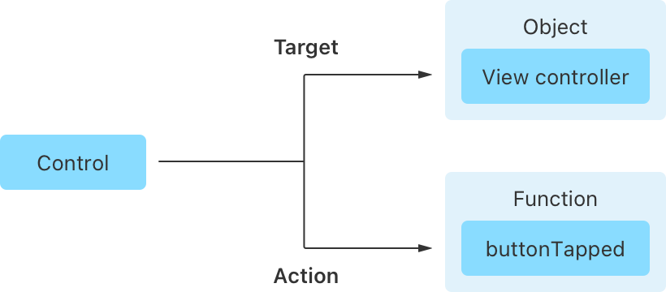
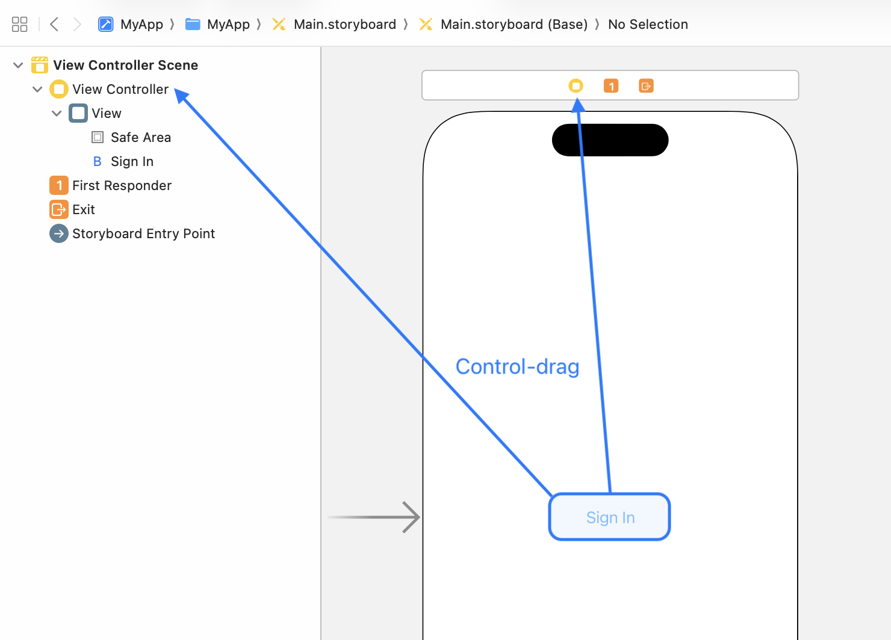
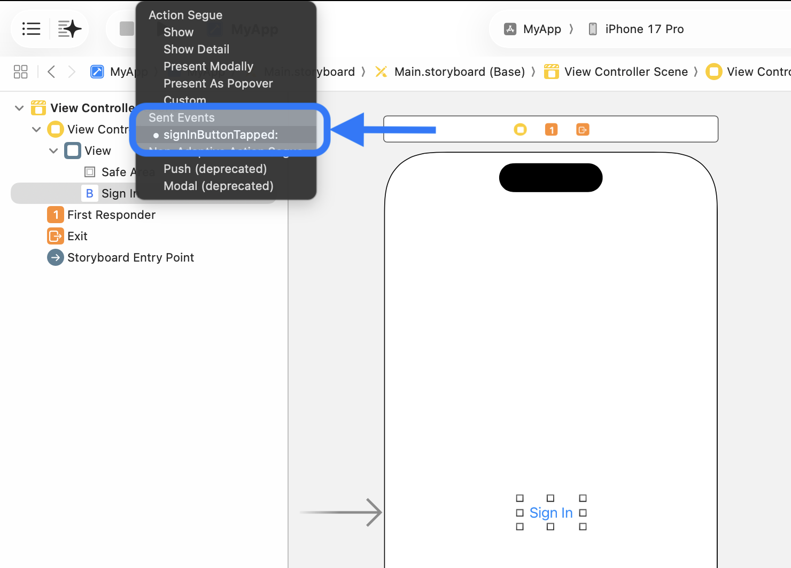
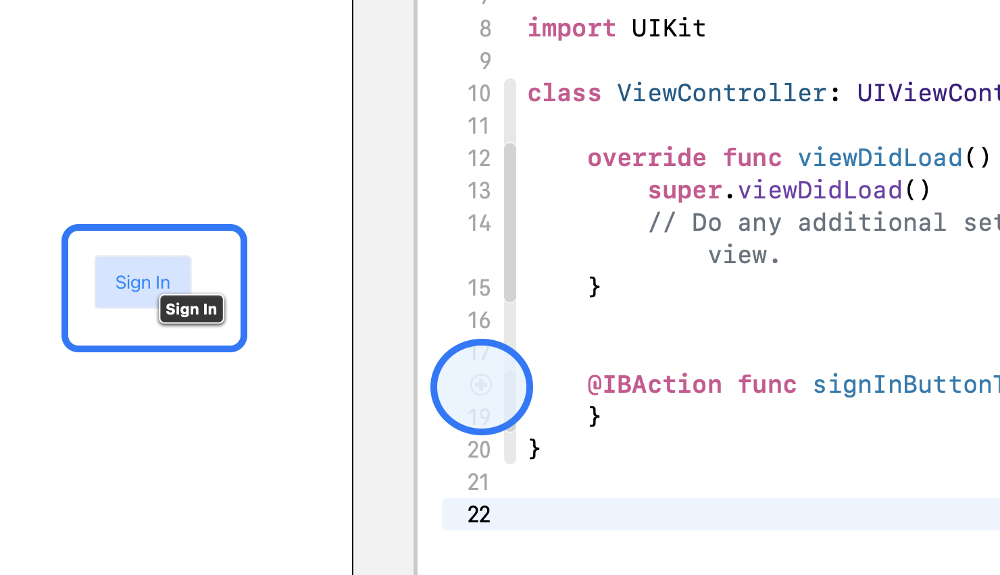
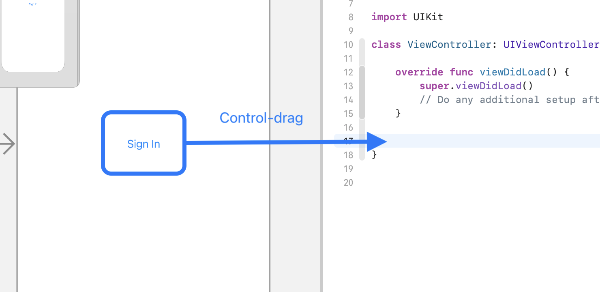
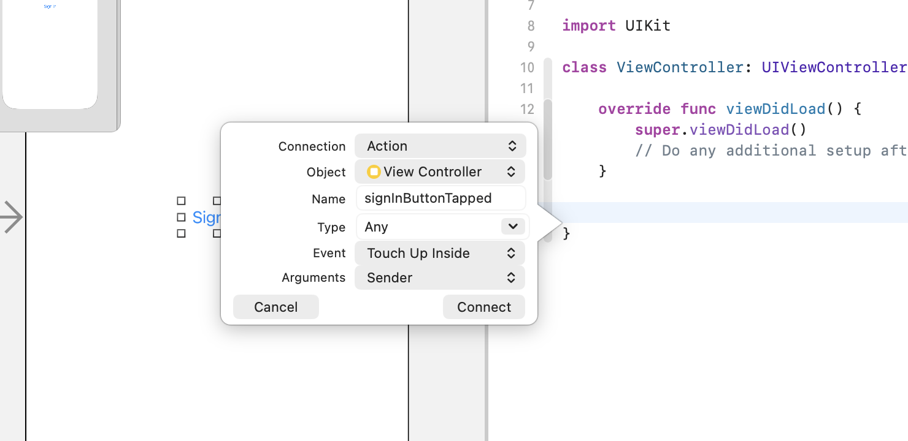
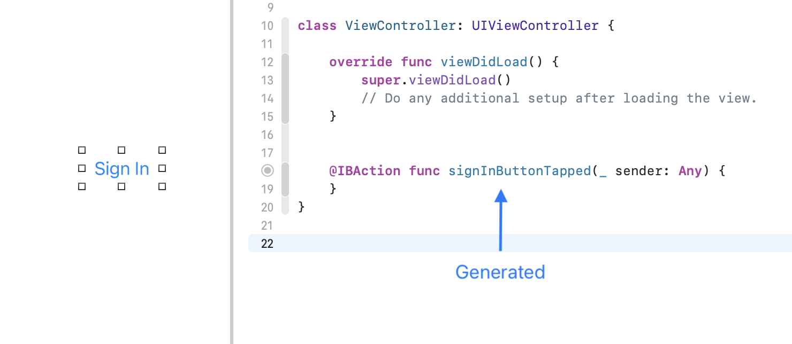

> Navigation: [Technologies](../technologies.md) · [UIKit](../uikit.md) · [Views and controls](views-and-controls.md)

# Responding to control-based events using target-action

<sub>Article</sub>

Handle user input by connecting buttons, sliders, and other controls to your app’s code using the target-action design pattern.

## Overview

User interactions generate thousands of events for your app. Every swipe of the finger or button click, for instance, results in numerous events your app has to process.

`Target-action` is a design pattern to help you handle these user interactions efficiently. By only registering actions against specific events on your controls, you simplify your event processing, while making your code more maintainable and easier to read.

Use `target-action` to connect events directly from controls in your UI to methods in your code.

### Designate an object to handle control-related events

When a person interacts with your control, the control needs to know where to send the event. The destination for the event is the _target_. View controllers make good targets because they’re adept at handling user interactions, as well as hosting UI controls.



<sub>A diagram that depicts the relationship between a control and its corresponding target and action. The control on the left has one arrow pointing to its target on the right, which is a view controller. Underneath this is a parallel arrow pointing from the control on the left to its action method on the right, which is a function with the name buttonTapped.</sub>

### Define the action methods you use to respond to events

With a control assigned to the target, provide a function to call on that target when the event occurs. This is the _action_ method.

Action methods have a distinct signature:

**Swift**

```swift
// UIKit.
@IBAction func doSomething()
@IBAction func doSomething(sender: Any)
@IBAction func doSomething(sender: Any, forEvent event: UIEvent)
 
// AppKit.
@IBAction func doSomething()
@IBAction func doSomething(sender: Any)
```

**Objective-C**

```objc
    // UIKit.
    - (IBAction)doSomething;
    - (IBAction)doSomething:(id)sender;
    - (IBAction)doSomething:(id)sender forControlEvents:(UIControlEvents)controlEvents;

    // AppKit.
    - (IBAction)doSomething;
    - (IBAction)doSomething:(id)sender;
```

Xcode uses the `@IBAction` keyword to connect controls in Interface Builder to functions in your code. The keyword also bridges the Swift and Objective-C runtimes, enabling Swift code to call into Objective-C, which is where the target-action functionality lives.

The `sender` parameter defines where the event comes from; for example, a button. Use the generic type `Any` to allow any control to call the action method, or specify the `sender` type when you need more information about the control for event processing. For example, set the `sender` type to [UISlider](uislider.md) to read the slider thumb value when someone moves the slider left or right.

**Swift**

```swift
// UIKit.
@IBAction func adjustVolume(sender: UISlider) {
    print(sender.value)
}

// AppKit.
@IBAction func adjustVolume(sender: NSSlider) {
    NSLog("%@", sender.stringValue)
}
```

**Objective-C**

```objc
// UIKit.
- (IBAction)adjustVolume:(UISlider *)sender {
    NSLog(@"%f", sender.value);
}

// AppKit.
- (IBAction)adjustVolume:(NSSlider *)sender {
    NSLog(@"%@", [sender stringValue]);
}
```

UIKit also supports coupling action methods to specific event types (see [Event](uicontrol/event.md)). For example, to set up target-action for a user dragging their finger inside the bounds of a control, register for the event type [UIControlEventTouchDragInside](uicontrol/event/touchdraginside.md).

### Connect controls to the action methods in Interface Builder

With the `target` and `action` methods defined, you’re ready to connect them visually to the controls in Interface Builder.

1. Select the control (the `target`) you want to connect to the code (the `action`).
2. Control-drag the control to the view controller in the document outline.
3. Select the action method that the control connects to.



<sub>A screenshot showing how to connect a control to an action in Xcode using Interface Builder. The screenshot consists of Xcode’s document outline view on the left displaying a connection to the view controller, with the Interface Builder canvas on the right containing a single button. A Control-drag arrow connects the button on the canvas to the view controller in the document outline. An alternate arrow connects the button on the canvas to the view controller icon in Interface Builder canvas.</sub>



<sub>A screenshot in Xcode showing a modal alert of connection options after completing a Control-drag action. The modal lists several action segue options including Show, Show Detail, and Present Modally. An arrow points to the signInButtonTapped option.</sub>

You can verify that the control and action are connected by moving the pointer over the circular dot to the left of the action method. When you do, Xcode highlights the control.



<sub>A screenshot in Xcode showing how moving the pointer over an action method in the code editor highlights the control it’s connected to in Interface Builder. Interface Builder is on the left with a highlighted button. The Assistant code editor is open on the right with the mouse tip hovering over the grey circle immediately to the left of the function definition.</sub>

Another way to connect is to Control-drag the control from Interface Builder into the view controller.



<sub>A screenshot in Xcode showing how Control-dragging a control from Interface Builder into the Assistant editor generates the target-action method. Interface Builder is open on the left. The Assistant editor is open beside it on the right. An arrow points from the button into the code editor with the words Control-drag appearing above it.</sub>

Enter the name of the `action` method you’d like the control to call and then click Connect.



<sub>A screenshot in Xcode showing a modal alert resulting from a Control-drag action between Interface Builder and the Assistant editor. The modal alert shows the fields Connection, Object, Name, Type, Event, and Arguments. Two buttons appear at the bottom: a Cancel button on the left and a Connect button on the right.</sub>

The following table lists the parameters available for configuration.

| Parameter | Description |
|---|---|
| Connection | The type of connection to make. Select Action to establish a target-action relationship between the control and the target. |
| Object | The `target` or object your control is connecting to. |
| Name | The name of the function, or `action`, your control calls when the event occurs. |
| Type | The type of the control sending the event. Choose `Any` if you don’t require any further information regarding the control’s state. Specify the control type if you require more information from the control for event processing. |
| Event | The [UIEvent](uievent.md) associated with the action. This feature is only available in UIKit. |
| Arguments | The arguments to include in the signature of your target-action method. Choose None to include no arguments. Choose Sender to pass in the control type as the sender. Choose Sender and Event to pass in both the control type and the event that caused the action. This feature is available only in UIKit. |

Connecting the target-action this way ensures the method signature and parameters are correct as Xcode generates the action method for you.



<sub>A screenshot in Xcode showing the generated code resulting from a Control-drag action from Interface Builder into the Assistant code editor. Interface Builder is open on the left. The Assistant editor is open beside it on the right, and inside the editor is the generated code. An arrow with the title Generated is pointing to the newly generated code.</sub>

### Connect a control to your code programmatically

In UIKit, use the [- addTarget:action:forControlEvents:](<uicontrol/addtarget(__action_for_).md>) method to set up target-action programmatically on a control:

**Swift**

```swift
import UIKit

class ViewController: UIViewController {
    let signInButton = UIButton(type: .system)
    
    override func viewDidLoad() {
        super.viewDidLoad()

        signInButton.translatesAutoresizingMaskIntoConstraints = false
        signInButton.setTitle("Sign in", for: .normal)
        
        // Target-action.
        signInButton.addTarget(self, action: #selector(buttonTapped), for: .touchUpInside)
        
        view.addSubview(signInButton)
        signInButton.centerXAnchor.constraint(equalTo: view.centerXAnchor).isActive = true
        signInButton.centerYAnchor.constraint(equalTo: view.centerYAnchor).isActive = true
    }
    
    @IBAction func buttonTapped(sender: UIButton) {
        print("Sign in successful 🎉")
    }
}
```

**Objective-C**

```objc
#import "ViewController.h"

@implementation ViewController

- (void)viewDidLoad {
    [super viewDidLoad];
    
    UIButton *signInButton = [UIButton buttonWithType:UIButtonTypeSystem];
    [signInButton setTitle:@"Sign in" forState:UIControlStateNormal];

    signInButton.translatesAutoresizingMaskIntoConstraints = false;

    // Target-action.
    [signInButton addTarget:self action:@selector(buttonTapped:) forControlEvents:UIControlEventTouchUpInside];
    
    [self.view addSubview:signInButton];
    [signInButton.centerXAnchor constraintEqualToAnchor:self.view.centerXAnchor].active = true;
    [signInButton.centerYAnchor constraintEqualToAnchor:self.view.centerYAnchor].active = true;
}

- (void)buttonTapped:(UIButton *)sender {
    NSLog(@"Sign in successful 🎉");
}
@end
```

In AppKit, use the control’s `target` and `action` properties to set target-action programmatically:

**Swift**

```swift
import Cocoa

class ViewController: NSViewController {
    let signInButton = NSButton()
    
    override func viewDidLoad() {
        super.viewDidLoad()

        signInButton.translatesAutoresizingMaskIntoConstraints = false
        signInButton.title = "Sign in"
        
        // Target-action.
        signInButton.target = self
        signInButton.action = #selector(buttonTapped(sender:))
        
        view.addSubview(signInButton)
        signInButton.centerXAnchor.constraint(equalTo: view.centerXAnchor).isActive = true
        signInButton.centerYAnchor.constraint(equalTo: view.centerYAnchor).isActive = true
    }
    
    @IBAction func buttonTapped(sender: NSButton) {
        print("Sign in successful 🎉")
    }
}
```

**Objective-C**

```objc
#import "ViewController.h"

@implementation ViewController

- (void)viewDidLoad {
    [super viewDidLoad];
    
    NSButton *signInButton = [[NSButton alloc] initWithFrame: NSMakeRect(20, 20, 100, 80)];
    signInButton.translatesAutoresizingMaskIntoConstraints = NO;
    signInButton.title = @"Sign in";
    signInButton.bezelStyle = NSBezelStyleRounded;
    
    // Target-action.
    signInButton.target = self;
    signInButton.action = @selector(buttonTapped:);
    
    [self.view addSubview:signInButton];
    [signInButton.centerXAnchor constraintEqualToAnchor:self.view.centerXAnchor].active = YES;
    [signInButton.centerYAnchor constraintEqualToAnchor:self.view.centerYAnchor].active = YES;
}

- (void)buttonTapped:(NSButton *)sender {
    NSLog(@"Sign in successful 🎉");
}

@end
```

### Enable other objects to respond to control-related events

When the object hosting the control isn’t the one you want handling the event, invoke the responder chain by passing in `nil` as the target. This causes the control to search the responder chain for the specified action method and invoke it when found. For more information, see [Using responders and the responder chain to handle events](using-responders-and-the-responder-chain-to-handle-events.md).

## See Also

### Controls

- [UIControl](uicontrol.md) — The base class for controls, which are visual elements that convey a specific action or intention in response to user interactions.
- [UIButton](uibutton.md) — A control that executes your custom code in response to user interactions.
- [UIColorWell](uicolorwell.md) — A control that displays a color picker.
- [UIDatePicker](uidatepicker.md) — A control for inputting date and time values.
- [UIPageControl](uipagecontrol.md) — A control that displays a horizontal series of dots, each of which corresponds to a page in the app’s document or other data-model entity.
- [UISegmentedControl](uisegmentedcontrol.md) — A horizontal control that consists of multiple segments, each segment functioning as a discrete button.
- [UISlider](uislider.md) — A control for selecting a single value from a continuous range of values.
- [UIStepper](uistepper.md) — A control for incrementing or decrementing a value.
- [UISwitch](uiswitch.md) — A control that offers a binary choice, such as on/off.
