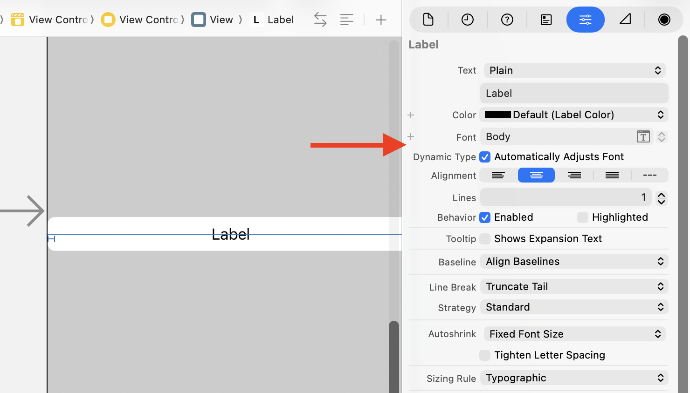

> Navigation: [Technologies](../technologies.md) · [UIKit](../uikit.md) · [Text display and fonts](text-display-and-fonts.md)

# Scaling fonts automatically

<sub>Article</sub>

Scale text in your interface automatically using Dynamic Type.

## Overview

The Dynamic Type feature allows users to choose the size of textual content displayed on the screen. It helps users who need larger text for better readability. It also accomodates those who can read smaller text, allowing more information to appear on the screen. Apps that support Dynamic Type also provide a more consistent reading experience.

To add support for Dynamic Type in your app, you use _text styles_. A text style describes the use of the text, such as [UIFontTextStyleHeadline](uifont/textstyle/headline.md) or [UIFontTextStyleBody](uifont/textstyle/body.md) or [UIFontTextStyleTitle1](uifont/textstyle/title1.md), and lets the system know how best to adjust its size. You can configure text styles in either Interface Builder or your source code.

Although custom fonts are supported in Dynamic Type, the preferred font is designed to look good at any size. Also, using the preferred font ensures consistency within the system and with other apps. For more information, see Human Interface Guidelines \> [Typography](../design/human-interface-guidelines/typography.md).

### Configuring text styles using Interface Builder

In Interface Builder, select the text style from the Font menu, then select the Automatically Adjust Font checkbox to the right of Dynamic Type.



<sub>A partial screenshot of Interface Builder with an arrow pointing at the text style 'Body' as the selected font in the Attributes Inspector for the selected label. Below the font selection is the label Dynamic Type, with the Automatically Adjust Font checkbox selected.</sub>

### Configuring text styles in source code

In your source code, call the [+ preferredFontForTextStyle:](<uifont/preferredfont(fortextstyle_).md>) method. This method returns a [UIFont](uifont.md) that you can assign to a label, text field, or text view. Next, set the [adjustsFontForContentSizeCategory](uicontentsizecategoryadjusting/adjustsfontforcontentsizecategory.md) property on the text control to [true](../swift/true.md). This setting tells the text control to adjust the text size based on the Dynamic Type setting provided by the user.

```swift
label.font = UIFont.preferredFont(forTextStyle: .body)
label.adjustsFontForContentSizeCategory = true
```

If the [adjustsFontForContentSizeCategory](uicontentsizecategoryadjusting/adjustsfontforcontentsizecategory.md) property is set to [false](../swift/false.md), the font will initially be the right size, but it won’t respond to text-size changes the user makes in Settings or Control Center. To detect such changes, override the [- traitCollectionDidChange:](<uitraitenvironment/traitcollectiondidchange(__).md>) method in your view or view controller, and check for changes to the content size category trait. You can also observe [UIContentSizeCategoryDidChangeNotification](uicontentsizecategory/didchangenotification.md) and update the font when the notification arrives.

If you use a custom font in your app and want to let the user control the text size, you must create a scaled instance of the font in your source code. Call [- scaledFontForFont:](<uifontmetrics/scaledfont(for_).md>), passing in a reference to the custom font that’s at a point size suitable for use with [UIContentSizeCategoryLarge](uicontentsizecategory/large.md). This is the default value for the Dynamic Type setting. You can use this call on the default font metrics, or you can specify a text style, such as [UIFontTextStyleHeadline](uifont/textstyle/headline.md).

```swift
guard let customFont = UIFont(name: "CustomFont-Light", size: UIFont.labelFontSize) else {
    fatalError("""
        Failed to load the "CustomFont-Light" font.
        Make sure the font file is included in the project and the font name is spelled correctly.
        """
    )
}
label.font = UIFontMetrics(forTextStyle: .headline).scaledFont(for: customFont)
label.adjustsFontForContentSizeCategory = true
```

> [!note] Note
> In Interface Builder, the Dynamic Type option to automatically adjust fonts applies only to text styles or scaled fonts returned by [UIFontMetrics](uifontmetrics.md). It has no effect on custom fonts set in Interface Builder.

Fonts created through [UIFontMetrics](uifontmetrics.md) behave the same as the preferred fonts the system provides. The system scales to match the user’s selected text size in a manner that’s similar to the way the text style you supply is scaled.

## See Also

### Fonts

- [Adding a custom font to your app](adding-a-custom-font-to-your-app.md) — Add a custom font to your app and use it in your app’s interface.
- [UIFont](uifont.md) — An object that provides access to the font’s characteristics.
- [UIFontDescriptor](uifontdescriptor.md) — A collection of attributes that describes a font.
- [SymbolicTraits](uifontdescriptor/symbolictraits-swift.struct.md) — Constants that describe the stylistic aspects of a font.
- [UIFontMetrics](uifontmetrics.md) — A utility object for obtaining custom fonts that scale to support Dynamic Type.
