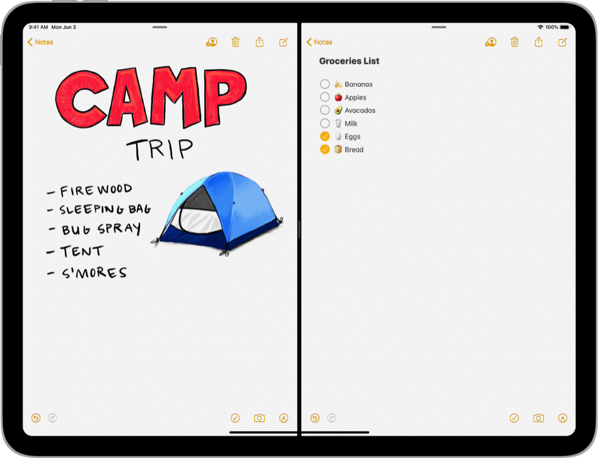

> Navigation: [Technologies](../technologies.md) · [UIKit](../uikit.md) · [App and environment](app-and-environment.md)

# Scenes

API Collection

Manage multiple instances of your app’s UI simultaneously, and direct resources to the appropriate instance of your UI.

## Overview

UIKit manages each instance of your app’s UI using a [UIWindowScene](uiwindowscene.md) object. A _scene_ contains the windows and view controllers for presenting one instance of your UI. Each scene also has a corresponding [UIWindowSceneDelegate](uiwindowscenedelegate.md) object, which you use to coordinate interactions between UIKit and your app. Scenes run concurrently with each other, sharing the same memory and app process space. As a result, a single app may have multiple scenes and scene delegate objects active at the same time.

Manage the configuration of new scenes from your [UIApplicationDelegate](uiapplicationdelegate.md) object.

## Topics

### Essentials

- [Preparing your UI to run in the foreground](preparing-your-ui-to-run-in-the-foreground.md) — Configure your app to appear onscreen.
- [Preparing your UI to run in the background](preparing-your-ui-to-run-in-the-background.md) — Prepare your app to be suspended.

### Window scenes

- [Supporting multiple windows on iPad](supporting-multiple-windows-on-ipad.md) — Support side-by-side instances of your app’s interface and create new windows.
- [UIWindowSceneDelegate](uiwindowscenedelegate.md) — Additional methods that you use to manage app-specific tasks occurring in a scene.
- [UIWindowScene](uiwindowscene.md) — A scene that manages one or more windows for your app.
- [UIScene](uiscene.md) — An object that represents one instance of your app’s user interface.
- [UISceneDelegate](uiscenedelegate.md) — The core methods you use to respond to life-cycle events occurring within a scene.

### Configuration

- [Specifying the scenes your app supports](specifying-the-scenes-your-app-supports.md) — Tell the system about your app’s scenes, including the objects you use to manage each scene and its initial user interface.
- [UIApplicationSceneManifest](../bundleresources/information-property-list/uiapplicationscenemanifest.md) — The information about the app’s scene-based life-cycle support.
- [UISceneConfiguration](uisceneconfiguration.md) — Information about the objects and storyboard for UKit to use when creating a particular scene.
- [UISceneSession](uiscenesession.md) — An object that contains information about one of your app’s scenes.

### Activation and destruction

- [UISceneActivationConditions](uisceneactivationconditions.md) — The set of conditions that define when UIKit activates the current scene.
- [ActivationRequestOptions](uiscene/activationrequestoptions.md) — An object that contains information you want the system to use when activating the session associated with a scene.
- [UIWindowSceneDestructionRequestOptions](uiwindowscenedestructionrequestoptions.md) — An object that contains information to use when removing a window scene from your app.
- [UISceneDestructionRequestOptions](uiscenedestructionrequestoptions.md) — An object you pass to UIKit to permanently remove a scene and its associated session from your app.
- [UISceneClosureConfirmation](uisceneclosureconfirmation.md) — A configuration specifying a confirmation dialog that will be shown before a user action will result in destruction of the scene session and the disconnection of the scene. _(beta)_

### Scene accessories

- [UISceneAccessory](uisceneaccessory.md) — A type which can be used to register for a specific type of scene accessory presentation. _(beta)_
- [UISceneAccessoryRegistration](uisceneaccessoryregistration.md) — A type which represents the registration for a given scene accessory. _(beta)_

### Scene accessories

- [Presenting content on a connected display](presenting-content-on-a-connected-display.md) — Fill connected displays with additional content from your app.
- [UISceneAccessory](uisceneaccessory.md) — A type which can be used to register for a specific type of scene accessory presentation. _(beta)_
- [UISceneAccessoryRegistration](uisceneaccessoryregistration.md) — A type which represents the registration for a given scene accessory. _(beta)_

### URL management

- [UIOpenURLContext](uiopenurlcontext.md) — A system-provided object that contains the information you need to open a single URL.
- [OpenExternalURLOptions](uiscene/openexternalurloptions.md) — Options you specify when asking a scene to open a URL.

### Errors

- [Code](uisceneerror/code.md) — Error codes for issues with scenes.
- [UISceneError](uisceneerror.md) — Errors returned during the creation or management of a scene.
- [UISceneErrorDomain](uisceneerrordomain.md) — The domain for scene-related errors.

## See Also

### Life cycle

- [Managing your app’s life cycle](managing-your-app-s-life-cycle.md) — Respond to system notifications when your app is in the foreground or background, and handle other significant system-related events.
- [Responding to the launch of your app](responding-to-the-launch-of-your-app.md) — Initialize your app’s data structures, prepare your app to run, and respond to any launch-time requests from the system.
- [UIApplication](uiapplication.md) — The centralized point of control and coordination for apps running in iOS.
- [UIApplicationDelegate](uiapplicationdelegate.md) — A set of methods to manage shared behaviors for your app.
- [Transitioning to the UIKit scene-based life cycle](transitioning-to-the-uikit-scene-based-life-cycle.md) — Adopt the scene-based life cycle to replace the app delegate life cycle in UIKit.
