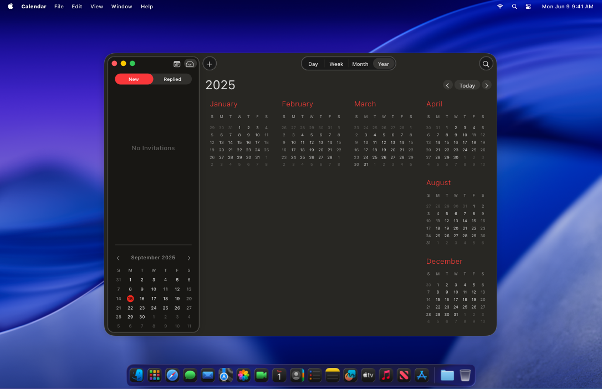
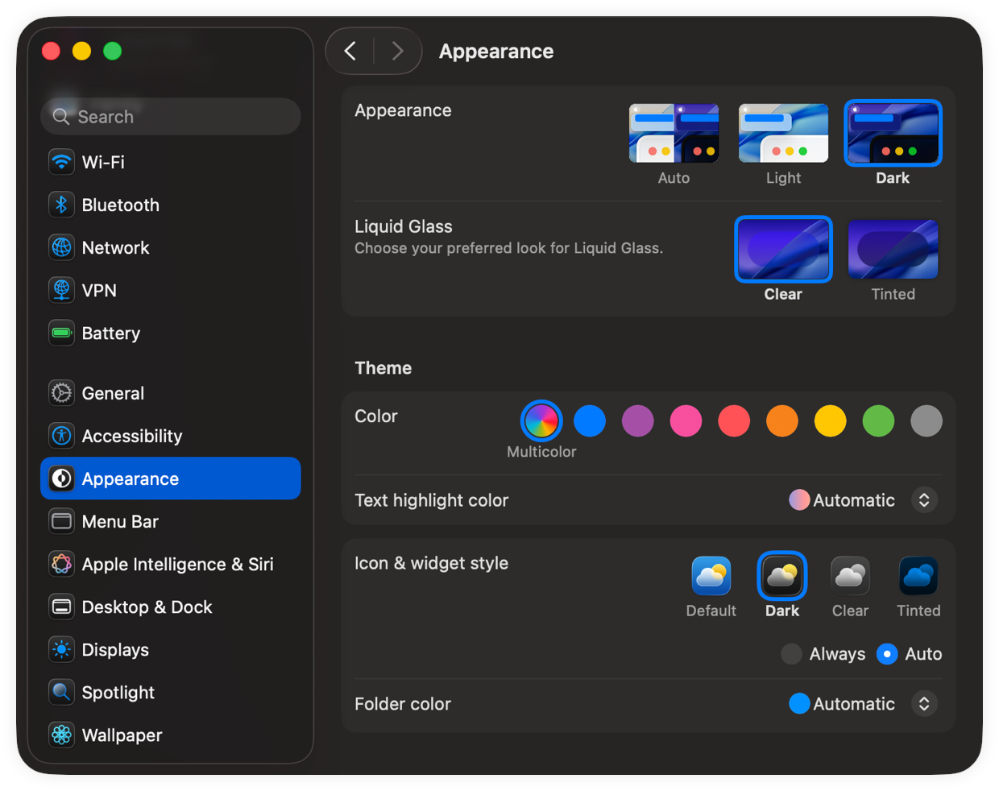
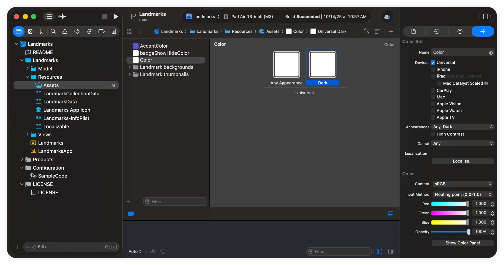

> Navigation: [Technologies](../technologies.md) · [UIKit](../uikit.md) · [Appearance customization](appearance-customization.md)

# Supporting Dark Mode in your interface

Update colors, images, and behaviors so that your app adapts automatically when Dark Mode is active.

## Overview

In macOS and iOS, users can choose to adopt a system-wide light or dark appearance. The dark appearance, known as Dark Mode, implements an interface style that many apps already adopt. Users choose the aesthetic they prefer, and can also choose to toggle their interface based on ambient lighting conditions or a specific schedule.



All apps should support both light and dark interface styles, but might perform better with a specific appearance in some places. For example, you might always adopt a light appearance for printed content.

Before you change your code, turn on Dark Mode and see how your app responds. The system does a lot of the work for you, and if your app uses standard views and controls, you might not need to make many changes. Standard views and controls automatically update their appearance to match the current interface style. If you already use color and image assets, you can add dark variants without changing your code.



### Choose adaptive colors for your UI

Choose colors that adapt automatically to the underlying interface style. Light and dark interfaces use very different color palettes. Colors that work well in a light appearance may be hard to see in a dark appearance, and vice versa. An adaptive color object returns different color values for different interface styles.

There are two ways to create adaptive color objects:

- Choose semantic colors instead of fixed color values. When configuring UI elements, choose colors with names like [labelColor](../appkit/nscolor/labelcolor.md). These semantic colors convey the intended use of the color, rather than specific color values. When you use them for their intended purpose, they render with color values appropriate for the current settings. For a complete list of semantic color names, see [NSColor](../appkit/nscolor.md) and [UIColor](uicolor.md).
- Define custom colors in your asset catalog. When you need a specific color, create it as a color asset. In your asset, specify different color values for both light and dark appearances. You can also specify high-contrast versions of your colors.

You configure custom color assets using Xcode’s asset editor. Add a Color Set asset to your project and configure the appearance variants you want to modify. Use the Any Appearance variant to specify the color value to use on older systems that do not support Dark Mode.



To load a color value from an asset catalog, load the color by name:

```swift
// macOS
let aColor = NSColor(named: NSColor.Name("customControlColor"))

// iOS
let aColor = UIColor(named: "customControlColor")
```

When you create a color object from a color asset, you do not have to recreate that object when the current appearance changes. Each time you set the fill or stroke color for drawing, the color object loads the color variant that matches the current environment settings. The same is true for semantic colors such as [labelColor](../appkit/nscolor/labelcolor.md), which adapt automatically to the current environment. By contrast, color objects you create using fixed component values do not adapt; you must create a new color object instead.

> [!note] Note
> For the user’s content, always preserve colors that the user explicitly chooses. For example, a painting app should not try to change colors that the user applies to their canvas. Use adaptable colors primarily in the views and controls for your app’s chrome.

### Create images for all appearances

Make sure the images in your interface look good in both light and dark appearances. Interfaces use images in many places, including in buttons, image views, and custom views and controls. If an image is difficult to see when changing appearances, provide a new image asset that looks good in the other appearance. Better yet, use a symbol image or template image, which define only the shape to render and therefore do not require separate images for light, dark, and high-contrast environments.

For information about configuring images for both light and dark interfaces, see [Providing images for different appearances](providing-images-for-different-appearances.md).

### Update custom views using specific methods

When the user changes the system appearance, the system automatically asks each window and view to redraw itself. During this process, the system calls several well-known methods for both macOS and iOS, listed in the following table, to update your content. The system updates the trait environment before calling these methods, so if you make all of your appearance-sensitive changes in these methods, your app updates itself correctly.

| Class | Appropriate methods |
|---|---|
| [NSView](../appkit/nsview.md) | [updateLayer()](<../appkit/nsview/updatelayer().md>)  [draw(_:)](<../appkit/nsview/draw(__).md>)  [layout()](<../appkit/nsview/layout().md>)  [updateConstraints()](<../appkit/nsview/updateconstraints().md>) |
| [UIView](uiview.md) | [- traitCollectionDidChange:](<uitraitenvironment/traitcollectiondidchange(__).md>)  [- layoutSubviews](<uiview/layoutsubviews().md>)  [- drawRect:](<uiview/draw(__).md>)  [- updateConstraints](<uiview/updateconstraints().md>)  [- tintColorDidChange](<uiview/tintcolordidchange().md>) |
| [UIViewController](uiviewcontroller.md) | [- traitCollectionDidChange:](<uitraitenvironment/traitcollectiondidchange(__).md>)  [- updateViewConstraints](<uiviewcontroller/updateviewconstraints().md>)  [- viewWillLayoutSubviews](<uiviewcontroller/viewwilllayoutsubviews().md>)  [- viewDidLayoutSubviews](<uiviewcontroller/viewdidlayoutsubviews().md>) |
| [UIPresentationController](uipresentationcontroller.md) | [- traitCollectionDidChange:](<uitraitenvironment/traitcollectiondidchange(__).md>)  [- containerViewWillLayoutSubviews](<uipresentationcontroller/containerviewwilllayoutsubviews().md>)  [- containerViewDidLayoutSubviews](<uipresentationcontroller/containerviewdidlayoutsubviews().md>) |

If you make appearance-sensitive changes outside of these methods, your app may not draw its content correctly for the current environment. The solution is to move your code into these methods. For example, instead of setting the background color of an [NSView](../appkit/nsview.md) object’s layer at creation time, move that code to your view’s [updateLayer()](<../appkit/nsview/updatelayer().md>) method instead, as shown in the code example below. Setting the background color at creation time might seem appropriate, but because [CGColor](../coregraphics/cgcolor.md) objects don’t adapt, setting it at creation time leaves the view with a fixed background color that never changes. Moving your code to [updateLayer()](<../appkit/nsview/updatelayer().md>) refreshes that background color whenever the environment changes.

```swift
override func updateLayer() {
   self.layer?.backgroundColor = NSColor.textBackgroundColor.cgColor

   // Other updates.
}
```

If your app has code that’s not part of an [NSView](../appkit/nsview.md) and can’t use the preferred methods listed above, it can observe the app’s [effectiveAppearance](../appkit/nsapplication/effectiveappearance.md) property and update [current](../appkit/nsappearance/current.md) manually.

```swift
// Use a property to keep a reference to the key-value observation object.
var observation: NSKeyValueObservation?

func applicationDidFinishLaunching(_ aNotification: Notification) {
    observation = NSApp.observe(\.effectiveAppearance) { (app, _) in
        app.effectiveAppearance.performAsCurrentDrawingAppearance {
            // Invoke your non-view code that needs to be aware of the
            // change in appearance.
        }
    }
}

```

### Choose visual-effect materials based on the intended usage

Visual-effect views add transparency to your background views, which gives your UI more visual depth than if the backgrounds were opaque. To ensure that your content remains visible, visual-effect views blur the background content subtly and add vibrancy effects to adjust the colors of your foreground content automatically. The system updates these effects dynamically, ensuring that your app’s content remains visible when the underlying content changes.

Use visual-effect views in your interface as container views, and add subviews to them to represent your foreground content. Configure each visual-effect view with the material or effects that are appropriate for the appearance you want:

- In macOS, configure an [NSVisualEffectView](../appkit/nsvisualeffectview.md) with the appropriate material based on how you use that view in your interface. For example, when using a visual-effect view as the background for a sidebar interface, configure it with the [NSVisualEffectView.Material.sidebar](../appkit/nsvisualeffectview/material-swift.enum/sidebar.md) material.
- In iOS, configure a [UIVisualEffectView](uivisualeffectview.md) with specific vibrancy and blur effects to create the appearance you want. Blur effects define the apparent thickness of the background view, and vibrancy effects adjust the appearance for specific types of content to ensure that they remain visible. For example, when your view contains labels, choose the [UIVibrancyEffectStyleLabel](uivibrancyeffectstyle/label.md) style or one of the other label-related vibrancy options.

> [!important] Important
> Do not use deprecated materials, such as [NSVisualEffectView.Material.light](../appkit/nsvisualeffectview/material-swift.enum/light.md), in macOS 10.14 and later because those materials do not adapt to Dark Mode. Instead, choose newer materials that adapt correctly to the environment.

### Opt out only as needed

Make every effort to adopt both light and dark appearances in your apps. If supporting one appearance makes no sense for all or part of your app, you can opt out of appearance changes in the appropriate windows or views. For example, you might always use a light appearance for your app’s printing views.

You can configure all or part of your interface to opt out of a specific appearance. You can also adopt a specific appearance for your entire app. For more information, see the following:

- [Choosing a Specific Appearance for Your macOS App](../appkit/choosing-a-specific-appearance-for-your-macos-app.md)
- [Choosing a specific interface style for your iOS app](choosing-a-specific-interface-style-for-your-ios-app.md)

### Avoid expensive tasks during appearance transitions

When the user toggles between light and dark interfaces, the system asks your app to redraw all of its content. Although the system manages the drawing process, it relies on your custom code at several points during that process. Your code must be as quick as possible and not perform tasks unrelated to the appearance change. In macOS, AppKit usually creates transition animations during appearance changes, but it aborts those animations if your app takes too long to redraw itself.

## Topics

### Appearance support

- [Choosing a Specific Appearance for Your macOS App](../appkit/choosing-a-specific-appearance-for-your-macos-app.md) — Adopt a specific appearance for your windows, views, or app when it is inappropriate to support both light and dark variants.
- [Choosing a specific interface style for your iOS app](choosing-a-specific-interface-style-for-your-ios-app.md) — Adopt a specific interface style for your views, view controllers, or app when it is inappropriate to support both light and dark variants.

### Images

- [Providing images for different appearances](providing-images-for-different-appearances.md) — Supply image resources appropriate for light and dark appearances and for high-contrast environments.
- [Configuring and displaying symbol images in your UI](configuring-and-displaying-symbol-images-in-your-ui.md) — Create scalable images that integrate with your app’s text, and adjust the appearance of those images dynamically.

## See Also

### Dark Mode

- [Adopting iOS Dark Mode](adopting-ios-dark-mode.md) — Adopt Dark Mode in your iOS app by using dynamic colors and visual effects.
