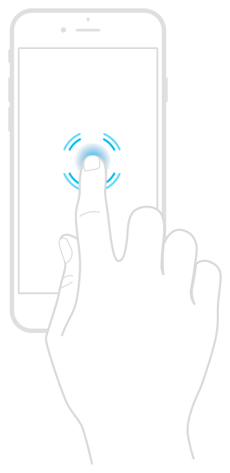

> Navigation: [Technologies](../technologies.md) · [UIKit](../uikit.md) · [Touches, presses, and gestures](touches-presses-and-gestures.md)

# Tracking the force of 3D Touch events

Manipulate your content based on the force of touches.

## Overview

A touch on the screen primarily conveys the location of that touch. However, devices that support 3D Touch also report the amount of force imparted by the user’s finger onto the screen. (Similarly, Apple Pencil reports the amount of force at its tip to the connected device.) You can use both the touch location and the force value as input to your app. For example, a drawing app might use force to set the thickness of the current line.

An illustration of how 3D Touch devices can detect touch force. A finger is shown pressing on the display, with rings emanating outward to indicate a force touch.

The raw force value associated with a touch is available in the [force](uitouch/force.md) property of the [UITouch](uitouch.md) object. You can compare that value against the value in the [maximumPossibleForce](uitouch/maximumpossibleforce.md) property to determine the relative amount of force.

> [!important] Important
> If your app implements peek-and-pop support, don’t use raw force as input to your app. For information about using 3D Touch to support the UIKit peek-and-pop APIs, see [Adopting 3D Touch on iPhone](https://developer.apple.com/library/archive/documentation/UserExperience/Conceptual/Adopting3DTouchOniPhone/index.html#//apple_ref/doc/uid/TP40016543).

For guidance about using 3D Touch, see [iOS Human Interface Guidelines](https://developer.apple.com/ios/human-interface-guidelines/).

## Topics

### Related articles

- [Checking the availability of 3D Touch](checking-the-availability-of-3d-touch.md) — Check whether a device supports 3D Touch before enabling features that use it.

## See Also

### Touches

- [Handling touches in your view](handling-touches-in-your-view.md) — Use touch events directly on a view subclass if touch handling is intricately linked to the view’s content.
- [Handling input from Apple Pencil](handling-input-from-apple-pencil.md) — Learn how to detect and respond to touches from Apple Pencil.
- [Illustrating the force, altitude, and azimuth properties of touch input](illustrating-the-force-altitude-and-azimuth-properties-of-touch-input.md) — Capture Apple Pencil and touch input in views.
- [Leveraging touch input for drawing apps](leveraging-touch-input-for-drawing-apps.md) — Capture touches as a series of strokes and render them efficiently on a drawing canvas.
- [UITouch](uitouch.md) — An object representing the location, size, movement, and force of a touch occurring on the screen.
