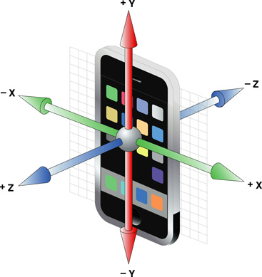

> Navigation: [Technologies](../technologies.md) · [UIKit](../uikit.md)

# UIAcceleration

<sub>Class</sub>

An acceleration event that represents immediate, three-dimensional acceleration data.

> [!warning] Deprecated
> Use the [Core Motion](../coremotion.md) framework instead.

<sub>iOS, iPadOS, Mac Catalyst, tvOS, visionOS, watchOS</sub>

```objc
@interface UIAcceleration : NSObject
```

## Overview

To receive accelerometer events, register an application object as a delegate of the shared [UIAccelerometer](uiaccelerometer.md) object, as described in [UIAccelerometer](uiaccelerometer.md).

Each acceleration event includes simultaneous acceleration readings along the three axes of the device, as shown in the following image.



The device accelerometer reports values for each axis in units of g-force, where a value of `1.0` represents acceleration of about +1 g along a given axis. When a device is laying still with its back on a horizontal surface, each acceleration event has approximately the following values:

```objc
x: 0
y: 0
z: -1
```

Individual acceleration values are of type [UIAccelerationValue](uiaccelerationvalue.md), equivalent to a `double`. Values can range over the accelerations found in normal use of a device.

> [!note] Note
> Acceleration event values are approximate—don’t attempt to use them to make precise measurements. Apple recommends that you average accelerometer values over time to derive usable data.

If you want to detect specific types of motion as gestures—specifically, shaking motions—use the [UIEvent](uievent.md) class and its [UIEventTypeMotion](uievent/eventtype/motion.md) event type. For details, see [Handling Tap and Long-Press Gestures](https://developer.apple.com/library/archive/documentation/EventHandling/Conceptual/EventHandlingiPhoneOS/HandlingTapandLongPressGestures.html#//apple_ref/doc/uid/TP40009541-CH4) in [Event Handling Guide for UIKit Apps](https://developer.apple.com/library/archive/documentation/EventHandling/Conceptual/EventHandlingiPhoneOS/index.html#//apple_ref/doc/uid/TP40009541).

## Relationships

- **Inherits From**: [NSObject](../objectivec/nsobject-swift.class.md)

## Topics

### Accessing the acceleration values

- [x](uiacceleration/x.md) — The acceleration value for the x axis of the device. _(deprecated)_
- [y](uiacceleration/y.md) — The acceleration value for the y axis of the device. _(deprecated)_
- [z](uiacceleration/z.md) — The acceleration value for the z axis of the device. _(deprecated)_
- [timestamp](uiacceleration/timestamp.md) — The relative time at which the acceleration event occurred. _(deprecated)_

### Constants

- [UIAccelerationValue](uiaccelerationvalue.md) — The amount of acceleration in a single linear direction. _(deprecated)_

## See Also

### Deprecated classes

- [UIAccelerometer](uiaccelerometer.md) — An object that lets you register to receive acceleration-related data from the onboard hardware. _(deprecated)_
- [UIActionSheet](uiactionsheet.md) — A view that presents a set of alternatives for how to proceed with a task. _(deprecated)_
- [UIAlertView](uialertview.md) — A view that displays an alert message. _(deprecated)_
- [UIDocumentMenuViewController](uidocumentmenuviewcontroller.md) — A list of all the available document providers for a given file type and mode, in addition to custom menu items that you add. _(deprecated)_
- [UILocalNotification](uilocalnotification.md) — A notification that an app can schedule for presentation at a specific date and time. _(deprecated)_
- [UIMenuController](uimenucontroller.md) — The menu interface for the Cut, Copy, Paste, Select, Select All, and Delete commands. _(deprecated)_
- [UIMenuItem](uimenuitem.md) — A custom item in the editing menu managed by the menu controller. _(deprecated)_
- [UIMutableUserNotificationAction](uimutableusernotificationaction.md) — A modifiable version of the user notification action class. _(deprecated)_
- [UIMutableUserNotificationCategory](uimutableusernotificationcategory.md) — Information about custom actions that your app can perform in response to a local or push notification. _(deprecated)_
- [UIPopoverController](uipopovercontroller.md) — An object that manages the presentation of content in a popover. _(deprecated)_
- [UIPreviewAction](uipreviewaction.md) — A preview action, or _peek quick action_, that displays below a peek when a user swipes the peek upward. _(deprecated)_
- [UIPreviewActionGroup](uipreviewactiongroup.md) — A group of one or more child quick actions, each an instance of the preview action class. _(deprecated)_
- [UISearchDisplayController](uisearchdisplaycontroller.md) — An object that manages the display of a search bar, along with a table view that displays search results. _(deprecated)_
- [UIStoryboardPopoverSegue](uistoryboardpopoversegue.md) — A specific type of segue for presenting content in a popover. _(deprecated)_
- [UIWebView](uiwebview.md) — A view that embeds web content in your app. _(deprecated)_
